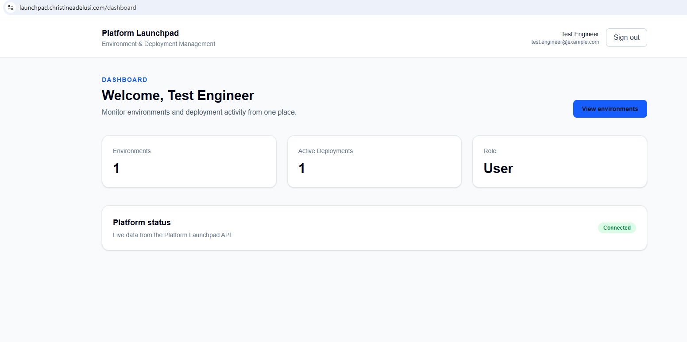
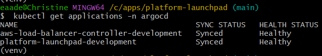
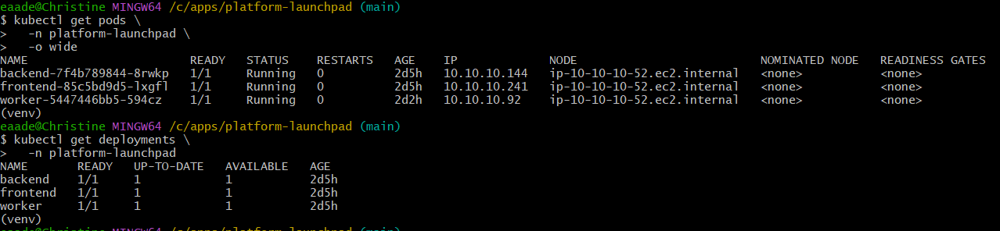
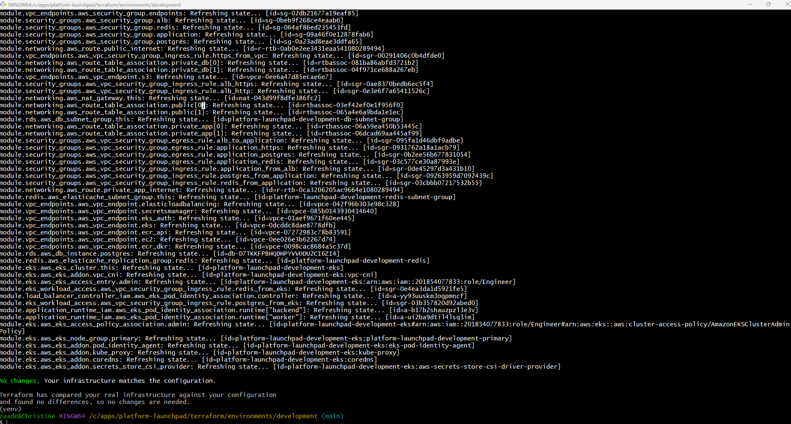

# Platform Launchpad

Platform Launchpad is a production-style platform engineering portfolio project that demonstrates how a modern application platform can be provisioned, secured, delivered, observed, and recovered using AWS, Kubernetes, Terraform, Jenkins, Argo CD, and GitOps practices.

The project combines application development with platform engineering concerns such as infrastructure as code, private container delivery, secrets management, database migrations, Kubernetes ingress, HTTPS, deployment orchestration, and reproducible platform bootstrap.

---

## Platform Status

The development environment has been validated end to end on AWS.

Current validated state:

- Amazon EKS cluster operational
- two Kubernetes worker nodes healthy across multiple Availability Zones
- backend, frontend, and worker workloads running
- PostgreSQL database reachable and healthy
- deployment worker processing requests successfully
- Argo CD applications `Synced` and `Healthy`
- AWS Load Balancer Controller managed through Argo CD
- database migrations automated through an Argo CD Sync hook
- application runtime secrets mounted from AWS Secrets Manager through the Secrets Store CSI Driver
- public application traffic served through an AWS Application Load Balancer
- TLS provided by AWS Certificate Manager
- HTTP redirected to HTTPS
- Terraform infrastructure validated with zero drift
- Argo CD bootstrap validated as idempotent
- GitOps application bootstrap validated as idempotent

Development URL:

```text
https://launchpad.christineadelusi.com
```

The development environment is intentionally designed to be torn down after validation to control cloud cost and rebuilt through Terraform and the documented bootstrap process.

---

## Architecture Overview

```text
                            GitHub
                               |
                               |
                    +----------+----------+
                    |                     |
                    v                     v
             Application Repo        GitOps Repo
                    |                     |
                    |                     |
                 Jenkins              Argo CD
                    |                     |
                    |                     |
                    v                     v
               Private ECR       Kubernetes Desired State
                                      |
                                      v
+-----------------------------------------------------------------------+
|                                AWS                                    |
|                                                                       |
|  +-----------------------------------------------------------------+  |
|  |                              VPC                                |  |
|  |                                                                 |  |
|  |  Public Subnets                                                 |  |
|  |  +----------------------+                                       |  |
|  |  | Application Load     |                                       |  |
|  |  | Balancer             |                                       |  |
|  |  +----------+-----------+                                       |  |
|  |             |                                                   |  |
|  |             v                                                   |  |
|  |  Private Application Subnets                                    |  |
|  |  +-----------------------------------------------------------+  |  |
|  |  |                       Amazon EKS                          |  |  |
|  |  |                                                           |  |  |
|  |  |  +----------+   +----------+   +----------+               |  |  |
|  |  |  | Frontend |   | Backend  |   | Worker   |               |  |  |
|  |  |  +----------+   +----------+   +----------+               |  |  |
|  |  |                        |                                  |  |  |
|  |  |                        |                                  |  |  |
|  |  |                 Secrets Store CSI                         |  |  |
|  |  +-----------------------------------------------------------+  |  |
|  |             |                              |                    |  |
|  |             |                              |                    |  |
|  |             v                              v                    |  |
|  |      AWS Secrets Manager             RDS PostgreSQL             |  |
|  |                                            |                    |  |
|  |                                            v                    |  |
|  |                                     ElastiCache Redis           |  |
|  |                                                                 |  |
|  |  NAT Gateway provides controlled outbound access from private   |  |
|  |  application subnets.                                           |  |
|  +-----------------------------------------------------------------+  |
|                                                                       |
+-----------------------------------------------------------------------+
```

---

## Core Platform Components

### Application Layer

Platform Launchpad contains three runtime workloads:

- **Frontend** — Next.js web application
- **Backend** — FastAPI REST API
- **Worker** — background deployment-request processor

The backend exposes health, authentication, environment, and deployment-request APIs. The worker continuously polls queued deployment requests and processes them asynchronously.

Validated worker processing includes successful deployment-request transitions to:

```text
succeeded
```

---

## Infrastructure as Code

Terraform provisions the AWS platform foundation.

Major Terraform-managed resources include:

- VPC
- public subnets
- private application subnets
- private database subnets
- route tables
- NAT Gateway
- Amazon EKS
- EKS managed node group
- IAM roles and policies
- EKS Pod Identity associations
- Amazon ECR repositories
- RDS PostgreSQL
- ElastiCache Redis
- AWS Secrets Manager
- VPC endpoints
- application and platform security groups
- AWS Load Balancer Controller IAM resources
- Argo CD bootstrap ECR repositories

Environment state is managed independently to support environment isolation and reproducible deployments.

See:

```text
docs/infrastructure/terraform-design.md
```

---

## GitOps Delivery

Runtime Kubernetes delivery is managed by Argo CD.

The GitOps repository contains the desired state for:

- backend Deployment and Service
- frontend Deployment and Service
- worker Deployment
- runtime ServiceAccounts
- SecretProviderClass
- Ingress
- database migration Job
- AWS Load Balancer Controller

Current Argo CD Applications:

```text
aws-load-balancer-controller-development
platform-launchpad-development
```

Both have been validated in:

```text
Synced
Healthy
```

state.

Application container images are deployed using immutable ECR image digests rather than mutable tags.

---

## Database Migration Strategy

Database migrations are automated through an Argo CD Sync hook.

The migration workflow runs:

```text
alembic upgrade head
```

before application resources proceed through the normal synchronization flow.

Sync ordering:

```text
Wave -3
  Namespace

Wave -2
  ServiceAccounts
  SecretProviderClass

Wave -1
  Database migration Job

Wave 0
  Backend
  Worker
  Frontend
  Services
  Ingress
```

A failed migration prevents the deployment from being considered successfully synchronized.

---

## Secrets Management

Runtime credentials are not committed to Git or embedded directly in Kubernetes manifests.

Platform Launchpad uses:

```text
AWS Secrets Manager
        |
        v
Secrets Store CSI Driver
        |
        v
SecretProviderClass
        |
        v
Backend / Worker / Migration Job
```

Runtime secret values are mounted into containers as files.

The application currently consumes:

```text
database_url
secret_key
```

through this mechanism.

---

## Networking and Ingress

The application runs inside private application subnets.

Public traffic enters through an internet-facing AWS Application Load Balancer managed by the AWS Load Balancer Controller.

Ingress routing includes:

```text
/               -> frontend
/api            -> backend
/docs           -> backend
/redoc          -> backend
/openapi.json   -> backend
/health         -> backend
```

The development endpoint uses:

```text
launchpad.christineadelusi.com
```

with:

- Route 53 DNS
- AWS Certificate Manager
- HTTPS listener on port 443
- HTTP listener on port 80
- HTTP-to-HTTPS redirect

Validated behavior:

```text
HTTP  :80  -> 301 redirect
HTTPS :443 -> HTTP/2 200
```

---

## Private Container Delivery

The platform avoids direct runtime dependence on public registries for critical platform components.

Private ECR repositories are used for:

- Platform Launchpad application images
- AWS Load Balancer Controller
- Argo CD
- Dex
- Redis used by Argo CD

Pinned Argo CD bootstrap images:

| Component | Version |
| --- | --- |
| Argo CD | `v3.5.2` |
| Dex | `v2.45.1` |
| Redis | `8.2.3-alpine` |

The Argo CD bootstrap verifies that no public runtime image references remain after manifest transformation.

---

## Reproducible Argo CD Bootstrap

Argo CD is installed through a deterministic bootstrap process located at:

```text
bootstrap/argocd/
```

The bootstrap process:

1. validates required tooling;
2. validates the active AWS account;
3. updates the EKS kubeconfig;
4. validates Kubernetes access;
5. authenticates Docker to ECR;
6. reuses or mirrors pinned bootstrap images;
7. downloads the pinned Argo CD manifest;
8. rewrites public image references to private ECR;
9. server-side applies Argo CD;
10. waits for all workloads;
11. validates required CRDs;
12. verifies private runtime images.

Run:

```bash
./bootstrap/argocd/install.sh
```

Then register the initial GitOps Applications:

```bash
./bootstrap/argocd/apply-applications.sh
```

Both bootstrap stages have been validated as safe to rerun against an already-running platform.

See:

```text
bootstrap/argocd/README.md
```

---

## Platform Rebuild Flow

The intended recovery and rebuild sequence is:

```text
Terraform
    |
    v
Provision AWS infrastructure
    |
    v
Install Argo CD
    |
    v
Register GitOps Applications
    |
    v
Argo CD reconciles platform workloads
    |
    v
Database migration hook
    |
    v
Application becomes healthy
```

Operationally:

```bash
cd terraform/environments/development

terraform init
terraform plan
terraform apply
```

Then:

```bash
cd ../../..

./bootstrap/argocd/install.sh
./bootstrap/argocd/apply-applications.sh
```

Argo CD then becomes the runtime delivery control plane.

---

## End-to-End Validation

The development environment has been tested through the full user workflow.

Validated behavior includes:

- frontend loads successfully over HTTPS;
- backend health endpoints respond successfully;
- database readiness reports healthy;
- environments can be created and listed;
- deployment requests can be submitted;
- backend accepts deployment requests with `202 Accepted`;
- worker processes deployment requests asynchronously;
- processed requests transition to `succeeded`;
- Argo CD remains `Synced` and `Healthy` after runtime activity.

Example readiness response:

```json
{
  "status": "ready",
  "checks": {
    "database": "ok"
  }
}
```

---

## Security Model

Key security controls include:

- workloads run in private subnets;
- database and cache resources are not publicly exposed;
- Kubernetes workloads use dedicated ServiceAccounts;
- AWS access uses IAM roles and EKS Pod Identity;
- runtime secrets remain in AWS Secrets Manager;
- Secrets Store CSI mounts secrets into workloads;
- application containers run as non-root;
- privilege escalation is disabled;
- Linux capabilities are dropped where applicable;
- root filesystems are read-only where supported;
- public traffic is encrypted with TLS;
- immutable image digests are used for application delivery;
- ECR repositories use lifecycle controls and image scanning;
- EKS API public access is restricted by CIDR.

See:

```text
docs/security/security-model.md
```

---

## Repository Structure

```text
platform-launchpad/
├── backend/
├── frontend/
├── worker/
├── bootstrap/
│   └── argocd/
├── terraform/
│   ├── environments/
│   ├── modules/
│   └── policies/
├── jenkins/
├── docker/
├── deploy/
└── docs/
    ├── adr/
    ├── api/
    ├── architecture/
    ├── cicd/
    ├── database/
    ├── infrastructure/
    ├── observability/
    ├── product/
    ├── project-management/
    ├── security/
    └── wireframes/
```

Runtime Kubernetes desired state is maintained separately in:

```text
platform-launchpad-gitops
```

This separation reinforces the boundary between CI-produced artifacts and GitOps-managed runtime state.

---

## Architecture Decision Records

The project records important engineering decisions as ADRs.

Current ADR topics include:

- Platform Launchpad as a portfolio application
- Next.js and FastAPI
- PostgreSQL as the system of record
- JWT authentication
- GitOps runtime deployment
- separation of CI and runtime deployment
- monorepo development
- logical environment destruction
- role-aware navigation
- FastAPI authorization
- immutable image digests
- separate Terraform state per environment
- OpenTelemetry distributed tracing

See:

```text
docs/adr/
```

---

## Documentation

Detailed design documentation is available under:

```text
docs/
```

Key documents include:

```text
docs/architecture/system-architecture.md
docs/architecture/technical-design.md
docs/cicd/cicd-design.md
docs/database/database-design.md
docs/infrastructure/terraform-design.md
docs/security/security-model.md
docs/observability/observability-design.md
docs/api/api-specification.md
```

---

---

## Validation Evidence

The development environment was validated end to end before teardown.

### Platform Dashboard



The dashboard demonstrates an authenticated user session, environment
visibility, active deployment tracking, role-aware access, and live backend
connectivity.

### GitOps Reconciliation



Both GitOps Applications were validated as:

```text
aws-load-balancer-controller-development   Synced   Healthy
platform-launchpad-development             Synced   Healthy
```

### Kubernetes Runtime



The frontend, backend, and worker workloads were validated as running on
Amazon EKS with zero container restarts at evidence-capture time.

### Terraform Zero Drift



The final infrastructure validation reported:

```text
No changes. Your infrastructure matches the configuration.
```

Additional evidence is available under:

```text
docs/screenshots/
├── application/
├── argocd/
├── infrastructure/
└── kubernetes/
```

The complete implementation narrative and validation results are documented in:

```text
docs/case-study.md
```

---

## Cost Management

The AWS development environment is not intended to remain online continuously.

After portfolio validation and evidence capture, the environment can be torn
down to avoid unnecessary cloud cost.

Major development cost drivers include:

- Amazon EKS control plane
- EC2 worker nodes
- NAT Gateway
- RDS PostgreSQL
- ElastiCache Redis
- Application Load Balancer

The platform is intentionally designed to support teardown and deterministic
rebuild rather than requiring a permanently running demonstration environment.

---

## Portfolio Goals

Platform Launchpad demonstrates practical experience with:

- AWS
- Terraform
- Kubernetes
- Amazon EKS
- Docker
- Jenkins
- Argo CD
- GitOps
- Amazon ECR
- AWS IAM
- EKS Pod Identity
- AWS Secrets Manager
- Secrets Store CSI Driver
- Application Load Balancer
- AWS Certificate Manager
- Route 53
- PostgreSQL
- Redis
- FastAPI
- Next.js
- Python
- Alembic
- CI/CD architecture
- infrastructure recovery
- platform security
- deployment automation

The emphasis is not simply on deploying an application. The project focuses on
building the platform, delivery controls, security boundaries, and recovery
processes required to operate that application reliably.
