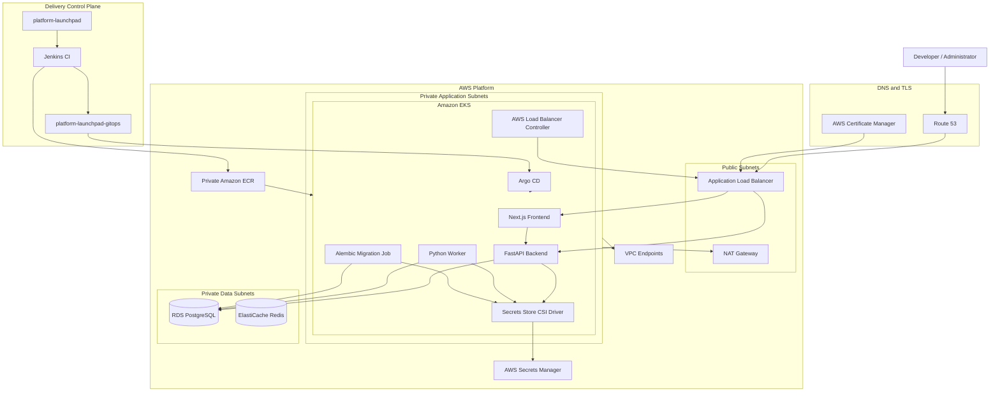

# Platform Launchpad — System Architecture

## 1. Overview

Platform Launchpad is a production-style Internal Developer Platform (IDP)
portfolio application designed to demonstrate modern Platform Engineering,
DevOps, GitOps, cloud infrastructure, and application-delivery practices.

The platform provides authenticated users with a self-service interface for
creating environments and submitting deployment requests while backend and
worker services coordinate lifecycle processing.

The system is deployed to Amazon EKS and integrates Terraform, Jenkins,
Amazon ECR, Argo CD, AWS Secrets Manager, Amazon RDS, ElastiCache Redis,
AWS Application Load Balancer, AWS Certificate Manager, Route 53, and
Kubernetes-native delivery controls.

The architecture intentionally separates:

- application concerns;
- continuous integration;
- infrastructure provisioning;
- platform bootstrap;
- Kubernetes desired state;
- runtime reconciliation;
- secrets management;
- database migration;
- public ingress.

This separation demonstrates production-oriented platform ownership
boundaries rather than a single deployment script with unrestricted access.

---

## 2. Current Implementation Status

The AWS development environment has been deployed and validated end to end.

Validated capabilities include:

- Terraform-managed AWS infrastructure;
- Amazon EKS runtime;
- two EKS worker nodes across multiple Availability Zones;
- private application subnets;
- private database subnets;
- NAT-based outbound access;
- VPC endpoints for selected AWS services;
- private Amazon ECR repositories;
- FastAPI backend;
- Next.js frontend;
- Python worker;
- Amazon RDS PostgreSQL;
- Amazon ElastiCache Redis infrastructure;
- AWS Secrets Manager;
- Secrets Store CSI Driver;
- EKS Pod Identity;
- Argo CD;
- GitOps-managed application delivery;
- GitOps-managed AWS Load Balancer Controller;
- automated Alembic database migration Sync hook;
- Application Load Balancer ingress;
- ACM-managed TLS;
- HTTP-to-HTTPS redirect;
- Route 53 DNS;
- reproducible Argo CD bootstrap;
- private-ECR Argo CD runtime images;
- successful asynchronous deployment-request processing;
- Terraform zero-drift validation.

Current development endpoint:

```text
https://launchpad.christineadelusi.com
```

The AWS development environment is intentionally temporary and may be
destroyed after validation to control cost.

---

# 3. High-Level Architecture



---

# 4. Architecture Ownership Model

Platform Launchpad uses explicit ownership boundaries.

```text
Terraform
    |
    | provisions cloud infrastructure
    v
AWS Platform
    |
    | establishes Kubernetes runtime
    v
Argo CD Bootstrap
    |
    | installs GitOps control plane
    v
Argo CD
    |
    | reconciles Kubernetes desired state
    v
Application Runtime
```

The ownership model is intentionally divided as follows.

## 4.1 Terraform Owns

Terraform owns AWS infrastructure and AWS-integrated platform prerequisites.

Current Terraform modules include:

```text
application-runtime-iam
argocd-ecr
ci-delivery-iam
controller-ecr
ecr
eks
eks-workload-access
iam
load-balancer-controller-iam
networking
rds
redis
secrets
security-groups
vpc-endpoints
```

Terraform provisions resources such as:

- VPC;
- subnets;
- route tables;
- NAT Gateway;
- security groups;
- Amazon EKS;
- EKS managed node group;
- Amazon RDS;
- ElastiCache Redis;
- Amazon ECR;
- IAM roles and policies;
- EKS Pod Identity associations;
- Secrets Manager resources;
- VPC endpoints;
- platform controller IAM;
- Argo CD bootstrap ECR repositories.

Manual AWS resources discovered during implementation are either imported into
Terraform or intentionally documented as external dependencies.

---

## 4.2 Bootstrap Automation Owns

The bootstrap layer establishes Argo CD after the EKS cluster exists.

Location:

```text
bootstrap/argocd/
```

Bootstrap responsibilities include:

- validate local tooling;
- validate the active AWS account;
- obtain Terraform outputs;
- update kubeconfig;
- validate EKS access;
- authenticate to private ECR;
- detect existing bootstrap images;
- mirror missing Argo CD images;
- download a pinned Argo CD manifest;
- rewrite public registry references;
- server-side apply Argo CD;
- validate Argo CD CRDs;
- validate runtime image sources;
- register initial Argo CD Applications.

The bootstrap layer exists because Argo CD cannot declaratively install itself
before an Argo CD control plane exists.

---

## 4.3 Jenkins Owns Continuous Integration

Jenkins represents the continuous-integration boundary.

The intended CI responsibilities are:

1. source checkout;
2. dependency installation;
3. application tests;
4. quality checks;
5. security checks;
6. Docker image build;
7. container image publication to Amazon ECR;
8. GitOps repository update.

Jenkins does not directly deploy application workloads to Kubernetes.

Runtime deployment authority belongs to Argo CD.

---

## 4.4 Argo CD Owns Kubernetes Runtime State

Argo CD is the runtime delivery control plane.

Current Argo CD Applications:

```text
aws-load-balancer-controller-development
platform-launchpad-development
```

Both have been validated as:

```text
Synced
Healthy
```

Argo CD manages Kubernetes resources including:

- backend Deployment;
- backend Service;
- frontend Deployment;
- frontend Service;
- worker Deployment;
- runtime ServiceAccounts;
- SecretProviderClass;
- database migration Job;
- Ingress;
- AWS Load Balancer Controller.

The application desired state is stored in the separate:

```text
platform-launchpad-gitops
```

repository.

---

# 5. Application Architecture

Platform Launchpad currently contains three primary runtime workloads.

## 5.1 Frontend

Technology:

- Next.js;
- React;
- TypeScript.

Responsibilities include:

- authentication user interface;
- dashboard presentation;
- environment management;
- deployment-request submission;
- deployment status presentation;
- API communication.

The frontend does not communicate directly with PostgreSQL, AWS APIs, or
Kubernetes.

---

## 5.2 Backend API

Technology:

- FastAPI;
- SQLAlchemy;
- Alembic;
- PostgreSQL;
- JWT authentication.

Responsibilities include:

- user registration;
- authentication;
- JWT issuance and validation;
- authorization;
- environment CRUD operations;
- deployment-request creation;
- deployment-request queries;
- audit logging;
- health endpoints;
- database readiness checks.

The backend remains the authoritative application authorization boundary.

---

## 5.3 Worker

The worker is implemented in Python.

The deployed worker performs asynchronous deployment-request processing.

Current validated behavior:

```text
Deployment request submitted
        |
        v
Request stored
        |
        v
Worker polls for work
        |
        v
Request processing begins
        |
        v
Status updated
        |
        v
succeeded
```

The deployed worker has successfully processed multiple deployment requests.

Example worker behavior:

```text
Processed deployment request <id> with status succeeded.
```

The current implementation should therefore be described as a polling worker,
not as a Redis-backed message consumer.

Future iterations may move task dispatch to an explicit message-queue model.

---

# 6. Persistence Architecture

## 6.1 PostgreSQL

PostgreSQL is the system of record.

The AWS development environment uses Amazon RDS PostgreSQL.

Application tables currently include:

```text
users
environments
deployment_requests
audit_logs
alembic_version
```

Persistent application state is stored in PostgreSQL rather than Kubernetes.

---

## 6.2 Redis

Amazon ElastiCache Redis is provisioned as part of the AWS platform.

Redis is available for future platform capabilities such as:

- queue coordination;
- caching;
- transient task state;
- distributed coordination.

The current validated worker path does not depend on Redis as its deployment
request queue.

This distinction is intentional so the documentation reflects deployed
behavior rather than the earlier design assumption.

---

# 7. Database Migration Architecture

Database migrations are integrated into GitOps delivery.

The application uses Alembic.

Migration command:

```text
alembic upgrade head
```

A Kubernetes Job named:

```text
database-migration
```

executes migrations as an Argo CD Sync hook.

Sync ordering is:

```text
Wave -3
    Namespace

Wave -2
    Runtime ServiceAccounts
    SecretProviderClass

Wave -1
    Database Migration Job

Wave 0
    Backend
    Worker
    Frontend
    Services
    Ingress
```

The migration Job:

- uses the backend application image;
- uses the backend ServiceAccount;
- receives database credentials through Secrets Store CSI;
- runs before normal application workloads complete synchronization;
- is deleted after successful hook execution.

Argo CD reports the migration Job as a successful Sync hook when migrations
complete.

This prevents database schema changes from being handled through ad hoc
manual commands during normal GitOps deployments.

---

# 8. Secrets Architecture

Runtime application secrets are stored in AWS Secrets Manager.

Current application secret:

```text
platform-launchpad/development/runtime
```

Current mounted keys include:

```text
database_url
secret_key
```

Secret delivery path:

```text
AWS Secrets Manager
        |
        v
Secrets Store CSI Driver
        |
        v
SecretProviderClass
        |
        +----------------+
        |                |
        v                v
     Backend           Worker
        |
        v
Migration Job
```

Secret values are mounted into workloads as files.

Application configuration references:

```text
DATABASE_URL_FILE
SECRET_KEY_FILE
```

This avoids placing runtime credentials directly in GitOps manifests.

---

# 9. AWS Workload Identity

Platform Launchpad uses EKS workload identity rather than embedding AWS
credentials inside containers.

EKS Pod Identity associations currently exist for workloads including:

```text
backend
worker
aws-load-balancer-controller
```

IAM roles and policies are separated according to workload responsibilities.

Examples include:

- application runtime secrets access;
- worker AWS access;
- AWS Load Balancer Controller permissions;
- CI delivery permissions.

This creates a stronger trust boundary between application workloads and AWS
services.

---

# 10. Network Architecture

The platform VPC separates public ingress, application workloads, and data
services.

## 10.1 Public Subnets

Public subnets host public-facing network infrastructure such as:

- Application Load Balancer;
- NAT Gateway.

The application workloads themselves do not require public IP addresses.

---

## 10.2 Private Application Subnets

Private application subnets host EKS worker nodes and Kubernetes workloads.

Current application workloads include:

```text
frontend
backend
worker
Argo CD
AWS Load Balancer Controller
```

Private application subnets use NAT egress where public outbound connectivity
is required.

---

## 10.3 Private Database Subnets

RDS PostgreSQL is placed in private database subnets.

The database is not exposed directly to the public Internet.

Access is restricted through security-group relationships.

---

# 11. NAT and Outbound Connectivity

Private application workloads require controlled outbound access for services
that are not available through VPC endpoints.

The development environment therefore includes a NAT Gateway.

The private application route table contains:

```text
0.0.0.0/0 -> NAT Gateway
```

This was required during implementation when components such as Argo CD needed
external Git repository access.

NAT is considered a cost-bearing development resource and is removed during
environment teardown.

---

# 12. VPC Endpoints

The platform also uses VPC endpoints to reduce unnecessary public network
paths for selected AWS services.

Configured endpoints include services such as:

- Amazon ECR API;
- Amazon ECR Docker registry;
- Amazon S3;
- AWS Secrets Manager;
- Amazon EKS-related services;
- Elastic Load Balancing.

Endpoints provide private AWS service connectivity where supported.

NAT remains available for destinations that do not have an appropriate VPC
endpoint, such as external Git hosting.

---

# 13. Ingress Architecture

Public application access terminates at an AWS Application Load Balancer.

The AWS Load Balancer Controller runs inside EKS and manages ALB integration.

Ingress routes include:

```text
/               -> frontend:3000
/api            -> backend:8000
/docs           -> backend:8000
/redoc          -> backend:8000
/openapi.json   -> backend:8000
/health         -> backend:8000
```

Application hostname:

```text
launchpad.christineadelusi.com
```

---

# 14. TLS Architecture

TLS is provided through AWS Certificate Manager.

Public traffic behavior has been validated as:

```text
HTTP :80
    |
    v
301 Redirect
    |
    v
HTTPS :443
    |
    v
Application Load Balancer
```

The HTTPS endpoint has been validated with:

```text
HTTP/2 200
```

Backend readiness through the public endpoint returns:

```json
{
  "status": "ready",
  "checks": {
    "database": "ok"
  }
}
```

---

# 15. DNS Architecture

The public hostname is managed through Route 53.

The Route 53 hosted zone is maintained in a separate AWS development account
from the Platform Launchpad runtime environment.

The DNS record points:

```text
launchpad.christineadelusi.com
```

to the Platform Launchpad Application Load Balancer.

This demonstrates a cross-account boundary between shared DNS ownership and
application runtime ownership.

---

# 16. Container Architecture

Application and platform containers are stored in private Amazon ECR
repositories.

Current repository categories include:

- application images;
- AWS Load Balancer Controller;
- Argo CD;
- Dex;
- Redis used by Argo CD.

Application Kubernetes overlays reference immutable image digests.

Example pattern:

```text
<ecr-repository>@sha256:<digest>
```

This avoids runtime ambiguity caused by mutable application tags.

---

# 17. Argo CD Bootstrap Architecture

Argo CD is bootstrapped from the main Platform Launchpad repository.

Pinned versions currently include:

```text
Argo CD  v3.5.2
Dex      v2.45.1
Redis    8.2.3-alpine
```

Bootstrap process:

```text
Terraform outputs
        |
        v
Validate AWS account
        |
        v
Authenticate to ECR
        |
        v
Check pinned images
        |
        v
Mirror missing images
        |
        v
Download pinned Argo CD manifest
        |
        v
Rewrite public image references
        |
        v
Server-side apply
        |
        v
Validate workloads and CRDs
```

The bootstrap has been rerun successfully against an already-running cluster.

All Argo CD runtime images remained sourced from private ECR.

---

# 18. GitOps Application Bootstrap

After Argo CD is running, the bootstrap registers:

```text
aws-load-balancer-controller-development
platform-launchpad-development
```

through:

```bash
./bootstrap/argocd/apply-applications.sh
```

The script has been validated as idempotent.

Existing Applications return:

```text
unchanged
```

when their definitions already match the desired state.

---

# 19. Request Flow

A normal application request follows:

```text
Browser
   |
   v
Route 53
   |
   v
ALB / HTTPS
   |
   v
Next.js Frontend
   |
   v
FastAPI Backend
   |
   +----------------------+
   |                      |
   v                      v
PostgreSQL         Deployment Request
                          |
                          v
                       Worker
                          |
                          v
                    PostgreSQL
                          |
                          v
                    Updated Status
```

Detailed flow:

1. User authenticates.
2. Frontend calls FastAPI.
3. Backend validates JWT.
4. Backend evaluates authorization.
5. User creates or selects an environment.
6. User submits a deployment request.
7. Backend stores the deployment request.
8. Backend returns `202 Accepted`.
9. Worker discovers queued work.
10. Worker processes the request.
11. Worker updates deployment status.
12. Frontend retrieves the resulting status.

This workflow has been validated end to end in the deployed AWS environment.

---

# 20. Health Model

The backend exposes separate liveness and readiness endpoints.

Liveness:

```text
/health/live
```

Readiness:

```text
/health/ready
```

Readiness validates database connectivity.

Kubernetes probes use these endpoints to determine application health.

The ALB and Kubernetes health checks therefore rely on application-aware
health signals rather than simply checking that a process exists.

---

# 21. Security Boundaries

Primary security boundaries include:

```text
Internet
   |
   v
ALB / TLS
   |
   v
Frontend
   |
   v
FastAPI Authorization Boundary
   |
   +----------------------+
   |                      |
   v                      v
PostgreSQL              Worker
```

Additional platform trust boundaries include:

- Jenkins to AWS and GitHub;
- Argo CD to Kubernetes;
- Kubernetes workloads to AWS;
- Terraform operator to AWS;
- EKS ServiceAccount to Pod Identity;
- CSI Driver to Secrets Manager;
- public subnets to private workloads;
- application subnets to database subnets.

The FastAPI backend remains authoritative for end-user authorization.

---

# 22. Runtime Container Security

Application workload security controls include:

```text
runAsNonRoot: true
allowPrivilegeEscalation: false
readOnlyRootFilesystem: true
```

where supported.

Linux capabilities are dropped for hardened workloads.

Secrets are mounted read-only.

Application containers do not require embedded AWS access keys.

---

# 23. Scalability

The frontend, backend, and worker are designed as independently deployable
Kubernetes workloads.

Current development replica counts are intentionally small for cost control.

The architecture allows future scaling through:

- increased Deployment replicas;
- Horizontal Pod Autoscaler;
- larger or additional EKS nodes;
- managed node-group scaling;
- RDS scaling;
- Redis scaling.

Persistent application state remains outside Kubernetes.

---

# 24. Disaster Recovery and Rebuild

Platform recovery is based on declarative infrastructure and GitOps state.

The rebuild model is:

```text
Terraform
    |
    v
AWS Infrastructure
    |
    v
Argo CD Bootstrap
    |
    v
GitOps Applications
    |
    v
Database Migration
    |
    v
Application Runtime
```

Operational sequence:

```bash
terraform apply
./bootstrap/argocd/install.sh
./bootstrap/argocd/apply-applications.sh
```

Argo CD then reconciles desired Kubernetes state.

This minimizes undocumented recovery steps.

---

# 25. Cost-Control Architecture

The AWS development environment is not intended to remain running
continuously.

Major cost-bearing resources include:

- EKS control plane;
- EC2 worker nodes;
- NAT Gateway;
- RDS PostgreSQL;
- ElastiCache Redis;
- Application Load Balancer.

The intended lifecycle is:

```text
Build
  |
  v
Validate
  |
  v
Capture Evidence
  |
  v
Destroy
  |
  v
Rebuild When Needed
```

Reproducibility is therefore an architectural requirement, not simply an
operational convenience.

---

# 26. Local Development Architecture

Local development remains supported independently of AWS.

Local components include:

- Next.js frontend;
- FastAPI backend;
- PostgreSQL;
- Python worker;
- Redis where required.

Docker and Docker Compose provide supporting local infrastructure.

Developers may run application processes directly on the host while using
containerized dependencies.

---

# 27. Observability

Platform Launchpad currently exposes application-level health signals and
structured runtime logs.

Validated operational signals include:

- backend liveness;
- backend readiness;
- database connectivity;
- Kubernetes pod health;
- Deployment availability;
- worker processing logs;
- Argo CD sync status;
- Argo CD health status;
- ALB response behavior.

A broader observability stack remains an explicit future platform phase.

Planned components include:

- Prometheus;
- Grafana;
- OpenTelemetry;
- centralized application logs;
- distributed traces;
- CloudWatch integration;
- alerting.

These components are architectural targets and should not be interpreted as
fully deployed Platform Launchpad runtime capabilities yet.

---

# 28. Implemented vs Planned Capabilities

## Implemented and Validated

```text
Next.js frontend
FastAPI backend
PostgreSQL
Python worker
JWT authentication
Authorization
Environment APIs
Deployment-request APIs
Audit data model
Alembic migrations
Terraform
Amazon VPC
Private networking
NAT Gateway
Amazon EKS
Amazon ECR
Amazon RDS
ElastiCache Redis infrastructure
AWS Secrets Manager
Secrets Store CSI Driver
EKS Pod Identity
Argo CD
GitOps
AWS Load Balancer Controller
Application Load Balancer
ACM TLS
Route 53 DNS
HTTPS redirect
Private Argo CD runtime images
Reproducible Argo CD bootstrap
GitOps Application bootstrap
End-to-end deployment-request processing
```

## Planned / Future Platform Work

```text
Prometheus
Grafana
Loki or equivalent centralized logging
OpenTelemetry distributed tracing
Tempo or equivalent trace backend
Alerting
Horizontal Pod Autoscaling validation
Multi-environment AWS promotion
Production-grade identity federation
Long-lived low-cost demo hosting
```

This distinction ensures portfolio documentation accurately reflects
implemented capabilities rather than presenting roadmap items as completed
work.

---

# 29. Architecture Principles Demonstrated

Platform Launchpad demonstrates the following platform-engineering principles:

- Infrastructure as Code;
- Git as desired-state authority;
- separation of CI and CD;
- pull-based GitOps;
- immutable application artifacts;
- private runtime artifact consumption;
- workload identity;
- least-privilege IAM;
- private application networking;
- private data services;
- externalized secrets;
- application-aware health checks;
- controlled schema migration;
- reproducible bootstrap;
- explicit ownership boundaries;
- auditable deployment flows;
- deterministic recovery;
- cost-aware infrastructure lifecycle.

---

# 30. Summary

Platform Launchpad has evolved from an application-development prototype into
a production-style AWS platform demonstration.

The current architecture combines:

```text
Terraform
AWS
EKS
Kubernetes
ECR
Jenkins
Argo CD
GitOps
Secrets Manager
Pod Identity
RDS
Redis
ALB
ACM
Route 53
FastAPI
Next.js
Python
Alembic
```

The emphasis is not only on running an application.

The project demonstrates how infrastructure, identity, secrets, delivery,
database lifecycle, networking, runtime reconciliation, recovery, and cost
control can be designed as a cohesive platform.