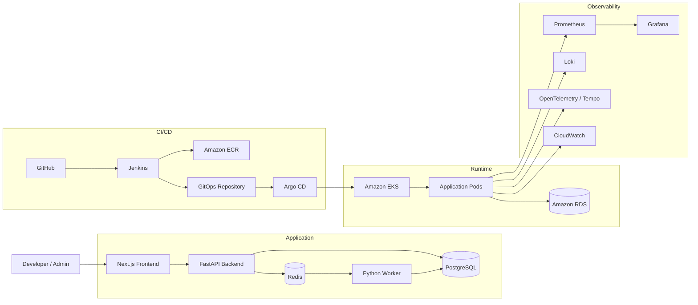

# Platform Launchpad - System Architecture

## Overview

Platform Launchpad is a self-service Internal Developer Platform (IDP) demonstration application designed to showcase modern Platform Engineering practices.

The application allows authenticated users to request, manage, and monitor application environments while platform automation handles provisioning, deployment, lifecycle management, and observability.

This architecture intentionally separates application responsibilities from infrastructure automation to demonstrate enterprise Platform Engineering patterns.

---

# High-Level Architecture



---

# Architecture Layers

The application is divided into several logical layers.

## User Layer

Users interact with the platform through the Next.js web interface.

Supported roles:

- User
- Administrator

---

## Presentation Layer

The frontend is implemented using:

- Next.js
- React
- TypeScript
- Tailwind CSS

Responsibilities include:

- Authentication
- Dashboard rendering
- Environment management
- API communication
- User experience

The frontend never communicates directly with the database or infrastructure.

---

## API Layer

FastAPI acts as the central orchestration layer.

Responsibilities include:

- Authentication
- Authorization
- JWT token validation
- CRUD operations
- Environment lifecycle management
- Audit logging
- Worker task submission
- Metrics
- Health endpoints

---

## Persistence Layer

PostgreSQL is the system of record.

It stores:

- Users
- Roles
- Environments
- Deployment Requests
- Audit Logs

The database is the only persistent data source for application state.

---

## Worker Layer

A background Python worker processes long-running operations.

Responsibilities include:

- Environment provisioning
- Environment destruction
- Retry logic
- Status updates
- Audit events

Initially, provisioning is simulated.

Later versions may integrate with:

- Jenkins
- Terraform
- Kubernetes
- GitHub
- AWS APIs

---

## Queue Layer

Redis provides:

- Background task queue
- Retry coordination
- Temporary task state
- Optional caching

Redis is introduced after the authentication milestone.

---

## CI/CD Layer

Continuous Integration is performed by Jenkins.

Pipeline responsibilities include:

1. Source checkout
2. Dependency installation
3. Unit testing
4. Linting
5. Security scanning
6. Docker image build
7. Image scanning
8. Push image to Amazon ECR
9. Update GitOps repository

Jenkins never deploys directly to Kubernetes.

---

## GitOps Layer

Application deployment follows GitOps principles.

Argo CD continuously reconciles Kubernetes state.

Deployment flow:

GitHub → Jenkins → GitOps Repository → Argo CD → Kubernetes

Rollback is performed by reverting Git commits.

---

## Runtime Layer

Application workloads execute inside Amazon EKS.

Components include:

- Frontend Pods
- Backend Pods
- Worker Pods
- Ingress Controller
- Services
- ConfigMaps
- Secrets

Persistent data is stored in Amazon RDS.

---

## Observability Layer

Platform monitoring includes:

- Prometheus
- Grafana
- Loki
- OpenTelemetry
- CloudWatch

Key metrics include:

- Request Rate
- Error Rate
- Request Duration
- Authentication Failures
- Environment Status Counts
- Queue Depth
- Worker Duration
- Worker Failures
- Database Connections
- Pod Health

---

# Request Flow

The following sequence describes a typical environment request.

1. User logs into Platform Launchpad.
2. User submits an Environment Request.
3. Frontend sends request to FastAPI.
4. FastAPI validates JWT.
5. FastAPI validates authorization.
6. FastAPI stores the request in PostgreSQL.
7. FastAPI creates an audit log.
8. FastAPI submits a background task.
9. Worker processes the request.
10. Worker updates Environment Status.
11. Dashboard refreshes automatically.
12. Metrics and logs are generated throughout the workflow.

---

# Environment Lifecycle

Every environment moves through the following lifecycle.

```text
Pending
    ↓
Provisioning
    ↓
Active
    ↓
Destroying
    ↓
Destroyed
```

Failure may occur during provisioning.

```text
Pending
    ↓
Provisioning
    ↓
Failed
```

Failed environments remain available for investigation.

---

# Deployment Flow

Application deployment follows a GitOps workflow.

1. Developer pushes code to GitHub.
2. Jenkins executes CI pipeline.
3. Tests execute.
4. Security scans execute.
5. Docker image is built.
6. Image is pushed to Amazon ECR.
7. Jenkins updates the GitOps repository.
8. Argo CD detects repository changes.
9. Argo CD synchronizes Kubernetes.
10. Updated application becomes available.

---

# Security Boundaries

Primary security boundaries include:

- Browser → Frontend
- Frontend → Backend API
- Backend API → PostgreSQL
- Backend API → Redis
- Worker → Infrastructure APIs
- Jenkins → AWS
- Argo CD → Kubernetes

The FastAPI backend is the primary authorization boundary.

---

# Scalability

Application services are stateless.

Horizontal scaling may be applied independently to:

- Frontend
- Backend
- Worker

Persistent state remains in PostgreSQL.

Redis may also be clustered if required.

---

# Disaster Recovery

Platform resilience includes:

- Database backups
- Infrastructure recreation through Terraform
- GitOps-based redeployment
- Immutable container images
- Audit history
- Health probes
- Retry logic

---

# Local Development Architecture

The local development environment consists of:

- Next.js
- FastAPI
- PostgreSQL
- Redis
- Python Worker

Docker Compose provides local infrastructure.

Developers may run frontend and backend directly on the host while PostgreSQL executes inside Docker.

---

# AWS Production Architecture

The production-style deployment includes:

- Amazon VPC
- Public Subnets
- Private Subnets
- Amazon EKS
- Amazon ECR
- Amazon RDS
- AWS Secrets Manager
- Route 53
- ACM Certificates
- Application Load Balancer
- CloudWatch
- S3
- DynamoDB

Infrastructure is provisioned through Terraform.

---

# MVP Scope

The initial implementation includes:

- FastAPI
- PostgreSQL
- SQLAlchemy
- Alembic
- JWT Authentication
- RBAC
- User Management
- Environment Management
- Audit Logging
- Docker Compose

Future iterations add:

- Redis
- Worker Queue
- Jenkins
- GitOps
- Argo CD
- Kubernetes
- Terraform
- AWS Deployment
- Observability Stack