# Platform Launchpad — CI/CD Design

## 1. Purpose

This document defines the Continuous Integration and Continuous Delivery design for Platform Launchpad.

The delivery model uses:

- GitHub for source control
- Jenkins for Continuous Integration
- Amazon ECR for container images
- A GitOps repository for desired deployment state
- Argo CD for Kubernetes reconciliation
- Amazon EKS for runtime workloads

The design intentionally separates build responsibilities from runtime deployment permissions.

Jenkins validates, tests, scans, builds, publishes, and updates desired state.

Argo CD deploys the approved desired state to Kubernetes.

---

## 2. Objectives

The CI/CD platform must:

- Validate every proposed source-code change.
- Prevent untested code from reaching protected branches.
- Build reproducible container images.
- Scan source code, dependencies, and container images.
- Publish immutable application artifacts.
- Preserve traceability from Git commit to runtime image.
- Promote changes through Git-controlled environments.
- Prevent Jenkins from requiring direct application-cluster deployment access.
- Support rollback through Git history.
- Produce clear pipeline status and failure information.
- Protect credentials and deployment permissions.
- Support manual approval for sensitive environments.
- Keep AWS infrastructure costs controlled.

---

## 3. Delivery Principles

### 3.1 Build Once, Promote the Same Artifact

The platform builds a container image once.

The same tested image digest is promoted through:

- Development
- Staging
- Production-style demonstration

The platform must not rebuild different images for each environment.

### 3.2 Git Is the Deployment Source of Truth

The GitOps repository defines the desired Kubernetes deployment state.

Runtime changes should not be performed manually unless required for emergency recovery and subsequently reconciled back into Git.

### 3.3 CI and Runtime Deployment Are Separate

Jenkins performs Continuous Integration and updates the GitOps repository.

Argo CD performs runtime reconciliation.

Jenkins does not require unrestricted `kubectl` access.

### 3.4 Artifacts Are Immutable

Published container images must not be overwritten.

Human-readable tags may exist, but image digests provide the authoritative artifact identity.

### 3.5 Security Checks Are Pipeline Gates

Security scanning is part of the release process rather than an optional post-deployment activity.

### 3.6 Every Release Is Traceable

A running workload should be traceable to:

- Git repository
- Source commit
- Jenkins build
- Container image tag
- Container image digest
- GitOps commit
- Runtime environment

### 3.7 Rollback Uses Known-Good State

Rollback is performed by restoring a previously approved image digest through a Git revert or controlled GitOps change.

---

## 4. High-Level Delivery Architecture

```mermaid
flowchart LR
    DEV[Developer]
    APPREPO[Application Repository]
    PR[Pull Request]
    JENKINS[Jenkins]
    TESTS[Tests and Quality Gates]
    SCANS[Security Scans]
    BUILD[Container Build]
    ECR[Amazon ECR]
    GITOPS[GitOps Repository]
    APPROVAL[Environment Approval]
    ARGO[Argo CD]
    EKS[Amazon EKS]
    OBS[Observability]

    DEV --> APPREPO
    APPREPO --> PR
    PR --> JENKINS
    JENKINS --> TESTS
    TESTS --> SCANS
    SCANS --> BUILD
    BUILD --> ECR
    ECR --> GITOPS
    GITOPS --> APPROVAL
    APPROVAL --> ARGO
    ARGO --> EKS
    EKS --> OBS
```



---

## 5. Repository Responsibilities

### Application Repository

The initial monorepo contains:

- Next.js frontend
- FastAPI backend
- Python worker
- Tests
- Dockerfiles
- Jenkins pipeline definitions
- Local Docker Compose configuration
- Product and architecture documentation

The application repository does not become the runtime source of truth after image publication.

### GitOps Repository

The GitOps repository contains:

- Kubernetes base manifests
- Development overlay
- Staging overlay
- Production overlay
- Image tags or digests
- ConfigMaps
- Ingress configuration
- Argo CD Application definitions

The GitOps repository must not contain plaintext secrets.

### Infrastructure Repository

Terraform-managed infrastructure may later move into a dedicated repository containing:

- Remote-state bootstrap
- Networking
- IAM
- ECR
- EKS
- RDS
- DNS
- Certificates
- Observability infrastructure

---

## 6. Branching Strategy

Initial branches:

```text
main
develop
feature/*
bugfix/*
hotfix/*
release/*
```

### `main`

Represents approved, release-quality application code.

Controls:

- Protected branch
- No direct pushes
- Pull request required
- Required CI checks
- Review required
- Force pushes disabled

### `develop`

Integration branch for completed feature work before release promotion.

Controls:

- Pull request required
- CI validation required
- Direct pushes discouraged or disabled

### Feature Branches

Examples:

```text
feature/authentication
feature/environment-api
feature/frontend-dashboard
feature/worker-provisioning
```

Feature branches merge into `develop`.

### Release Branches

Example:

```text
release/1.0.0
```

Release branches support:

- Final validation
- Release notes
- Version selection
- Controlled merge into `main`

### Hotfix Branches

Example:

```text
hotfix/login-token-validation
```

Hotfix branches originate from `main` and are merged back into both `main` and `develop`.

---

## 7. Pull Request Workflow

A typical feature workflow is:

1. Developer creates a feature branch.
2. Developer commits a focused change.
3. Developer pushes the branch.
4. Developer opens a pull request.
5. Jenkins runs pull-request validation.
6. Required checks complete.
7. Reviewer evaluates code and design impact.
8. Required changes are addressed.
9. Pull request is approved.
10. Pull request merges into `develop`.
11. Integration pipeline runs.
12. A release process promotes approved code into `main`.

Required pull-request checks should include:

- Formatting
- Linting
- Unit tests
- API contract validation
- Dependency scanning
- Secret scanning
- Static analysis
- Dockerfile validation where applicable

---

## 8. Jenkins Pipeline Types

Platform Launchpad will use several logical pipelines.

### Pull Request Validation Pipeline

Triggered by:

- Pull request opened
- Pull request updated
- Pull request reopened

Responsibilities:

- Checkout
- Dependency installation
- Formatting validation
- Linting
- Unit tests
- API contract validation
- Secret scanning
- Dependency scanning
- Static analysis
- Optional test container build

This pipeline does not publish release images.

### Integration Pipeline

Triggered by:

- Merge into `develop`

Responsibilities:

- Full backend test suite
- Full frontend test suite
- Worker tests
- Integration tests
- Docker image builds
- Container scanning
- Publish development images
- Update development GitOps overlay

### Release Pipeline

Triggered by:

- Merge into `main`
- Approved release tag
- Manual controlled release request

Responsibilities:

- Validate release metadata
- Run required tests
- Build or resolve the approved immutable artifact
- Publish semantic-version tags
- Capture image digests
- Update staging GitOps overlay
- Wait for optional approval
- Update production-style overlay
- Record release metadata

### Infrastructure Pipeline

Triggered separately for Terraform code.

Responsibilities:

- `terraform fmt -check`
- `terraform init`
- `terraform validate`
- Security scanning
- Terraform plan
- Manual approval
- Terraform apply

Infrastructure pipelines remain separate from application image delivery.

---

## 9. Pipeline Stage Design

The main Jenkins application pipeline includes the following stages.

### Stage 1: Checkout

Responsibilities:

- Check out the approved repository and branch.
- Record the Git commit SHA.
- Prevent builds from untrusted repository origins.
- Clean the workspace where required.

Captured metadata:

- Repository
- Branch
- Commit SHA
- Pull request number
- Build number
- Triggering user

### Stage 2: Validate Repository Structure

Checks:

- Required files exist.
- Required directories exist.
- Dockerfiles exist where expected.
- OpenAPI document exists.
- No forbidden files are committed.
- `.env` is not tracked.
- Terraform state files are not tracked.

### Stage 3: Backend Dependency Installation

The backend stage installs dependencies from the committed dependency definition.

The final implementation should prefer a deterministic lock strategy.

Checks:

- Dependency resolution succeeds.
- No unapproved package source is used.
- Installed dependencies match the committed project files.

### Stage 4: Frontend Dependency Installation

The frontend uses a committed lock file.

The pipeline should use a deterministic installation command such as:

```text
npm ci
```

rather than updating the dependency graph during CI.

### Stage 5: Formatting and Linting

Backend checks may include:

- Ruff
- Black check mode
- Import ordering
- Type checking

Frontend checks may include:

- ESLint
- TypeScript compiler
- Prettier check mode

Formatting failures block the pipeline.

### Stage 6: Unit Tests

Backend tests cover:

- Authentication
- Authorization
- Services
- Models
- Lifecycle rules
- Validation

Frontend tests cover:

- Components
- Forms
- Role-aware navigation
- Error states
- Status rendering

Worker tests cover:

- Task validation
- State transitions
- Retry behavior
- Idempotency

### Stage 7: API Contract Validation

Validate:

- `docs/api/openapi.yaml` parses successfully.
- OpenAPI version is supported.
- References resolve.
- Required paths exist.
- Implemented routes match the approved contract.
- Generated FastAPI schema does not drift unexpectedly.

Contract drift should fail CI after implementation begins.

### Stage 8: Integration Tests

Integration tests may use Docker Compose to start:

- PostgreSQL
- Redis
- Backend
- Worker

Tests cover:

- Database migrations
- Registration and login
- Environment creation
- Deployment request creation
- Worker lifecycle processing
- Environment destruction
- Audit event creation

### Stage 9: Static Analysis

Planned static-analysis tools may include:

- SonarQube
- Python security analysis
- TypeScript analysis
- Infrastructure linters

Required quality gates may include:

- No new blocker issues
- No new critical issues
- Required code coverage
- No unresolved secret findings

### Stage 10: Dependency Security Scan

Scan:

- Python dependencies
- Node.js dependencies
- Container base-image dependencies

Critical vulnerabilities should block release unless a documented exception exists.

### Stage 11: Secret Scan

Scan Git changes and repository history where appropriate for:

- AWS keys
- Tokens
- Passwords
- Private keys
- Connection strings
- JWT secrets

Any verified secret requires:

1. Pipeline failure
2. Secret revocation
3. Repository cleanup where required
4. Security review

### Stage 12: Build Container Images

Images:

- Platform Launchpad frontend
- Platform Launchpad backend
- Platform Launchpad worker

Requirements:

- Reproducible Dockerfiles
- Multi-stage builds where useful
- Minimal runtime dependencies
- Non-root execution where practical
- No `.env`
- No Git history
- No credentials
- Build metadata labels

### Stage 13: Container Image Scan

Scan each image before publication.

Policy:

- Critical vulnerabilities block publication.
- High vulnerabilities require remediation or documented review.
- Findings are retained as pipeline artifacts.

### Stage 14: Authenticate to Amazon ECR

Jenkins assumes a least-privilege AWS role.

The role permits only the required ECR operations and related metadata reads.

Long-lived IAM user keys should not be used when role-based access is available.

### Stage 15: Publish Container Images

Each service image is published using immutable identifiers.

Example tags:

```text
backend:sha-667f679
backend:build-142
backend:1.0.0
```

Equivalent frontend and worker tags are published.

The pipeline records the resulting image digest.

### Stage 16: Update GitOps Repository

Jenkins updates the approved environment overlay.

Example desired state:

```yaml
images:
  - name: platform-launchpad-backend
    newName: 201854077833.dkr.ecr.us-east-1.amazonaws.com/platform-launchpad-backend
    digest: sha256:example
```

The GitOps commit includes:

- Application repository
- Source commit
- Jenkins build
- Image digest
- Target environment

### Stage 17: Argo CD Reconciliation

Argo CD detects the GitOps repository change and reconciles it into EKS.

Jenkins does not invoke direct application deployment commands.

### Stage 18: Post-Deployment Verification

Verification may include:

- Argo CD application health
- Kubernetes rollout health
- API readiness endpoint
- Frontend availability
- Basic smoke tests
- Error-rate check
- Alert status

### Stage 19: Notification

Notifications include:

- Pipeline result
- Branch
- Commit
- Build number
- Failed stage
- Image versions
- Target environment
- GitOps commit
- Deployment health

Slack is the initial notification channel.

---

## 10. Artifact Versioning

Platform Launchpad uses several identifiers.

### Git Commit Tag

Example:

```text
sha-667f679
```

Provides direct source traceability.

### Jenkins Build Tag

Example:

```text
build-142
```

Provides pipeline traceability.

### Semantic Version

Example:

```text
1.0.0
```

Used for approved releases.

### Image Digest

Example:

```text
sha256:1234567890abcdef
```

The digest is the authoritative immutable identifier.

Human-readable tags must not be treated as the final trust anchor.

---

## 11. Image Repository Strategy

Planned ECR repositories:

```text
platform-launchpad-frontend
platform-launchpad-backend
platform-launchpad-worker
```

Repository controls:

- Encryption at rest
- Image scanning
- Lifecycle policies
- Restricted push permissions
- Read permissions limited to approved workloads
- Immutable tags where supported
- Cross-account access only when explicitly required

Lifecycle policies should retain:

- Active release images
- Recent development images
- Images referenced by GitOps
- A defined rollback window

---

## 12. Environment Promotion

Environment sequence:

```text
Development → Staging → Production-Style Demo
```

### Development Promotion

Triggered automatically after successful integration checks.

The pipeline updates the development GitOps overlay.

### Staging Promotion

Triggered after:

- Release candidate approval
- Full test completion
- Container scan approval
- Development verification

Staging uses the same image digest built earlier.

### Production-Style Promotion

Requires:

- Approved release
- Staging verification
- Manual approval
- Confirmed rollback target
- Confirmed infrastructure availability
- Cost-awareness check where AWS resources are temporary

The production-style deployment may be created only for demonstrations.

---

## 13. Approval Gates

Manual approval is appropriate for:

- Terraform apply to shared environments
- Production-style GitOps promotion
- Destructive infrastructure operations
- Database-destructive migrations
- Emergency status overrides
- Security exception approval

Approval information should include:

- Source commit
- Image digest
- Test results
- Scan results
- Terraform plan where applicable
- Target environment
- Rollback version

---

## 14. Database Migration Delivery

Alembic manages database migrations.

Requirements:

- Migration files are committed.
- CI validates the migration chain.
- Migrations are tested against a clean database.
- Migrations are tested against the previous supported schema.
- Production migrations should be backward-compatible where practical.
- Destructive migrations require approval and backup verification.

Recommended production pattern:

1. Deploy migration-compatible application code.
2. Apply backward-compatible migration.
3. Complete data transition.
4. Remove deprecated fields in a later release.

Application startup should not silently alter production schemas.

---

## 15. Secrets in CI/CD

Secrets may include:

- GitHub credentials
- ECR access role
- GitOps repository credential
- Slack token
- SonarQube token
- Registry credentials

Requirements:

- Store credentials in Jenkins credential management.
- Inject credentials only into required stages.
- Mask credential output.
- Prevent shell tracing around secret use.
- Never place secrets in Jenkinsfiles.
- Never commit credentials to Git.
- Rotate credentials after suspected exposure.

---

## 16. Jenkins AWS Permissions

The Jenkins application-delivery role may require permission to:

- Authenticate to ECR
- Push image layers
- Publish image manifests
- Read repository metadata

It should not automatically receive permission to:

- Administer EKS
- Modify RDS
- Change IAM policies
- Destroy VPC resources
- Access unrelated ECR repositories

Terraform uses a separate controlled role.

---

## 17. GitOps Commit Strategy

A GitOps update should create a small, explicit commit.

Example:

```text
deploy(dev): promote backend to sha256:1234...
```

Commit metadata should include:

```text
Application commit: 667f679
Jenkins build: 142
Image digest: sha256:1234...
Environment: development
```

GitOps pull requests may be required for staging and production-style promotions.

---

## 18. Rollback Strategy

### Application Rollback

Rollback steps:

1. Identify a known-good image digest.
2. Revert the GitOps commit or create a corrective commit.
3. Argo CD reconciles the previous desired state.
4. Verify application readiness and health.
5. Confirm error rates return to acceptable levels.
6. Record the incident and rollback.

### Database Rollback

Database rollback is treated separately.

Options include:

- Forward-fix migration
- Backward-compatible application rollback
- Explicit Alembic downgrade when proven safe
- RDS snapshot restoration for severe failures

Application rollback must not assume that every database migration is safely reversible.

### Infrastructure Rollback

Infrastructure changes use:

- Terraform plan review
- Git revert
- Corrective Terraform apply
- State recovery procedures
- Backups where applicable

---

## 19. Failure Handling

### Test Failure

- Stop pipeline.
- Do not build release images.
- Publish test reports.
- Notify the author.

### Security Scan Failure

- Stop publication.
- Retain scan report.
- Require remediation or an approved exception.

### Image Build Failure

- Stop publication.
- Retain build logs.
- Do not update GitOps.

### ECR Push Failure

- Retry transient failures where appropriate.
- Do not update GitOps unless all required images are available.

### GitOps Update Failure

- Application image may remain in ECR.
- Runtime state remains unchanged.
- Notify the platform team.

### Argo CD Sync Failure

- Preserve Git desired state.
- Surface application health.
- Investigate manifest, policy, image, or runtime failure.
- Revert GitOps state where required.

### Smoke Test Failure

- Mark deployment unhealthy.
- Prevent promotion.
- Consider automatic or manual rollback.

---

## 20. Pipeline Concurrency

Controls should prevent:

- Two builds overwriting the same mutable tag
- Conflicting GitOps updates
- Concurrent production promotions
- Concurrent Terraform applies against the same state
- Duplicate database migrations

Possible controls include:

- Jenkins pipeline locking
- Environment-specific locks
- Git pull-request serialization
- DynamoDB Terraform state locking
- Immutable image identifiers

---

## 21. Pipeline Artifacts

Retained pipeline artifacts may include:

- Test reports
- Coverage reports
- Lint reports
- Static-analysis results
- Dependency scan reports
- Container scan reports
- SBOMs
- Terraform plans
- Release metadata
- Image digest manifests
- Smoke-test results

Artifacts must not contain secrets.

Retention periods should balance auditability and storage cost.

---

## 22. Notifications

Initial Slack notifications should cover:

- Pull-request validation failure
- Integration pipeline failure
- Release success
- Release failure
- Security gate failure
- GitOps update
- Argo CD health failure
- Terraform approval request

Notification messages should include enough context to identify the build without exposing secrets.

---

## 23. Observability for CI/CD

Pipeline metrics should include:

- Pipeline success rate
- Pipeline failure rate
- Mean build duration
- Stage duration
- Test failure frequency
- Security gate failures
- Image-build duration
- Deployment frequency
- Deployment success rate
- Rollback count
- Lead time for change
- Mean time to recovery

These metrics support DORA-style delivery analysis.

---

## 24. Local CI Simulation

Developers should be able to run major validation checks locally.

Examples:

```text
make lint
make test
make validate-openapi
make build
make integration-test
```

The exact task runner may be defined during implementation.

Local checks improve feedback speed but do not replace Jenkins validation.

---

## 25. Jenkinsfile Structure

The initial pipeline may use repository-scoped Jenkinsfiles.

Planned structure:

```text
jenkins/
├── Jenkinsfile.pr
├── Jenkinsfile.integration
├── Jenkinsfile.release
├── Jenkinsfile.terraform
└── scripts/
```

A Jenkins Shared Library may be introduced when reusable patterns stabilize.

Shared-library candidates include:

- AWS role assumption
- Slack notification
- Container scanning
- ECR publication
- GitOps update
- Terraform validation
- Approval gates

---

## 26. Build Agent Requirements

Jenkins agents may require:

- Git
- Python
- Node.js
- Docker or an approved image builder
- AWS CLI
- Terraform
- Security scanners
- YAML and OpenAPI validation tools

Build agents should be:

- Ephemeral where practical
- Isolated
- Reproducible
- Updated regularly
- Restricted from unrelated production access

---

## 27. Protected Change Categories

The following changes require explicit review:

- Authentication
- Authorization
- Password handling
- JWT logic
- Database migrations
- Jenkinsfiles
- Terraform
- IAM policies
- Kubernetes RBAC
- Argo CD configuration
- Secrets integration
- Container base images
- Security scanning policy

CODEOWNERS may later enforce review for sensitive paths.

---

## 28. Release Metadata

Each approved release should produce metadata similar to:

```json
{
  "version": "1.0.0",
  "source_commit": "667f679",
  "jenkins_build": 142,
  "frontend_digest": "sha256:frontend-example",
  "backend_digest": "sha256:backend-example",
  "worker_digest": "sha256:worker-example",
  "gitops_commit": "abc1234",
  "created_at": "2026-07-11T18:30:00Z"
}
```

This metadata may be stored as a pipeline artifact and included in release notes.

---

## 29. CI/CD Security Controls

Required controls include:

- Protected branches
- Pull-request review
- Required Jenkins checks
- Secret scanning
- Dependency scanning
- Static analysis
- Container scanning
- Least-privilege Jenkins credentials
- No unrestricted cluster credentials
- Immutable artifacts
- Audit-friendly GitOps commits
- Approval gates for sensitive changes
- Credential masking
- Build-log review
- Build-agent isolation

---

## 30. Known MVP Limitations

The first implementation may not include:

- Full ephemeral Jenkins agents
- Artifact signing
- Provenance attestations
- SBOM enforcement
- Admission policies
- Automated canary analysis
- Automated rollback
- Multi-region promotion
- Formal change-management integration

These are future hardening opportunities.

---

## 31. CI/CD Acceptance Criteria

The CI/CD design is complete when:

- Source-control responsibilities are documented.
- Branching and pull-request workflows are defined.
- Jenkins pipeline types are defined.
- Pipeline stages are documented.
- Test and security gates are defined.
- Container publication is defined.
- Image versioning and digest use are defined.
- Jenkins and Argo CD responsibilities are separated.
- GitOps updates are documented.
- Environment promotion is documented.
- Approval gates are documented.
- Database migration delivery is documented.
- Rollback procedures are documented.
- Pipeline failure handling is documented.
- Credential handling is documented.
- Pipeline metrics are identified.
- Known MVP limitations are documented.