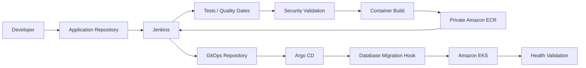

# Platform Launchpad — CI/CD and GitOps Delivery Design

## 1. Purpose

This document defines the Continuous Integration, artifact-delivery, GitOps,
and runtime reconciliation architecture for Platform Launchpad.

The delivery model separates build-time responsibilities from runtime
deployment authority.

The platform uses:

- GitHub for source control;
- Jenkins for Continuous Integration;
- Amazon ECR for private container storage;
- a dedicated GitOps repository for Kubernetes desired state;
- Argo CD for runtime reconciliation;
- Amazon EKS for Kubernetes workloads;
- Terraform for AWS infrastructure provisioning;
- Alembic migrations executed through Argo CD Sync hooks.

The central delivery principle is:

```text
Jenkins builds and publishes.
Git defines desired state.
Argo CD deploys.
Terraform provisions infrastructure.
```

Jenkins does not directly own application deployment into Kubernetes.

---

## 2. Current Implementation Status

The Platform Launchpad AWS development environment has been deployed and
validated.

Implemented delivery capabilities include:

- application source maintained in GitHub;
- separate GitOps repository;
- private Amazon ECR application repository;
- private ECR repository for AWS Load Balancer Controller;
- private ECR repositories for Argo CD bootstrap dependencies;
- application deployments using immutable image digests;
- Argo CD installed in Amazon EKS;
- Argo CD Application for Platform Launchpad;
- Argo CD Application for AWS Load Balancer Controller;
- database migrations executed as an Argo CD Sync hook;
- GitOps-managed ingress;
- GitOps-managed runtime ServiceAccounts;
- GitOps-managed Secrets Store CSI configuration;
- GitOps-managed application workloads;
- HTTPS ingress through AWS ALB and ACM;
- end-to-end deployment-request processing;
- validated Argo CD `Synced` and `Healthy` state;
- Terraform zero-drift validation;
- reproducible Argo CD bootstrap;
- reproducible GitOps Application bootstrap.

Current Argo CD Applications:

```text
platform-launchpad-development
aws-load-balancer-controller-development
```

Both have been validated as:

```text
Synced
Healthy
```

---

## 3. Delivery Objectives

The CI/CD platform is designed to:

- validate proposed source-code changes;
- prevent untested code from being promoted;
- build reproducible container images;
- scan source code, dependencies, and images;
- publish private immutable artifacts;
- preserve source-to-runtime traceability;
- separate CI from runtime CD;
- make Git the desired-state authority;
- prevent Jenkins from requiring unrestricted cluster deployment access;
- support Git-based rollback;
- expose clear failure states;
- protect credentials;
- support approval gates where appropriate;
- keep infrastructure and application delivery workflows separate;
- support environment teardown and rebuild;
- make the platform suitable for interview demonstrations.

---

## 4. Core Delivery Principles

### 4.1 Build Once, Promote the Same Artifact

A container artifact should be built once and promoted without rebuilding.

The same approved image digest can move through:

```text
Development
    |
    v
Staging
    |
    v
Production
```

A different environment should not receive a different binary built from the
same source commit.

---

### 4.2 Git Is the Runtime Source of Truth

The GitOps repository defines Kubernetes desired state.

Normal runtime changes should not be performed manually with:

```text
kubectl edit
kubectl set image
kubectl patch
```

unless required for emergency recovery.

Any emergency change must subsequently be reconciled back into Git.

---

### 4.3 Jenkins and Argo CD Have Different Authorities

Jenkins owns:

- checkout;
- tests;
- linting;
- static analysis;
- security scanning;
- image build;
- image publication;
- GitOps updates.

Argo CD owns:

- desired-state comparison;
- Kubernetes reconciliation;
- Sync hooks;
- rollout state;
- deployment health.

Jenkins does not require unrestricted `kubectl` deployment access.

---

### 4.4 Terraform Owns AWS Infrastructure

Terraform provisions the AWS foundation required by the runtime.

Examples include:

- VPC;
- EKS;
- IAM;
- Pod Identity;
- RDS;
- Redis;
- ECR;
- Secrets Manager;
- VPC endpoints;
- NAT;
- security groups.

Terraform does not normally deploy application Kubernetes workloads.

---

### 4.5 Artifacts Are Immutable

Human-readable image tags may exist, but the deployment trust anchor is the
image digest.

Example:

```text
201854077833.dkr.ecr.us-east-1.amazonaws.com/platform-launchpad-development-application@sha256:<digest>
```

GitOps manifests reference immutable image digests.

---

### 4.6 Security Checks Are Delivery Gates

Security checks are part of delivery, not an optional afterthought.

Relevant validation may include:

- dependency scanning;
- static analysis;
- secret scanning;
- container scanning;
- Terraform validation;
- Kubernetes manifest validation.

---

### 4.7 Every Release Is Traceable

A running application should be traceable back through:

```text
Runtime Pod
    |
    v
Image Digest
    |
    v
Amazon ECR
    |
    v
Jenkins Build
    |
    v
Source Commit
```

and through the desired-state path:

```text
Runtime Pod
    |
    v
Argo CD Application
    |
    v
GitOps Commit
    |
    v
Image Digest
```

---

### 4.8 Rollback Restores Known-Good Desired State

Rollback should restore previously approved desired state.

Typical rollback mechanisms include:

- Git revert;
- corrective GitOps commit;
- previous immutable image digest.

The preferred model is not manual cluster mutation.

---

## 5. High-Level Delivery Architecture



---

## 6. Repository Model

Platform Launchpad separates application source from runtime desired state.

### Application Repository

Repository:

```text
platform-launchpad
```

Contains:

- Next.js frontend;
- FastAPI backend;
- Python worker;
- tests;
- Dockerfiles;
- Jenkins configuration;
- Terraform;
- Argo CD bootstrap scripts;
- application documentation;
- architecture documentation.

The application repository is not the Kubernetes runtime source of truth after
artifact publication.

---

### GitOps Repository

Repository:

```text
platform-launchpad-gitops
```

Contains:

- Kubernetes base manifests;
- development overlay;
- runtime ServiceAccounts;
- backend configuration;
- frontend configuration;
- worker configuration;
- SecretProviderClass;
- Ingress;
- migration Job;
- Argo CD Application definitions;
- AWS Load Balancer Controller values;
- immutable application image digests.

Plaintext runtime secrets must not be committed.

---

## 7. Current GitOps Structure

Representative GitOps structure:

```text
platform-launchpad-gitops/
├── applications/
│   ├── development.yaml
│   └── aws-load-balancer-controller-development.yaml
├── base/
│   ├── backend/
│   ├── frontend/
│   ├── worker/
│   ├── migration/
│   ├── runtime/
│   ├── ingress.yaml
│   └── namespace.yaml
├── overlays/
│   └── development/
└── platform/
    └── aws-load-balancer-controller/
        └── development-values.yaml
```

The application deployment and the platform controller are represented as
separate Argo CD Applications.

---

## 8. Argo CD Applications

### Platform Launchpad

Application:

```text
platform-launchpad-development
```

Source:

```text
platform-launchpad-gitops
```

Path:

```text
overlays/development
```

Destination:

```text
namespace: platform-launchpad
```

---

### AWS Load Balancer Controller

Application:

```text
aws-load-balancer-controller-development
```

The Application uses:

- upstream AWS EKS Helm chart;
- GitOps-managed environment values;
- private ECR image location.

Destination:

```text
namespace: kube-system
```

---

## 9. Current Sync Policy

The current development Applications use manual synchronization rather than
automatic self-healing.

Sync options include:

```text
CreateNamespace=false
PruneLast=true
ApplyOutOfSyncOnly=true
```

This allows synchronization to be initiated deliberately while preserving
GitOps authority.

Future environments may enable:

```yaml
automated:
  prune: true
  selfHeal: true
```

after the operational model is intentionally reviewed.

---

## 10. Continuous Integration Architecture

Jenkins represents the Continuous Integration boundary.

The intended application pipeline performs:

1. checkout;
2. repository validation;
3. dependency installation;
4. formatting and linting;
5. unit tests;
6. API contract validation;
7. integration tests;
8. static analysis;
9. dependency scanning;
10. secret scanning;
11. container build;
12. image scanning;
13. ECR authentication;
14. image publication;
15. digest capture;
16. GitOps desired-state update;
17. deployment verification.

The exact stage implementation may evolve, but the CI/CD authority boundary
does not.

---

## 11. Pull Request Validation

Pull requests should run checks appropriate to the changed components.

Backend checks may include:

- formatting;
- linting;
- unit tests;
- API tests;
- authorization tests;
- dependency scanning.

Frontend checks may include:

- ESLint;
- TypeScript validation;
- component tests;
- build validation.

Infrastructure checks may include:

- `terraform fmt -check`;
- `terraform validate`;
- Terraform security scanning;
- policy checks.

GitOps checks may include:

- YAML validation;
- Kustomize rendering;
- Helm value validation;
- immutable image reference validation.

---

## 12. Repository Validation

CI should reject unsafe repository state.

Checks include:

- no tracked `.env`;
- no tracked `.tfstate`;
- no tracked `.terraform`;
- no credentials in source;
- expected manifests present;
- expected Dockerfiles present;
- required lock files present;
- API specification present;
- migration files consistent.

---

## 13. Dependency Installation

### Backend

Python dependencies should be installed from committed dependency definitions.

The pipeline should avoid silently updating dependencies during normal builds.

### Frontend

Node dependencies should use the committed lock file.

Preferred deterministic installation:

```bash
npm ci
```

instead of:

```bash
npm install
```

for CI execution.

---

## 14. Formatting and Linting

Backend validation may include:

- Ruff;
- Black check mode;
- import validation;
- type checking.

Frontend validation may include:

- ESLint;
- TypeScript compiler;
- Prettier check mode.

Formatting and lint failures should fail the pipeline.

---

## 15. Unit Testing

Backend tests cover concerns such as:

- authentication;
- authorization;
- environment ownership;
- environment lifecycle;
- deployment requests;
- validation;
- persistence behavior.

Worker tests should cover:

- polling logic;
- request selection;
- lifecycle transitions;
- retries;
- failure state;
- idempotency.

Frontend tests should cover:

- authentication UI;
- environment views;
- deployment forms;
- state rendering;
- role-aware behavior.

---

## 16. API Contract Validation

The repository includes an OpenAPI specification.

CI should validate:

```text
docs/api/openapi.yaml
```

and compare implementation behavior where appropriate.

Checks may include:

- parse validity;
- OpenAPI version;
- reference resolution;
- required routes;
- response schema compatibility.

Unexpected API drift should fail validation once contract enforcement is
enabled.

---

## 17. Integration Testing

Integration tests may provision local dependencies such as:

- PostgreSQL;
- backend;
- worker;
- frontend;
- Redis where a test specifically requires Redis behavior.

Important integration scenarios include:

- database migrations;
- registration;
- authentication;
- environment creation;
- deployment-request creation;
- worker processing;
- environment lifecycle changes;
- authorization failures.

The current production-style worker path uses database-backed polling rather
than Redis as its primary deployment-request queue.

---

## 18. Static Analysis

Static analysis may include:

- Python code analysis;
- TypeScript analysis;
- SonarQube;
- Terraform linting;
- Dockerfile analysis;
- Kubernetes manifest validation.

Quality gates should block critical issues where policy requires.

---

## 19. Dependency Security Scanning

Dependencies should be scanned before release.

Targets include:

- Python packages;
- Node packages;
- container dependencies;
- base images.

Critical vulnerabilities should block promotion unless a reviewed exception is
documented.

---

## 20. Secret Scanning

CI should detect exposed credentials such as:

- AWS access keys;
- GitHub tokens;
- passwords;
- private keys;
- database URLs;
- JWT signing secrets.

A confirmed secret finding should trigger:

1. pipeline failure;
2. credential revocation;
3. repository remediation;
4. security review.

---

## 21. Container Build Strategy

The application runtime includes:

- frontend;
- backend;
- worker.

The current AWS architecture uses a shared private application ECR repository:

```text
platform-launchpad-development-application
```

Application images are distinguished through the image content and published
artifact references used by GitOps.

Container requirements include:

- reproducible build inputs;
- explicit base-image versions;
- multi-stage builds where useful;
- no `.env`;
- no credentials;
- no Git metadata;
- minimized runtime packages;
- non-root execution;
- hardened Kubernetes runtime security context.

---

## 22. Container Security Scanning

Images should be scanned before promotion.

Policy may include:

```text
Critical -> block
High     -> remediate or approve explicitly
Medium   -> track
Low      -> track
```

Scan findings should be retained as pipeline evidence where practical.

---

## 23. Amazon ECR Authentication

Jenkins should authenticate to ECR through AWS role-based access.

The CI architecture uses dedicated Terraform-managed identities rather than
granting Jenkins unrestricted AWS permissions.

The trust model is:

```text
Jenkins Identity
      |
      v
Assume CI Delivery Role
      |
      v
Approved ECR Actions
```

Long-lived administrative AWS access keys should not be embedded in the
pipeline.

---

## 24. ECR Repository Model

### Application Repository

```text
platform-launchpad-development-application
```

Stores application artifacts used by:

- backend;
- frontend;
- worker.

### AWS Load Balancer Controller Repository

```text
platform-launchpad-development-aws-load-balancer-controller
```

Stores the mirrored controller image used by the Argo CD-managed Helm release.

### Argo CD Bootstrap Repositories

```text
platform-launchpad-development-argocd
platform-launchpad-development-argocd-dex
platform-launchpad-development-argocd-redis
```

These repositories support deterministic Argo CD bootstrap.

---

## 25. Immutable Image Delivery

The GitOps repository deploys application images by digest.

Example:

```yaml
images:
  - name: platform-launchpad-backend
    newName: 201854077833.dkr.ecr.us-east-1.amazonaws.com/platform-launchpad-development-application
    digest: sha256:<digest>
```

This makes the running artifact independent of tag mutation.

Human-readable tags remain useful for:

- debugging;
- build metadata;
- releases.

The digest remains the authoritative runtime identifier.

---

## 26. GitOps Update Strategy

Jenkins updates the appropriate environment overlay after publishing an
approved image.

A GitOps change should be:

- small;
- explicit;
- attributable;
- reviewable;
- reversible.

Example commit:

```text
deploy(dev): promote backend image digest
```

Useful commit metadata may include:

```text
Source repository
Source commit
Jenkins build
Image digest
Target environment
```

---

## 27. GitOps Reconciliation

Argo CD detects GitOps changes and compares desired state to cluster state.

```text
GitOps Commit
      |
      v
Argo CD
      |
      v
Diff
      |
      +---- no difference ---> Synced
      |
      +---- difference ------> Reconcile
```

Jenkins does not invoke direct application deployment commands as part of the
normal application release path.

---

## 28. Database Migration Delivery

Database schema evolution is integrated with Argo CD.

The GitOps repository defines a migration Job:

```text
database-migration
```

The Job runs:

```text
alembic upgrade head
```

as an Argo CD Sync hook.

This makes database migration part of the deployment lifecycle.

---

## 29. Migration Sync Ordering

The application currently uses sync waves.

Representative ordering:

```text
Wave -3
    Namespace

Wave -2
    ServiceAccounts
    SecretProviderClass

Wave -1
    Database migration Job

Wave 0
    Backend
    Frontend
    Worker
    Services
    Ingress
```

The migration Job must complete before the normal application synchronization
can be considered successful.

---

## 30. Migration Failure Behavior

If the migration Job fails:

- Argo CD reports hook failure;
- application synchronization does not complete successfully;
- failed migration state remains visible in Argo CD;
- investigation occurs before continuing promotion.

This is preferable to hiding schema changes inside application startup logic.

---

## 31. Argo CD Bootstrap Delivery

Argo CD itself cannot initially be installed by Argo CD.

Platform Launchpad therefore includes:

```text
bootstrap/argocd/
```

with:

```text
README.md
images.env
install.sh
rewrite_manifest.py
apply-applications.sh
```

---

## 32. Argo CD Bootstrap Flow

The bootstrap performs:

```text
Terraform Outputs
      |
      v
Validate AWS Identity
      |
      v
Update EKS Kubeconfig
      |
      v
Authenticate to ECR
      |
      v
Check Private Images
      |
      v
Mirror Missing Images
      |
      v
Download Pinned Argo CD Manifest
      |
      v
Rewrite Public Runtime Images
      |
      v
Validate Manifest
      |
      v
Install Argo CD
      |
      v
Validate CRDs / Pods
```

Pinned versions include:

```text
Argo CD  v3.5.2
Dex      v2.45.1
Redis    8.2.3-alpine
```

---

## 33. Private Bootstrap Supply Chain

Argo CD runtime images are mirrored into private ECR.

The bootstrap script validates that rewritten manifests do not retain runtime
references to:

```text
quay.io
ghcr.io
public.ecr.aws
```

for the mirrored Argo CD components.

This improves rebuild consistency and artifact control.

---

## 34. GitOps Application Bootstrap

After Argo CD exists, the following script registers initial Applications:

```bash
./bootstrap/argocd/apply-applications.sh
```

Applications:

```text
aws-load-balancer-controller-development
platform-launchpad-development
```

The script has been validated as idempotent.

When desired state already matches:

```text
unchanged
```

is expected.

---

## 35. Environment Promotion Model

The intended promotion path is:

```text
Development
    |
    v
Staging
    |
    v
Production
```

The current deployed AWS implementation is:

```text
development
```

Staging and production remain future environment expansions.

The design principle remains build-once/promote-the-same-digest.

---

## 36. Development Promotion

Development may be updated after successful integration validation.

The desired-state change updates:

```text
overlays/development
```

and is reconciled by:

```text
platform-launchpad-development
```

---

## 37. Staging Promotion

A future staging environment should receive the same immutable image digest
validated in development.

Typical gates may include:

- integration tests;
- security scans;
- development health;
- migration compatibility;
- release candidate approval.

---

## 38. Production Promotion

A future production environment should require stronger controls.

Potential gates include:

- manual approval;
- production change review;
- rollback target confirmation;
- backup verification;
- security scan approval;
- migration review.

The same image digest should be promoted rather than rebuilt.

---

## 39. Approval Gates

Manual approval is appropriate for higher-risk operations such as:

- production Terraform apply;
- production GitOps promotion;
- destructive migrations;
- security exceptions;
- emergency rollback.

Approval context should include:

- source commit;
- image digest;
- test results;
- scan results;
- Terraform plan where applicable;
- migration impact;
- rollback target.

---

## 40. Rollback Strategy

### Application Rollback

Typical rollback:

1. identify known-good image digest;
2. revert the GitOps commit or create a corrective commit;
3. Argo CD reconciles the previous desired state;
4. verify application health;
5. verify database compatibility;
6. record the rollback.

---

### Database Rollback

Database rollback is handled separately.

Application rollback must not assume every migration is safely reversible.

Preferred migration practices include:

- backward-compatible schema changes;
- expand/contract patterns;
- pre-deployment backup where required;
- explicit destructive migration approval.

---

### Infrastructure Rollback

Infrastructure correction uses Terraform.

Typical process:

```text
Review failure
    |
    v
Correct Terraform
    |
    v
terraform plan
    |
    v
Review
    |
    v
terraform apply
```

Direct rollback of infrastructure state without understanding the dependency
impact should be avoided.

---

## 41. Failure Handling

### Test Failure

- stop pipeline;
- do not publish release artifact;
- report failing stage.

### Security Scan Failure

- stop pipeline;
- retain findings;
- do not update GitOps.

### Container Build Failure

- stop pipeline;
- publish nothing;
- preserve logs.

### ECR Push Failure

- stop pipeline;
- do not update GitOps to a missing artifact.

### GitOps Update Failure

- application artifact may remain safely in ECR;
- runtime desired state remains unchanged;
- pipeline reports failure.

### Argo CD Sync Failure

- inspect Argo CD resources;
- inspect hook status;
- inspect Kubernetes events;
- inspect pod logs;
- correct GitOps state;
- revert where appropriate.

### Migration Failure

- do not treat deployment as successful;
- inspect migration Job;
- correct migration;
- re-run controlled synchronization.

---

## 42. Post-Deployment Verification

Deployment validation should include:

```bash
kubectl get applications -n argocd
```

Expected:

```text
Synced
Healthy
```

Application workloads:

```bash
kubectl get pods -n platform-launchpad
```

Public frontend:

```bash
curl -I https://launchpad.christineadelusi.com/
```

Backend readiness:

```bash
curl -sS \
  https://launchpad.christineadelusi.com/health/ready
```

Expected readiness:

```json
{
  "status": "ready",
  "checks": {
    "database": "ok"
  }
}
```

---

## 43. End-to-End Functional Validation

The deployed development environment has been validated through a complete
application workflow.

Validated behavior includes:

- frontend available over HTTPS;
- user authentication;
- environment creation;
- deployment-request submission;
- API returning `202 Accepted`;
- worker discovering queued requests;
- worker processing requests;
- deployment requests reaching `succeeded`;
- backend remaining healthy;
- database remaining reachable;
- Argo CD remaining `Synced` and `Healthy`.

This provides functional evidence beyond infrastructure-only validation.

---

## 44. Jenkins AWS Permissions

Jenkins AWS access should be scoped to delivery requirements.

Allowed capabilities may include:

- ECR authentication;
- image upload;
- image metadata inspection;
- controlled role assumption.

Jenkins should not receive permissions for unrelated infrastructure.

Terraform uses a separate provisioning authority.

---

## 45. CI Credential Handling

Pipeline secrets may include:

- AWS role-assumption credentials or identity context;
- GitHub credentials;
- GitOps repository credential;
- scanning-service credentials;
- notification credentials.

Requirements:

- Jenkins credential management;
- stage-scoped injection;
- no credentials in Jenkinsfiles;
- no secrets in logs;
- shell tracing disabled around sensitive operations where required;
- credentials rotated when compromised.

---

## 46. GitHub Security Controls

Recommended repository controls include:

- protected `main`;
- required pull requests;
- required CI checks;
- review requirements;
- restricted force push;
- secret scanning;
- dependency alerts.

Sensitive delivery changes should receive explicit review.

Examples:

- Jenkinsfile changes;
- Terraform changes;
- IAM changes;
- GitOps changes;
- Argo CD configuration;
- secret-delivery changes.

---

## 47. Branching Strategy

A practical branching model may include:

```text
main
feature/*
bugfix/*
hotfix/*
release/*
```

A separate `develop` branch may be used if release management requires it.

The current repository workflow may remain simpler where a smaller portfolio
team does not benefit from maintaining unnecessary long-lived branches.

Branching complexity should match actual collaboration needs.

---

## 48. Pipeline Concurrency

Concurrent delivery operations require control.

Risks include:

- simultaneous GitOps updates;
- multiple releases modifying the same overlay;
- concurrent Terraform applies;
- duplicate image publication.

Controls may include:

- Jenkins pipeline locking;
- branch protection;
- Terraform remote-state locking;
- serialized environment promotion;
- pull-request-based GitOps changes.

---

## 49. Pipeline Artifacts

Useful retained pipeline evidence may include:

- test reports;
- coverage reports;
- dependency scans;
- container scans;
- static-analysis reports;
- Terraform plans;
- release metadata;
- image digest manifests.

Artifacts must not contain secrets.

---

## 50. Release Metadata

A release record may include:

```json
{
  "source_commit": "abcdef1",
  "jenkins_build": 142,
  "frontend_digest": "sha256:...",
  "backend_digest": "sha256:...",
  "worker_digest": "sha256:...",
  "gitops_commit": "1234567",
  "environment": "development"
}
```

This metadata can support:

- release notes;
- incident investigation;
- rollback;
- auditability.

---

## 51. Notifications

CI/CD notifications may include:

- pipeline result;
- branch;
- source commit;
- Jenkins build;
- failed stage;
- image digest;
- GitOps commit;
- Argo CD health;
- target environment.

Notification payloads must avoid secrets.

Slack is an appropriate initial notification channel.

---

## 52. Deployment Metrics

Useful pipeline and delivery metrics include:

- pipeline success rate;
- pipeline failure rate;
- average pipeline duration;
- build frequency;
- deployment frequency;
- deployment success rate;
- rollback count;
- failed migration count;
- Argo CD sync failures;
- mean recovery time.

These metrics support future DORA-style delivery analysis.

---

## 53. Infrastructure Pipeline

Terraform delivery is separated from application delivery.

Typical infrastructure pipeline:

```text
Checkout
   |
   v
terraform fmt -check
   |
   v
terraform init
   |
   v
terraform validate
   |
   v
Security Validation
   |
   v
terraform plan
   |
   v
Approval
   |
   v
terraform apply
```

A final:

```bash
terraform plan
```

can be used to confirm zero drift after application.

---

## 54. Terraform Plan Safety

For higher-risk infrastructure changes:

```bash
terraform plan \
  -out=platform.tfplan
```

The saved plan should be reviewed before:

```bash
terraform apply platform.tfplan
```

Unexpected:

```text
replace
destroy
```

actions should stop automated application until reviewed.

---

## 55. Terraform Import and Adoption

Pre-existing infrastructure should not remain permanently unmanaged.

Platform Launchpad has used:

```text
terraform import
```

to bring existing Argo CD ECR repositories under Terraform ownership.

The adoption workflow is:

```text
Existing Resource
    |
    v
Declare in Terraform
    |
    v
Import
    |
    v
Plan
    |
    v
Reconcile
    |
    v
Zero Drift
```

---

## 56. Argo CD and Terraform Ownership Boundary

Terraform and Argo CD intentionally manage different resource classes.

Terraform manages:

```text
AWS infrastructure
IAM
EKS
RDS
Redis
ECR
Networking
Secrets Manager
VPC Endpoints
```

Argo CD manages:

```text
Deployments
Services
Ingress
Migration Jobs
ServiceAccounts
SecretProviderClass
AWS Load Balancer Controller runtime
```

Avoiding shared ownership prevents reconciliation conflicts.

---

## 57. Secrets in GitOps

The GitOps repository must not contain plaintext runtime secret values.

Instead:

```text
AWS Secrets Manager
        |
        v
Secrets Store CSI Driver
        |
        v
SecretProviderClass
        |
        v
Workload Files
```

GitOps stores secret references and configuration, not secret values.

---

## 58. Runtime Workload Identity

AWS access from Kubernetes uses EKS Pod Identity.

Workloads such as:

```text
backend
worker
aws-load-balancer-controller
```

receive dedicated AWS permissions without embedded static access keys.

This keeps runtime identity separate from Jenkins and Terraform credentials.

---

## 59. Security Context in Delivery

GitOps manifests enforce workload security settings.

Examples include:

```yaml
securityContext:
  allowPrivilegeEscalation: false
  readOnlyRootFilesystem: true
  runAsNonRoot: true
  capabilities:
    drop:
      - ALL
```

Container security is therefore part of desired state and code review.

---

## 60. Ingress Delivery

Ingress is managed through GitOps.

The development application exposes:

```text
launchpad.christineadelusi.com
```

routing:

```text
/               -> frontend
/api            -> backend
/docs           -> backend
/redoc          -> backend
/openapi.json   -> backend
/health         -> backend
```

The Ingress includes AWS Load Balancer Controller annotations for:

- internet-facing ALB;
- IP target type;
- HTTP listener;
- HTTPS listener;
- ACM certificate;
- HTTP-to-HTTPS redirect.

---

## 61. TLS Delivery Boundary

ACM certificate resources exist outside the GitOps repository.

GitOps references the approved certificate through the Ingress configuration.

The delivery model therefore distinguishes:

```text
Certificate lifecycle
    |
    v
AWS / external infrastructure ownership

Ingress certificate reference
    |
    v
GitOps ownership
```

---

## 62. DNS Delivery Boundary

Route 53 DNS exists in a separate AWS development account.

The DNS record points the public hostname to the runtime ALB.

DNS is therefore an external integration dependency rather than a normal
application deployment artifact.

A production CI/CD pipeline should not receive permission to modify unrelated
shared DNS zones unless explicitly required.

---

## 63. Argo CD Administrative Access

Argo CD administrative access is operational, not application-facing.

During development, access may be performed through:

```bash
kubectl port-forward \
  svc/argocd-server \
  -n argocd \
  8080:443
```

This avoids requiring a separate public Argo CD endpoint for routine
development administration.

A longer-lived production environment should consider SSO and a dedicated
access model.

---

## 64. Delivery Recovery

The platform recovery sequence is:

```text
Terraform Apply
      |
      v
AWS Foundation
      |
      v
Argo CD Bootstrap
      |
      v
GitOps Application Bootstrap
      |
      v
Argo CD Reconciliation
      |
      v
Database Migration
      |
      v
Application Runtime
```

Representative commands:

```bash
terraform apply
```

then:

```bash
./bootstrap/argocd/install.sh
./bootstrap/argocd/apply-applications.sh
```

---

## 65. Cost-Aware Delivery

The development environment is intentionally temporary.

CI/CD design therefore assumes the environment may be unavailable between
demonstrations.

Delivery configuration must survive environment destruction.

Persistent delivery assets include:

- source repository;
- GitOps repository;
- Terraform;
- Jenkins configuration;
- private ECR artifacts where retained;
- bootstrap automation;
- documentation.

This makes reproducible delivery part of cost management.

---

## 66. Teardown Considerations

Before destroying the AWS development environment:

- confirm source changes are pushed;
- confirm GitOps changes are pushed;
- capture screenshots;
- capture Argo CD health evidence;
- capture Terraform zero-drift evidence;
- decide which ECR artifacts must remain;
- decide database snapshot requirements;
- verify Route 53 ownership;
- verify ACM ownership;
- review Terraform destroy plan.

After destroy:

- check for orphaned ALBs;
- check NAT Gateway removal;
- check EKS removal;
- check worker-node removal;
- check RDS/Redis status;
- check VPC endpoints;
- check unnecessary ECR storage.

---

## 67. Implemented vs Planned Delivery Features

### Implemented and Validated

```text
GitHub source control
Application repository
Separate GitOps repository
Private ECR application repository
Private controller ECR
Private Argo CD bootstrap ECR
Immutable image digests
Argo CD
GitOps application reconciliation
AWS Load Balancer Controller via Argo CD
Database migration Sync hook
Kustomize development overlay
Secrets Store CSI configuration
HTTPS ingress
Terraform infrastructure
Argo CD bootstrap
GitOps Application bootstrap
End-to-end worker processing
Terraform zero-drift validation
```

### Designed / Future

```text
Full automated PR Jenkins pipeline
Full automated release pipeline
Staging environment promotion
Production environment promotion
Automated rollback
Image signing
SBOM generation
Provenance attestations
Admission-time signature verification
Automated release metadata publication
DORA metric dashboards
```

Future features should not be presented as currently deployed until they are
implemented and validated.

---

## 68. CI/CD Architecture Evolution

The delivery architecture evolved during implementation.

### Original Design

The initial design assumed:

- separate ECR repositories for frontend, backend, and worker;
- multiple long-lived environments;
- broader automated pipeline coverage;
- Redis-backed worker queue;
- Argo CD as a future milestone.

### Current Implementation

The current development environment uses:

- one primary application ECR repository;
- immutable image digests;
- database-backed worker polling;
- deployed Amazon EKS;
- deployed Argo CD;
- GitOps-managed application workloads;
- GitOps-managed AWS Load Balancer Controller;
- Argo CD migration hooks;
- private Argo CD runtime images;
- reproducible platform bootstrap.

The delivery principles remain the same even where implementation details
evolved.

---

## 69. Senior Platform Engineering Principles Demonstrated

This CI/CD architecture demonstrates:

- separation of CI and CD;
- pull-based GitOps;
- immutable artifact promotion;
- private artifact storage;
- declarative runtime state;
- infrastructure/runtime ownership separation;
- controlled database migrations;
- workload identity;
- secure secret delivery;
- reproducible cluster bootstrap;
- Git-based rollback;
- delivery traceability;
- failure visibility;
- cost-aware environment lifecycle;
- drift detection;
- platform recovery automation.

---

## 70. Summary

Platform Launchpad uses a deliberate delivery boundary:

```text
Application Source
      |
      v
Jenkins CI
      |
      +---- Test
      +---- Scan
      +---- Build
      |
      v
Private Amazon ECR
      |
      v
Immutable Image Digest
      |
      v
GitOps Repository
      |
      v
Argo CD
      |
      +---- Database Migration Hook
      |
      v
Amazon EKS
```

Terraform owns AWS infrastructure.

Jenkins owns continuous integration and artifact publication.

Git owns Kubernetes desired state.

Argo CD owns runtime reconciliation.

ECR owns immutable container artifacts.

The resulting model avoids granting the CI system direct deployment authority
over application workloads and provides a clear, auditable, recoverable
software delivery path.