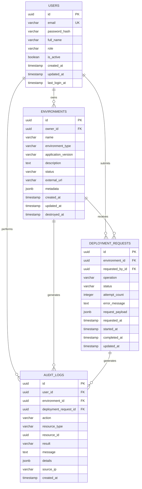
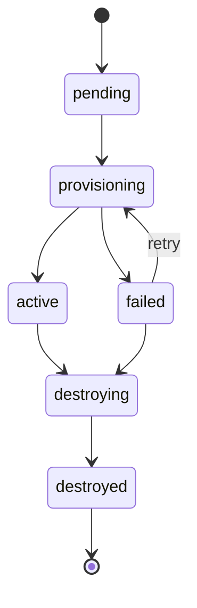
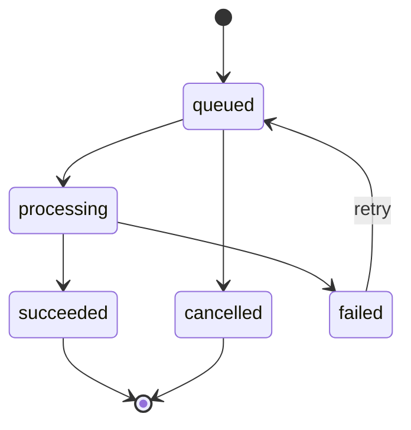

# Platform Launchpad - Database Design

## 1. Purpose

This document defines the initial relational database design for Platform Launchpad.

PostgreSQL serves as the system of record for:

- Users
- Environments
- Deployment requests
- Audit events

The database model supports:

- Multi-user authentication
- Role-based access control
- Environment ownership
- Environment lifecycle tracking
- Asynchronous deployment workflows
- Historical auditability
- Future platform integrations

---

## 2. Design Principles

The database design follows these principles:

- Use UUIDs for externally exposed resource identifiers.
- Maintain referential integrity through foreign keys.
- Preserve historical environment records instead of immediately deleting them.
- Store timestamps in UTC.
- Use explicit lifecycle states.
- Prevent duplicate user email addresses.
- Prevent duplicate active environment names per user.
- Separate environment state from deployment-operation state.
- Record security-sensitive and lifecycle-changing actions in audit logs.
- Avoid storing secrets or plaintext passwords.

---

## 3. Core Entities

The initial schema contains four primary tables:

1. `users`
2. `environments`
3. `deployment_requests`
4. `audit_logs`

---

# 4. Entity Relationship Diagram



---

# 5. Table Definitions

## 5.1 Users

The `users` table stores application identities.

### Table Name

```text
users
```

### Columns

| Column | Type | Nullable | Default | Description |
|---|---|---:|---|---|
| `id` | UUID | No | Generated UUID | Primary identifier |
| `email` | VARCHAR(320) | No | None | Unique normalized email address |
| `password_hash` | VARCHAR(255) | No | None | Password hash only |
| `full_name` | VARCHAR(150) | No | None | User display name |
| `role` | VARCHAR(20) | No | `user` | Application role |
| `is_active` | BOOLEAN | No | `true` | Whether login is permitted |
| `created_at` | TIMESTAMPTZ | No | Current UTC time | Creation timestamp |
| `updated_at` | TIMESTAMPTZ | No | Current UTC time | Last update timestamp |
| `last_login_at` | TIMESTAMPTZ | Yes | `null` | Most recent successful login |

### Allowed Roles

- `user`
- `admin`

### Constraints

- `id` is the primary key.
- `email` must be unique.
- `email` must be stored in lowercase.
- `role` must be one of the supported role values.
- `password_hash` must never contain a plaintext password.

### Indexes

- Unique index on `email`
- Index on `role`
- Index on `is_active`

---

## 5.2 Environments

The `environments` table represents developer-requested application environments.

### Table Name

```text
environments
```

### Columns

| Column | Type | Nullable | Default | Description |
|---|---|---:|---|---|
| `id` | UUID | No | Generated UUID | Primary identifier |
| `owner_id` | UUID | No | None | User who owns the environment |
| `name` | VARCHAR(100) | No | None | User-defined environment name |
| `environment_type` | VARCHAR(20) | No | None | Environment classification |
| `application_version` | VARCHAR(100) | No | None | Requested application version |
| `description` | TEXT | Yes | `null` | Optional description |
| `status` | VARCHAR(20) | No | `pending` | Current lifecycle state |
| `external_url` | VARCHAR(2048) | Yes | `null` | Assigned application URL |
| `metadata` | JSONB | No | `{}` | Extensible platform metadata |
| `created_at` | TIMESTAMPTZ | No | Current UTC time | Creation timestamp |
| `updated_at` | TIMESTAMPTZ | No | Current UTC time | Last update timestamp |
| `destroyed_at` | TIMESTAMPTZ | Yes | `null` | Destruction completion time |

### Allowed Environment Types

- `development`
- `staging`
- `demo`

A future release may add:

- `production`
- `preview`
- `sandbox`

### Allowed Status Values

- `pending`
- `provisioning`
- `active`
- `failed`
- `destroying`
- `destroyed`

### Constraints

- `owner_id` references `users.id`.
- Environment names must be unique per owner while the environment is not destroyed.
- A destroyed environment may retain its historical name.
- `destroyed_at` should only be populated when the status is `destroyed`.
- `external_url` should normally be populated only for active environments.

### Indexes

- Index on `owner_id`
- Index on `status`
- Index on `environment_type`
- Composite index on `owner_id, status`
- Composite index on `owner_id, name`

---

## 5.3 Deployment Requests

The `deployment_requests` table tracks asynchronous environment lifecycle operations.

A deployment request is not the environment itself. It represents an operation performed against an environment.

Examples:

- Provision an environment
- Destroy an environment
- Retry a failed provision
- Upgrade an application version

### Table Name

```text
deployment_requests
```

### Columns

| Column | Type | Nullable | Default | Description |
|---|---|---:|---|---|
| `id` | UUID | No | Generated UUID | Primary identifier |
| `environment_id` | UUID | No | None | Target environment |
| `requested_by_id` | UUID | No | None | User who initiated the operation |
| `operation` | VARCHAR(30) | No | None | Requested lifecycle operation |
| `status` | VARCHAR(20) | No | `queued` | Operation status |
| `attempt_count` | INTEGER | No | `0` | Number of processing attempts |
| `error_message` | TEXT | Yes | `null` | Sanitized failure message |
| `request_payload` | JSONB | No | `{}` | Operation-specific inputs |
| `requested_at` | TIMESTAMPTZ | No | Current UTC time | Request creation time |
| `started_at` | TIMESTAMPTZ | Yes | `null` | Processing start time |
| `completed_at` | TIMESTAMPTZ | Yes | `null` | Processing completion time |
| `updated_at` | TIMESTAMPTZ | No | Current UTC time | Last update time |

### Allowed Operations

- `provision`
- `destroy`
- `retry`
- `upgrade`

For the MVP, the implemented operations will initially be:

- `provision`
- `destroy`

### Allowed Request Status Values

- `queued`
- `processing`
- `succeeded`
- `failed`
- `cancelled`

### Constraints

- `environment_id` references `environments.id`.
- `requested_by_id` references `users.id`.
- `attempt_count` cannot be negative.
- `completed_at` should be populated for terminal states.
- `error_message` should only be populated for failed requests.
- Only one active lifecycle-changing request should normally exist for an environment at a time.

### Indexes

- Index on `environment_id`
- Index on `requested_by_id`
- Index on `status`
- Index on `operation`
- Index on `requested_at`
- Composite index on `environment_id, status`

---

## 5.4 Audit Logs

The `audit_logs` table stores immutable security and operational events.

Audit records should be appended, not updated through standard application workflows.

### Table Name

```text
audit_logs
```

### Columns

| Column | Type | Nullable | Default | Description |
|---|---|---:|---|---|
| `id` | UUID | No | Generated UUID | Primary identifier |
| `user_id` | UUID | Yes | `null` | Acting user, when known |
| `environment_id` | UUID | Yes | `null` | Related environment |
| `deployment_request_id` | UUID | Yes | `null` | Related deployment request |
| `action` | VARCHAR(100) | No | None | Event action |
| `resource_type` | VARCHAR(50) | No | None | Resource category |
| `resource_id` | UUID | Yes | `null` | Generic resource identifier |
| `result` | VARCHAR(20) | No | `success` | Action result |
| `message` | TEXT | Yes | `null` | Human-readable summary |
| `details` | JSONB | No | `{}` | Additional structured context |
| `source_ip` | VARCHAR(45) | Yes | `null` | IPv4 or IPv6 source address |
| `created_at` | TIMESTAMPTZ | No | Current UTC time | Event timestamp |

### Example Actions

- `user.registered`
- `user.login_succeeded`
- `user.login_failed`
- `environment.created`
- `environment.provision_started`
- `environment.provision_succeeded`
- `environment.provision_failed`
- `environment.destroy_requested`
- `environment.destroyed`
- `environment.status_changed`
- `admin.user_disabled`

### Allowed Result Values

- `success`
- `failure`
- `denied`

### Constraints

- At least one meaningful resource reference should be present where applicable.
- Sensitive values must not be stored in `details`.
- Passwords, JWTs, secrets, credentials, and connection strings must never appear in audit records.
- Audit records should not be deleted through normal application endpoints.

### Indexes

- Index on `user_id`
- Index on `environment_id`
- Index on `deployment_request_id`
- Index on `action`
- Index on `resource_type`
- Index on `result`
- Index on `created_at`

---

# 6. Relationships

## User to Environment

```text
users 1 ────< environments
```

- One user can own many environments.
- One environment has exactly one owner.

Deletion strategy:

- Users with environment history should normally be deactivated rather than physically deleted.
- The MVP will not expose hard deletion of users.

---

## Environment to Deployment Request

```text
environments 1 ────< deployment_requests
```

- One environment can have many lifecycle operations.
- Each deployment request belongs to exactly one environment.

This creates a complete operational history.

---

## User to Deployment Request

```text
users 1 ────< deployment_requests
```

- One user can initiate many requests.
- Each request records the initiating user.

The requester may be:

- The environment owner
- An administrator
- A future service identity

---

## Audit Relationships

Audit logs may reference:

- A user
- An environment
- A deployment request
- A generic resource identifier

These relationships are optional because certain events may occur before a user or resource can be resolved.

An example is a failed login attempt for an unknown email address.

---

# 7. Lifecycle State Transitions

## Environment State Machine



### Valid Transitions

| Current State | Allowed Next State |
|---|---|
| `pending` | `provisioning`, `failed`, `destroying` |
| `provisioning` | `active`, `failed` |
| `active` | `destroying`, `failed` |
| `failed` | `provisioning`, `destroying` |
| `destroying` | `destroyed`, `failed` |
| `destroyed` | None |

Invalid transitions must be rejected by the service layer.

---

## Deployment Request State Machine



---

# 8. Deletion Strategy

Platform Launchpad will use lifecycle-based logical deletion for environments.

When a user destroys an environment:

1. The environment status becomes `destroying`.
2. A destruction request is created.
3. The worker performs cleanup.
4. The environment status becomes `destroyed`.
5. `destroyed_at` is populated.
6. The record remains available for audit and reporting.

The MVP will not immediately remove destroyed environment records.

A future retention policy may archive or purge old records after a defined period.

---

# 9. Concurrency and Consistency

The service layer must protect against concurrent lifecycle operations.

Examples of invalid concurrent actions:

- Two provision requests for the same environment
- A destroy request while provisioning is already processing
- Two workers processing the same deployment request
- Status updates based on stale data

Planned controls include:

- Database transactions
- Row-level locking where appropriate
- Idempotency checks
- Unique constraints or partial indexes
- Worker task identifiers
- Optimistic concurrency where needed

---

# 10. UUID Strategy

All primary keys will use UUIDs.

Benefits:

- Resources are safer to expose through APIs.
- Identifiers are not easily enumerable.
- Records can be created across distributed components.
- IDs remain portable across environments.

The initial implementation will use UUID version 4 unless a later decision adopts UUID version 7.

---

# 11. Timestamp Strategy

All application timestamps will:

- Use timezone-aware PostgreSQL timestamps
- Be stored in UTC
- Be serialized through the API using ISO 8601
- Be converted to the user's display timezone only in the frontend

Example:

```text
2026-07-10T14:30:00Z
```

---

# 12. JSONB Usage

JSONB is used only for extensible metadata and operation-specific context.

Examples of environment metadata:

```json
{
  "namespace": "launchpad-demo-42",
  "region": "us-east-1",
  "cluster": "platform-launchpad-eks",
  "gitops_path": "environments/demo-42"
}
```

Examples of deployment request payload:

```json
{
  "requested_version": "1.4.2",
  "environment_type": "demo",
  "replica_count": 1
}
```

Core queryable attributes should remain normal relational columns.

JSONB must not become a substitute for deliberate schema design.

---

# 13. Data Retention

Initial retention rules:

| Data Type | Initial Retention |
|---|---|
| Active users | Indefinite |
| Disabled users | Indefinite for MVP |
| Active environments | Indefinite |
| Destroyed environments | Indefinite for MVP |
| Deployment requests | Indefinite for MVP |
| Audit logs | Indefinite for MVP |

A future production version may implement:

- Audit-log retention policies
- Record archival
- Storage lifecycle management
- Compliance-specific retention periods

---

# 14. Security Requirements

The database layer must enforce the following:

- Passwords are stored only as strong hashes.
- Email addresses are normalized before storage.
- Database credentials are supplied through secrets.
- Application services use least-privilege database accounts.
- Database errors returned to clients are sanitized.
- SQLAlchemy parameterization prevents SQL injection.
- Audit logs exclude sensitive values.
- Production database traffic uses encrypted connections.
- RDS is not publicly accessible.
- Backups are encrypted.
- Database access is restricted through security groups.

---

# 15. Migration Strategy

Alembic will manage database schema changes.

Rules:

- Every schema change requires an Alembic migration.
- Migration files are committed to Git.
- Migrations are reviewed before deployment.
- Production migrations must be backward-compatible where practical.
- Destructive migrations require explicit approval and backups.
- Application startup should not silently create or alter production tables.
- Rollback instructions should accompany high-risk migrations.

Initial migration order:

1. Create PostgreSQL extension support if needed.
2. Create `users`.
3. Create `environments`.
4. Create `deployment_requests`.
5. Create `audit_logs`.
6. Create indexes and constraints.

---

# 16. Seed Data

Development environments may include seed data for:

- One admin account
- One regular user account
- Sample environments
- Sample deployment requests
- Sample audit events

Seed data must not include real credentials or production secrets.

Production deployments must not use default passwords.

---

# 17. Future Entities

The following entities are outside the initial MVP but may be added later:

- `teams`
- `team_memberships`
- `applications`
- `environment_templates`
- `approval_requests`
- `policies`
- `notifications`
- `api_tokens`
- `service_accounts`
- `cost_records`
- `quotas`
- `webhooks`

These future entities are not required for the first release.

---

# 18. MVP Database Acceptance Criteria

The database design is ready for implementation when:

- All four MVP tables are documented.
- Relationships are defined.
- Lifecycle states are defined.
- Primary and foreign keys are identified.
- Required constraints are documented.
- Required indexes are documented.
- Deletion behavior is documented.
- Security and retention expectations are documented.
- The ERD renders successfully in GitHub.
- The schema can be mapped directly to SQLAlchemy models and Alembic migrations.