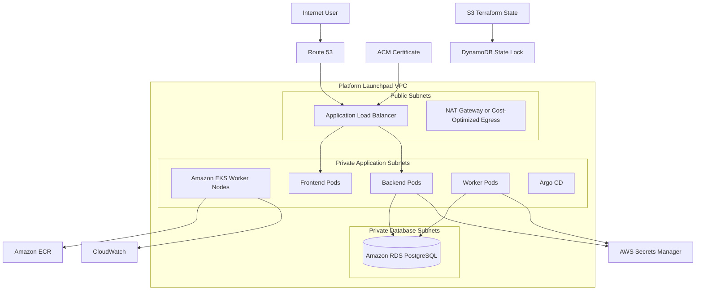

# Platform Launchpad — Terraform and AWS Infrastructure Design

## 1. Purpose

This document defines the Terraform and AWS infrastructure architecture for Platform Launchpad.

The production-style portfolio deployment will use Terraform to provision and manage:

- Terraform remote state
- Amazon VPC
- Public and private subnets
- Route tables and network boundaries
- Security groups
- Amazon ECR
- Amazon EKS
- Amazon RDS for PostgreSQL
- AWS Secrets Manager
- Application Load Balancer integration
- Route 53
- ACM certificates
- IAM roles and policies
- CloudWatch integration
- Cost-control resources

The design supports reproducibility, controlled deployment, teardown, and interview demonstration.

---

## 2. Infrastructure Objectives

The infrastructure must:

- Be fully reproducible through Terraform.
- Separate application workloads from public network exposure.
- Keep PostgreSQL private.
- use least-privilege IAM roles.
- Support GitOps deployment through Argo CD.
- Support secure container publication through Amazon ECR.
- Support TLS and custom DNS.
- Store Terraform state remotely.
- Support environment-specific configuration.
- Allow safe teardown to control cost.
- Avoid undocumented manual console changes.
- Preserve required state and database backups when appropriate.
- Produce outputs needed by Jenkins, Argo CD, and application configuration.

---

## 3. Infrastructure Principles

### 3.1 Infrastructure as Code Is Authoritative

AWS resources must be created and changed through Terraform.

Manual console changes are considered drift and should either:

- Be imported into Terraform, or
- Be reverted.

### 3.2 Remote State Is Required

Terraform state must not be stored only on a developer workstation.

The platform will use:

- Amazon S3 for remote state
- DynamoDB for state locking
- Encryption at rest
- Versioning
- Restricted IAM access

### 3.3 Environment Isolation

Development, staging, and production-style environments must use separate state files.

Environment isolation may use:

- Separate backend keys
- Separate AWS accounts in a future design
- Separate clusters or namespaces depending on cost constraints

### 3.4 Private Data Services

RDS must not be publicly accessible.

Application workloads access PostgreSQL through private networking.

### 3.5 Public Access Terminates at the Load Balancer

The Application Load Balancer is the primary public entry point.

EKS worker nodes and RDS remain in private subnets.

### 3.6 Least-Privilege IAM

Terraform, Jenkins, Kubernetes controllers, and application workloads use distinct IAM roles.

### 3.7 Cost Is a Design Constraint

The complete AWS environment may be created only for demos and interviews.

Teardown must be documented and tested.

---

## 4. High-Level AWS Architecture



---

## 5. AWS Region

The initial deployment region is:

```text
us-east-1
```

Reasons:

- Existing portfolio resources already use this region.
- Existing Route 53 and ACM workflows align with this region.
- Existing Jenkins and ECR experience is centered in this region.
- It simplifies integration with the user's current AWS portfolio.

The region must remain configurable through Terraform variables.

---

## 6. Terraform Repository Structure

The initial project may retain Terraform inside the monorepo.

Recommended structure:

```text
terraform/
├── bootstrap/
│   ├── main.tf
│   ├── variables.tf
│   ├── outputs.tf
│   ├── providers.tf
│   └── versions.tf
│
├── modules/
│   ├── networking/
│   ├── security-groups/
│   ├── ecr/
│   ├── eks/
│   ├── rds/
│   ├── iam/
│   ├── secrets/
│   ├── dns/
│   ├── certificates/
│   ├── observability/
│   └── budgets/
│
├── environments/
│   ├── development/
│   ├── staging/
│   └── production/
│
├── policies/
├── scripts/
└── README.md
```

A future repository split may move infrastructure into:

```text
platform-launchpad-infrastructure
```

---

## 7. Terraform Bootstrap Layer

The bootstrap layer creates the resources needed before the main infrastructure can use remote state.

Resources:

- S3 state bucket
- DynamoDB state-lock table
- Bucket encryption
- Bucket versioning
- Public-access blocking
- Lifecycle rules
- State-access IAM policy

Example state layout:

```text
platform-launchpad/
├── development/terraform.tfstate
├── staging/terraform.tfstate
└── production/terraform.tfstate
```

Bootstrap state may initially be managed locally, then migrated to a dedicated remote backend.

---

## 8. Terraform Backend Design

Example backend configuration:

```hcl
terraform {
  backend "s3" {
    bucket         = "platform-launchpad-terraform-state"
    key            = "development/terraform.tfstate"
    region         = "us-east-1"
    encrypt        = true
    dynamodb_table = "platform-launchpad-terraform-locks"
  }
}
```

Backend values should not be duplicated unnecessarily across environment files.

Backend initialization may use environment-specific backend configuration files.

---

## 9. Provider and Version Strategy

Terraform configuration must pin:

- Terraform minimum version
- AWS provider version range
- Kubernetes provider version range
- Helm provider version range

Example:

```hcl
terraform {
  required_version = ">= 1.8.0"

  required_providers {
    aws = {
      source  = "hashicorp/aws"
      version = "~> 5.0"
    }
  }
}
```

Provider upgrades require review and validation.

Lock files must be committed.

---

## 10. Naming Convention

Resource names follow:

```text
platform-launchpad-<environment>-<resource>
```

Examples:

```text
platform-launchpad-dev-vpc
platform-launchpad-dev-eks
platform-launchpad-dev-rds
platform-launchpad-prod-backend-ecr
```

Required tags:

```text
Project     = PlatformLaunchpad
Environment = development
ManagedBy   = Terraform
Owner       = PlatformEngineering
Repository  = platform-launchpad
```

Optional tags:

```text
CostCenter
CreatedBy
DataClass
ExpirationDate
```

---

## 11. Environment Strategy

Initial environments:

- `development`
- `staging`
- `production`

### Development

Purpose:

- Integration testing
- GitOps validation
- Early demonstrations

Characteristics:

- Smaller instance sizes
- Minimal replicas
- Reduced retention
- May use cost-optimized networking

### Staging

Purpose:

- Release-candidate validation
- Migration testing
- Deployment testing

Characteristics:

- Production-like configuration
- Limited uptime
- Created when required

### Production-Style Demo

Purpose:

- Interviews
- Portfolio demonstrations
- Architecture validation

Characteristics:

- TLS
- Custom domain
- Controlled promotion
- Monitoring
- Backup
- Manual approval
- May be torn down when not required

---

## 12. VPC Design

The VPC spans at least two Availability Zones.

Example CIDR:

```text
10.50.0.0/16
```

Example subnet allocation:

| Subnet Type | Availability Zone | CIDR |
|---|---|---|
| Public | us-east-1a | `10.50.0.0/24` |
| Public | us-east-1b | `10.50.1.0/24` |
| Private application | us-east-1a | `10.50.10.0/24` |
| Private application | us-east-1b | `10.50.11.0/24` |
| Private database | us-east-1a | `10.50.20.0/24` |
| Private database | us-east-1b | `10.50.21.0/24` |

Actual CIDRs remain configurable.

---

## 13. Public Subnets

Public subnets host resources that require internet routing.

Potential resources:

- Application Load Balancer
- NAT Gateway

Public subnets use:

- Internet Gateway
- Public route table
- Required Kubernetes subnet tags

EKS worker nodes must not run in public subnets.

---

## 14. Private Application Subnets

Private application subnets host:

- EKS worker nodes
- Frontend Pods
- Backend Pods
- Worker Pods
- Argo CD
- Monitoring workloads

These subnets use private route tables.

Outbound access may use:

- NAT Gateway
- VPC endpoints
- A cost-optimized alternative for temporary demonstrations

---

## 15. Private Database Subnets

Private database subnets host Amazon RDS.

Requirements:

- No direct internet route
- Dedicated DB subnet group
- Access only from authorized application security groups
- No public IP addressing
- Multi-AZ support when required

---

## 16. NAT Gateway Cost Decision

NAT Gateway improves standard private-subnet egress but creates ongoing hourly and data-processing cost.

For the complete production-style architecture, NAT Gateway is the standard design.

For cost-controlled demonstration environments, alternatives may include:

- Single NAT Gateway rather than one per Availability Zone
- VPC endpoints for AWS services
- Temporary environment lifetime
- NAT instance for non-production experimentation
- Public nodes only in a clearly documented lower-security demo variant

The final deployed design must document its tradeoff.

---

## 17. VPC Endpoints

Potential VPC endpoints include:

- Amazon ECR API
- Amazon ECR Docker
- Amazon S3
- CloudWatch Logs
- AWS Secrets Manager
- AWS STS

Benefits:

- Reduced NAT traffic
- Private AWS service access
- Improved security posture

Cost must be evaluated because interface endpoints also incur charges.

---

## 18. Security Group Design

Planned security groups:

```text
platform-launchpad-alb-sg
platform-launchpad-eks-nodes-sg
platform-launchpad-rds-sg
```

### ALB Security Group

Inbound:

- TCP 443 from the internet
- Optional TCP 80 for redirect to HTTPS

Outbound:

- To approved Kubernetes targets

### EKS Node or Pod Security Group

Inbound:

- Required ALB traffic
- Required cluster communication
- Internal service communication

Outbound:

- RDS
- ECR
- Secrets Manager
- CloudWatch
- Required internet egress

### RDS Security Group

Inbound:

- PostgreSQL TCP 5432 only from approved backend or worker security groups

No broad public CIDR access is permitted.

---

## 19. Amazon ECR

Planned repositories:

```text
platform-launchpad-frontend
platform-launchpad-backend
platform-launchpad-worker
```

Configuration:

- Encryption at rest
- Image scanning
- Lifecycle policies
- Immutable tags where practical
- Repository policies
- Least-privilege push permissions
- Read access for EKS workloads

Retention policy should preserve:

- Current deployed images
- Known-good rollback images
- Recent development images
- Approved semantic releases

---

## 20. Amazon EKS

EKS hosts the production-style application platform.

Planned components:

- EKS control plane
- Managed node groups
- Kubernetes namespaces
- AWS Load Balancer Controller
- EBS CSI driver if required
- External DNS if introduced
- External Secrets integration
- Argo CD
- Prometheus and Grafana
- Logging and tracing components

The cluster name follows:

```text
platform-launchpad-<environment>-eks
```

---

## 21. EKS Node Groups

Initial node-group goals:

- Small instance types for cost control
- Two nodes when demonstrating availability
- Configurable minimum, desired, and maximum capacity
- Private subnet placement
- Managed node groups

Example non-production configuration:

```text
min_size     = 1
desired_size = 2
max_size     = 3
```

Instance selection must consider:

- Frontend
- Backend
- Worker
- Argo CD
- Monitoring workloads
- Available memory
- Cost

Observability workloads may require larger nodes than the application alone.

---

## 22. EKS Access Model

EKS access must be controlled.

Planned identities:

- Platform administrator
- Argo CD
- AWS Load Balancer Controller
- Monitoring components
- Application service accounts
- Read-only operational access

Jenkins does not receive unrestricted Kubernetes deployment access.

Administrative access must be limited and auditable.

---

## 23. IAM Roles for Service Accounts

IRSA will provide AWS permissions to Kubernetes workloads.

Potential roles:

- AWS Load Balancer Controller
- External Secrets
- CloudWatch integration
- Application workload access where required

Applications must not inherit broad node-role permissions.

---

## 24. Kubernetes Namespace Strategy

Planned namespaces:

```text
platform-launchpad
argocd
monitoring
logging
```

Environment strategy may use:

- Separate clusters for strong isolation, or
- Separate namespaces and overlays for cost control

For the portfolio MVP, separate namespaces or temporary clusters may be more cost-effective.

---

## 25. Amazon RDS PostgreSQL

RDS stores production-style application data.

Configuration goals:

- PostgreSQL
- Private DB subnet group
- Encrypted storage
- Automated backups
- Configurable deletion protection
- Configurable final snapshot
- Restricted security group
- Secrets Manager credentials
- CloudWatch logs where useful

Database identifier:

```text
platform-launchpad-<environment>-postgres
```

---

## 26. RDS Availability and Cost

Development may use:

- Single-AZ
- Small instance class
- Minimal storage
- Short backup retention

Production-style demonstration may use:

- Multi-AZ when demonstrating resilience
- Longer backup retention
- Deletion protection while active
- Final snapshot during teardown

The selected configuration must clearly state whether it is cost-optimized or high-availability.

---

## 27. RDS Destruction Protection

Terraform variables control:

```text
deletion_protection
skip_final_snapshot
backup_retention_period
multi_az
```

Development defaults may permit quick teardown.

Production-style defaults should be safer.

Example:

| Setting | Development | Production-Style |
|---|---:|---:|
| Deletion protection | false | true |
| Final snapshot | optional | required |
| Backup retention | short | longer |
| Multi-AZ | false | configurable |

---

## 28. AWS Secrets Manager

Secrets Manager stores:

- PostgreSQL credentials
- JWT signing secret
- Redis credentials if required
- Third-party integration credentials

Requirements:

- No plaintext secret values in Terraform output
- No secret values committed to Git
- Secret access restricted by IAM
- Rotation considered for long-lived environments
- Kubernetes retrieves secrets through an approved integration

Terraform may create secret containers while secret-value creation is handled carefully to avoid unnecessary state exposure.

---

## 29. Redis Strategy

The local environment uses Redis through Docker Compose.

AWS options include:

- Amazon ElastiCache for Redis-compatible workloads
- Redis deployed in Kubernetes for temporary demos
- A managed low-cost external service

Tradeoffs:

### ElastiCache

Advantages:

- Managed
- Private networking
- Better production posture

Disadvantages:

- Additional cost
- More infrastructure

### Redis in Kubernetes

Advantages:

- Lower short-term demo cost
- Easier teardown

Disadvantages:

- Less durable
- More operational responsibility
- Not ideal for production

The initial AWS demonstration may use Kubernetes-hosted Redis with clearly documented limitations.

---

## 30. Application Load Balancer

The AWS Load Balancer Controller provisions an ALB from Kubernetes Ingress resources.

The ALB provides:

- Public HTTPS entry point
- Host-based routing
- TLS termination
- Health checks
- Frontend and backend routing

Example hosts:

```text
launchpad.christineadelusi.com
api.launchpad.christineadelusi.com
argocd.launchpad.christineadelusi.com
grafana.launchpad.christineadelusi.com
```

Actual DNS structure may be simplified.

---

## 31. Route 53

Route 53 manages application DNS records.

Planned records:

- Frontend
- API
- Argo CD
- Grafana

Terraform may create:

- Alias records to the ALB
- Validation records for ACM
- Environment-specific subdomains

Hosted-zone ownership remains outside environment teardown unless explicitly managed.

---

## 32. ACM Certificates

ACM provides TLS certificates.

Requirements:

- DNS validation
- Terraform-managed validation records
- Certificate lifecycle safety
- Correct region for ALB use
- Separate hostnames or wildcard certificate where appropriate

Certificate destruction should be handled carefully when shared across environments.

---

## 33. IAM Role Separation

Planned roles:

### Terraform Role

Permissions:

- Provision approved infrastructure
- Read and write Terraform state
- Manage resources within project scope

### Jenkins Application Delivery Role

Permissions:

- Authenticate to ECR
- Push approved images
- Read repository metadata

It does not receive full infrastructure-administration rights.

### Jenkins Terraform Role

Permissions:

- Execute Terraform plan and apply for approved project resources

This role is separate from application delivery.

### Kubernetes Workload Roles

Permissions:

- Access only required AWS services
- Use IRSA
- Avoid broad node-role inheritance

---

## 34. Terraform State Security

Terraform state may contain sensitive infrastructure metadata.

Controls:

- S3 encryption
- Bucket versioning
- Public-access block
- Restricted IAM policy
- DynamoDB locking
- Logging where appropriate
- No state file in Git
- No state file in Jenkins artifacts
- Backup and recovery procedure

State access should be considered equivalent to privileged infrastructure access.

---

## 35. Terraform Variables

Variables should cover:

- Project name
- Environment
- AWS region
- VPC CIDR
- Availability Zones
- Subnet CIDRs
- EKS version
- Node instance types
- Node scaling
- RDS instance class
- RDS storage
- Backup retention
- Multi-AZ
- Domain name
- Certificate options
- Enable or disable NAT
- Enable or disable observability
- Resource tags

Sensitive variables must be marked:

```hcl
sensitive = true
```

This reduces accidental display but does not remove sensitive values from state.

---

## 36. Terraform Outputs

Useful outputs include:

- VPC ID
- Public subnet IDs
- Private application subnet IDs
- Private database subnet IDs
- EKS cluster name
- EKS endpoint
- ECR repository URLs
- RDS endpoint
- Secret ARNs
- Route 53 record names
- ALB hostname
- Argo CD endpoint
- Grafana endpoint

Sensitive outputs must be marked appropriately.

---

## 37. Terraform Module Standards

Each module should include:

```text
main.tf
variables.tf
outputs.tf
versions.tf
README.md
```

Modules must:

- Avoid environment-specific hardcoding
- Expose only required variables
- Apply consistent tags
- Document assumptions
- Document outputs
- Define validation rules
- Avoid hidden dependencies
- Support repeated use where practical

---

## 38. Terraform Validation Pipeline

Required checks:

```text
terraform fmt -check
terraform init
terraform validate
terraform plan
```

Additional checks may include:

- TFLint
- Checkov
- Trivy configuration scanning
- Terraform-docs
- Policy-as-code checks

Production apply requires approval.

---

## 39. Terraform Plan Review

Plan review should inspect:

- Resource creation
- Resource replacement
- Resource destruction
- Security-group changes
- IAM changes
- RDS changes
- EKS changes
- DNS changes
- State changes
- Unexpected drift

High-risk changes require explicit acknowledgment.

---

## 40. Destructive Change Controls

High-risk operations include:

- RDS replacement
- EKS deletion
- VPC deletion
- IAM trust-policy expansion
- State-bucket changes
- DNS removal
- Secret replacement
- Security-group broadening

Controls may include:

- Manual approval
- Terraform lifecycle rules
- Deletion protection
- Final snapshots
- Backups
- Separate destroy workflow

---

## 41. Drift Detection

Terraform drift detection may run on a schedule.

Workflow:

1. Initialize the environment.
2. Run a refresh-only plan or standard plan.
3. Detect unmanaged changes.
4. Notify the platform owner.
5. Reconcile through code.

Drift must not be silently accepted without review.

---

## 42. Cost Controls

Cost controls include:

- AWS Budgets
- Cost-allocation tags
- Small development instances
- Short-lived staging and production-style environments
- ECR lifecycle policies
- Log-retention limits
- On-demand teardown
- Optional observability deployment
- Minimal NAT architecture for demonstrations
- RDS sizing controls
- Autoscaling bounds

The infrastructure documentation should include an estimated monthly cost range before deployment.

---

## 43. AWS Budgets

Terraform may provision a project budget.

Alerts may be sent at:

- 50 percent
- 80 percent
- 100 percent

Budget alerts should not be treated as real-time shutdown mechanisms.

---

## 44. Logging and Monitoring Infrastructure

AWS infrastructure telemetry may include:

- EKS control-plane logs
- CloudWatch application logs
- RDS logs
- ALB access logs
- CloudTrail
- VPC Flow Logs where enabled
- Budget notifications

Log retention must be configurable to control cost.

---

## 45. Backup Strategy

### Terraform State

Protected through:

- S3 versioning
- Encryption
- Restricted access

### RDS

Protected through:

- Automated backups
- Final snapshots
- Optional manual snapshots
- Restore testing

### GitOps and Source

Protected through:

- GitHub history
- Branch protection
- Local clone and remote repository

Application containers are retained in ECR according to lifecycle policy.

---

## 46. Disaster Recovery

Recovery objectives for the portfolio release are primarily documentation-driven rather than strict enterprise SLAs.

Recovery flow:

1. Restore Terraform state if required.
2. Recreate infrastructure through Terraform.
3. Restore RDS from a snapshot if required.
4. Reinstall Argo CD.
5. Reconnect the GitOps repository.
6. Reconcile application workloads.
7. Validate DNS, TLS, secrets, and health.
8. Confirm observability.

The target is reproducibility rather than zero downtime.

---

## 47. Teardown Strategy

Teardown is essential for cost control.

Recommended sequence:

1. Disable production traffic.
2. Confirm no interview or demo is active.
3. Export or snapshot required database data.
4. Disable RDS deletion protection if intentionally destroying.
5. Remove Kubernetes Ingress resources.
6. Confirm ALB resources are deleted.
7. Remove Argo CD-managed workloads.
8. Run Terraform destroy.
9. Confirm NAT Gateways and load balancers are removed.
10. Confirm RDS handling matches snapshot policy.
11. Retain Terraform state backend.
12. Retain source, GitOps history, and documentation.
13. Verify AWS Billing and Cost Explorer.

The remote-state bucket should not be destroyed with normal environment teardown.

---

## 48. Rebuild Strategy

Rebuild flow:

1. Confirm backend state resources.
2. Initialize Terraform.
3. Apply networking and IAM.
4. Apply ECR, EKS, and RDS.
5. Configure DNS and certificates.
6. Install platform controllers.
7. Install Argo CD.
8. Connect GitOps repository.
9. Restore secrets.
10. Restore database where required.
11. Reconcile workloads.
12. Validate monitoring and application health.

Rebuild steps must eventually be tested and documented as a runbook.

---

## 49. Local and Hosted Portfolio Separation

The lightweight public portfolio deployment and AWS production-style deployment serve different purposes.

### Lightweight Hosted Deployment

Purpose:

- Always-accessible recruiter demo
- Minimal operating cost

Possible services:

- Vercel
- Render or similar API hosting
- Low-cost managed PostgreSQL

### AWS Deployment

Purpose:

- Demonstrate infrastructure architecture
- Demonstrate EKS
- Demonstrate Terraform
- Demonstrate GitOps
- Demonstrate IAM and observability

The application code remains consistent across both deployment models.

---

## 50. Known MVP Limitations

The initial infrastructure implementation may not include:

- Multi-account AWS organization
- Multi-region failover
- Dedicated transit networking
- Full private endpoint architecture
- Automated secret rotation
- Production-grade Redis
- Service mesh
- WAF
- Shield Advanced
- Enterprise SIEM integration
- Formal compliance controls

These are future hardening opportunities.

---

## 51. Infrastructure Acceptance Criteria

The infrastructure design is complete when:

- Remote-state architecture is defined.
- Environment separation is defined.
- Terraform repository structure is defined.
- VPC and subnet architecture are defined.
- Security-group boundaries are defined.
- ECR repositories are defined.
- EKS architecture is defined.
- RDS architecture is defined.
- IAM role separation is defined.
- Secrets handling is defined.
- DNS and TLS are defined.
- Terraform plan and approval workflows are defined.
- Cost controls are defined.
- Backup and recovery are defined.
- Teardown and rebuild strategies are defined.
- Known MVP limitations are documented.