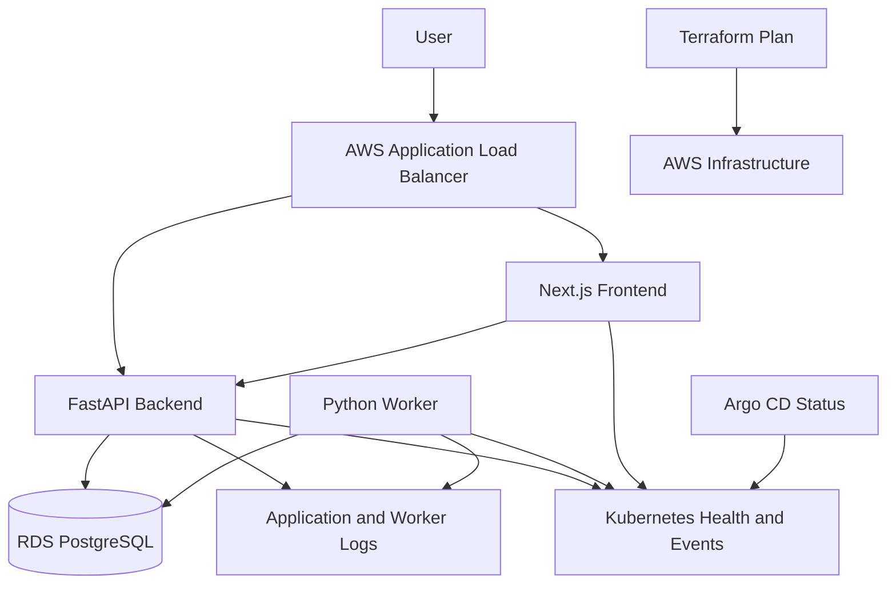
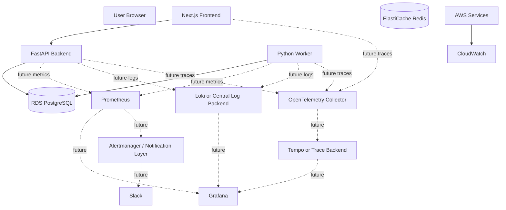

# Platform Launchpad — Observability Design

## 1. Purpose

This document defines the observability architecture for Platform Launchpad.

The observability strategy is designed to answer operational questions such as:

- Is the application reachable?
- Is the backend alive?
- Is the backend ready to serve requests?
- Is PostgreSQL reachable?
- Are frontend, backend, and worker workloads healthy?
- Are deployment requests being processed successfully?
- Is Argo CD synchronized with Git?
- Are GitOps applications healthy?
- Is the AWS Load Balancer Controller healthy?
- Is infrastructure drifting from Terraform configuration?
- Can an operator trace a user-facing failure through the relevant platform layers?
- What additional telemetry should be introduced as the platform matures?

Platform Launchpad intentionally distinguishes between:

1. **Implemented and validated operational visibility**
2. **Designed but not yet deployed observability capabilities**

This prevents roadmap tooling such as Prometheus, Grafana, Loki, Tempo, and
OpenTelemetry from being presented as already-running production services.

---

## 2. Current Observability Status

The AWS development environment currently provides operational visibility
through:

- FastAPI application logs;
- worker logs;
- Kubernetes pod state;
- Kubernetes Deployment state;
- Kubernetes readiness probes;
- Kubernetes liveness probes;
- backend `/health/live`;
- backend `/health/ready`;
- database readiness checks;
- frontend HTTP availability;
- AWS Application Load Balancer responses;
- HTTPS endpoint validation;
- Argo CD synchronization status;
- Argo CD application health status;
- Argo CD Sync-hook execution results;
- Kubernetes events and resource descriptions;
- Terraform drift detection;
- direct AWS CLI inspection where required.

The following have been validated in the development environment:

```text
Terraform
    No infrastructure drift

Argo CD
    platform-launchpad-development
        Synced
        Healthy

    aws-load-balancer-controller-development
        Synced
        Healthy

Application
    frontend
        Running

    backend
        Running

    worker
        Running

HTTPS
    HTTP/2 200

Backend readiness
    database = ok

Worker
    deployment requests processed successfully
```

A full centralized metrics, logs, traces, and alerting stack remains a future
platform phase.

---

## 3. Observability Objectives

Platform Launchpad observability should ultimately provide:

- application availability visibility;
- dependency-health visibility;
- deployment visibility;
- worker processing visibility;
- infrastructure health;
- GitOps health;
- security-relevant telemetry;
- user-impact signals;
- low-friction troubleshooting;
- request correlation;
- controlled telemetry cost;
- actionable alerts;
- service-level objectives.

The platform should prioritize telemetry that answers operational questions
rather than collecting data without a defined use case.

---

## 4. Observability Principles

### 4.1 Measure User Impact

Infrastructure health alone does not prove that the platform is functioning.

A healthy EC2 instance or Kubernetes node does not prove that:

- users can authenticate;
- environments can be created;
- deployment requests can be submitted;
- workers can process requests;
- the database is reachable;
- the frontend is available.

User-facing health signals must therefore complement infrastructure metrics.

---

### 4.2 Separate Liveness from Readiness

Liveness answers:

```text
Is the process running?
```

Readiness answers:

```text
Can the service safely receive traffic?
```

A dependency outage should not automatically imply that the application
process itself must be restarted.

---

### 4.3 Correlate Across Layers

Operational data should support correlation across:

```text
User request
    |
    v
Frontend
    |
    v
FastAPI request
    |
    v
Database operation
    |
    v
Deployment request
    |
    v
Worker processing
```

Useful correlation identifiers include:

- request ID;
- deployment request ID;
- environment ID;
- Git commit;
- Jenkins build number;
- image digest;
- GitOps commit.

High-cardinality identifiers belong primarily in logs and traces rather than
Prometheus labels.

---

### 4.4 Avoid Sensitive Telemetry

Telemetry must not contain:

- passwords;
- password hashes;
- JWT values;
- authorization headers;
- AWS credentials;
- database credentials;
- application secrets;
- private keys;
- full sensitive request bodies.

Observability systems should never become alternate secret stores.

---

### 4.5 Alerts Must Be Actionable

An alert should explain:

- what failed;
- where it failed;
- probable user impact;
- relevant environment or service;
- investigation path;
- associated runbook.

Alerts that contain only a raw metric name provide limited operational value.

---

### 4.6 Instrumentation Is Part of Platform Design

Observability should be considered during application and platform design.

At minimum, services should expose:

- health;
- readiness;
- useful logs;
- meaningful lifecycle events.

Metrics and distributed tracing can then be added without redesigning the
entire application.

---

### 4.7 Cost Is a Constraint

Telemetry storage can become expensive.

The design must control:

- metric cardinality;
- log volume;
- trace sampling;
- retention;
- dashboard query cost;
- AWS-native monitoring cost.

The development environment should not run expensive observability services
continuously merely for portfolio demonstration.

---

## 5. Current Operational Visibility Architecture

The implemented visibility path is:



Current troubleshooting relies on the combination of:

```text
curl
kubectl
Argo CD
Terraform
AWS CLI
application logs
```

This is sufficient for the current development milestone but not the final
observability architecture.

---

## 6. Target Observability Architecture

The future target architecture adds centralized telemetry.



Dashed connections represent planned rather than validated runtime
capabilities.

---

## 7. Implemented Versus Planned Components

| Capability | Current Status |
|---|---|
| FastAPI liveness endpoint | Implemented |
| FastAPI readiness endpoint | Implemented |
| PostgreSQL readiness check | Implemented |
| Kubernetes readiness probes | Implemented |
| Kubernetes liveness probes | Implemented |
| Backend logs | Implemented |
| Worker logs | Implemented |
| Frontend availability check | Implemented |
| Argo CD sync status | Implemented |
| Argo CD health status | Implemented |
| Migration-hook status | Implemented |
| Terraform drift validation | Implemented |
| ALB HTTP/HTTPS validation | Implemented |
| Prometheus application metrics | Planned |
| Grafana dashboards | Planned |
| Loki centralized logging | Planned |
| OpenTelemetry tracing | Planned |
| Tempo trace backend | Planned |
| Alertmanager | Planned |
| Formal SLO dashboards | Planned |
| Synthetic authenticated monitoring | Planned |
| Central CloudWatch log aggregation | Future expansion |

---

## 8. Backend Liveness

Endpoint:

```http
GET /health/live
```

Purpose:

Confirm that the FastAPI process is alive.

Validated response resembles:

```json
{
  "status": "ok",
  "service": "Platform Launchpad API",
  "version": "1.0.0",
  "environment": "development"
}
```

The liveness endpoint should remain lightweight.

It should not perform expensive dependency checks.

A temporary database failure should not cause Kubernetes to repeatedly restart
an otherwise functioning API process.

---

## 9. Backend Readiness

Endpoint:

```http
GET /health/ready
```

Purpose:

Determine whether the backend is ready to receive traffic.

The current validated readiness dependency is PostgreSQL.

Validated response:

```json
{
  "status": "ready",
  "checks": {
    "database": "ok"
  }
}
```

Redis is **not** currently part of application readiness because the deployed
worker uses database-backed polling rather than Redis as its primary
deployment-request queue.

When a required dependency is unavailable, readiness should return an
appropriate non-success response such as:

```text
503 Service Unavailable
```

---

## 10. Kubernetes Health Probes

The backend uses Kubernetes liveness and readiness probes.

Representative configuration:

```yaml
readinessProbe:
  httpGet:
    path: /health/ready
    port: http
  initialDelaySeconds: 5
  periodSeconds: 10

livenessProbe:
  httpGet:
    path: /health/live
    port: http
  initialDelaySeconds: 10
  periodSeconds: 20
```

The probes allow Kubernetes to distinguish:

```text
Process unhealthy
        |
        v
Restart may be appropriate
```

from:

```text
Dependency unavailable
        |
        v
Remove pod from ready endpoints
```

---

## 11. Frontend Health

The frontend currently provides operational visibility through:

- Kubernetes pod status;
- Deployment availability;
- service health;
- ALB routing;
- public HTTPS requests.

A simple public validation is:

```bash
curl -I \
  https://launchpad.christineadelusi.com/
```

The validated development endpoint returns:

```text
HTTP/2 200
```

A dedicated application-specific frontend health route may be introduced later
if operational needs justify it.

---

## 12. Worker Health

The worker currently exposes health primarily through:

- Kubernetes pod state;
- restart count;
- container logs;
- successful request-processing messages;
- resulting deployment-request state.

Example validated worker log:

```text
Processed deployment request <request-id> with status succeeded.
```

The worker currently polls PostgreSQL for deployment requests.

Therefore, the most important present worker-health questions are:

- Is the worker pod running?
- Is it restarting?
- Is polling continuing?
- Are requests being discovered?
- Are requests completing?
- Are requests failing?
- Are requests stuck in queued or processing state?

Future metrics may formalize these signals.

---

## 13. Worker Health Commands

Current validation:

```bash
kubectl get pods \
  -n platform-launchpad
```

Worker logs:

```bash
kubectl logs \
  -n platform-launchpad \
  deployment/worker \
  --tail=100
```

Live worker logs:

```bash
kubectl logs \
  -n platform-launchpad \
  deployment/worker \
  -f
```

These commands currently provide direct evidence of worker operation.

---

## 14. Backend Logs

Backend logs expose:

- HTTP method;
- path;
- response status;
- client connection information;
- health-check requests;
- API lifecycle activity.

Example:

```text
POST /api/v1/environments/<id>/deployment-requests HTTP/1.1" 202 Accepted
```

followed by worker processing provides an observable application workflow.

Backend logs must not include sensitive authorization or secret values.

---

## 15. Worker Logs

Worker logs should record significant lifecycle activity.

Useful events include:

- worker started;
- poll interval;
- request claimed;
- request processing started;
- request succeeded;
- request failed;
- retry scheduled;
- unexpected exception.

Example:

```text
Deployment worker started with poll interval 5.00 seconds.
```

and:

```text
Processed deployment request <id> with status succeeded.
```

These logs are currently one of the strongest observability signals for the
asynchronous processing layer.

---

## 16. Structured Logging Target

Application logs should evolve toward structured JSON.

Example:

```json
{
  "timestamp": "2026-09-04T05:57:28Z",
  "level": "INFO",
  "service": "platform-launchpad-worker",
  "environment": "development",
  "message": "Deployment request processed",
  "deployment_request_id": "example-id",
  "status": "succeeded"
}
```

Useful fields may include:

- timestamp;
- level;
- service;
- environment;
- request ID;
- trace ID;
- environment ID;
- deployment request ID;
- operation;
- status.

---

## 17. Log Levels

### DEBUG

Used for controlled development troubleshooting.

Must not expose secrets.

### INFO

Normal lifecycle activity.

Examples:

- application startup;
- request accepted;
- request completed;
- worker started;
- deployment request succeeded.

### WARNING

Recoverable conditions.

Examples:

- retry scheduled;
- elevated processing time;
- repeated authentication failure;
- transient dependency failure.

### ERROR

Failed operations.

Examples:

- database connection failure;
- deployment-request processing failure;
- unhandled API error.

### CRITICAL

Platform-wide or sustained severe failure.

Examples:

- persistent database outage;
- widespread authentication failure;
- multiple critical dependencies unavailable.

---

## 18. Log Redaction

Logs must exclude or redact:

```text
password
password_hash
access_token
refresh_token
authorization
cookie
secret_key
database password
AWS_ACCESS_KEY_ID
AWS_SECRET_ACCESS_KEY
private keys
```

Complete `DATABASE_URL` values should not be emitted when they contain
credentials.

---

## 19. Request Correlation

The target API model should propagate a request identifier such as:

```http
X-Request-ID: req_example
```

The identifier should be:

1. generated when absent;
2. returned to the client;
3. placed in API logs;
4. attached to relevant errors;
5. propagated where practical to background processing.

This provides a correlation path between synchronous API requests and
asynchronous work.

---

## 20. Audit Logs Versus Runtime Logs

Audit logs and runtime logs serve different purposes.

### Audit Logs

Answer:

```text
Who did what, to which resource, and when?
```

Audit data belongs in durable application storage.

Examples:

- registration;
- environment creation;
- lifecycle requests;
- administrative actions.

### Runtime Logs

Answer:

```text
What happened inside the software while processing the operation?
```

Examples:

- HTTP request completed;
- database dependency failed;
- worker processed request;
- exception raised.

Runtime logs should not replace application audit history.

---

## 21. Argo CD Observability

Argo CD provides important deployment-health telemetry even before a dedicated
metrics stack exists.

Current command:

```bash
kubectl get applications \
  -n argocd
```

Validated state:

```text
NAME                                       SYNC STATUS   HEALTH STATUS
aws-load-balancer-controller-development   Synced        Healthy
platform-launchpad-development             Synced        Healthy
```

These states provide immediate answers to:

```text
Does cluster state match Git?
```

and:

```text
Is the reconciled application healthy?
```

---

## 22. Argo CD Operation Visibility

Detailed sync information can be retrieved from:

```bash
kubectl get application \
  platform-launchpad-development \
  -n argocd \
  -o json
```

Important fields include:

- sync revision;
- sync status;
- health status;
- operation phase;
- operation message;
- resource sync results;
- hook phase.

This has been used to verify database migration execution.

---

## 23. Database Migration Observability

The database migration Job runs as an Argo CD Sync hook.

Operational evidence includes:

```text
kind: Job
name: database-migration
hookType: Sync
hookPhase: Succeeded
status: Synced
```

Argo CD therefore provides deployment-level visibility into schema migration
success or failure.

A migration failure should be treated as a deployment failure.

---

## 24. Kubernetes Workload Visibility

Current workload visibility uses:

```bash
kubectl get pods \
  -n platform-launchpad
```

and:

```bash
kubectl get deployments \
  -n platform-launchpad
```

Important fields include:

- READY;
- STATUS;
- RESTARTS;
- AVAILABLE;
- UP-TO-DATE;
- AGE.

Unexpected restarts should trigger investigation even if the current pod is
healthy.

---

## 25. Kubernetes Event Visibility

For workload problems:

```bash
kubectl describe pod \
  <pod-name> \
  -n platform-launchpad
```

or:

```bash
kubectl get events \
  -n platform-launchpad \
  --sort-by=.lastTimestamp
```

may reveal:

- image-pull failures;
- scheduling problems;
- probe failures;
- secret-mount failures;
- volume failures;
- resource pressure.

---

## 26. AWS Load Balancer Visibility

Current edge validation uses:

```bash
curl -I \
  http://launchpad.christineadelusi.com/
```

Expected:

```text
301 Moved Permanently
Location: https://...
```

HTTPS validation:

```bash
curl -I \
  https://launchpad.christineadelusi.com/
```

Expected:

```text
HTTP/2 200
```

These checks validate:

- DNS;
- ALB reachability;
- HTTP listener;
- HTTPS listener;
- TLS certificate;
- ingress routing;
- frontend availability.

---

## 27. Backend Public Readiness

Public-path dependency validation:

```bash
curl -sS \
  https://launchpad.christineadelusi.com/health/ready
```

Expected:

```json
{
  "status": "ready",
  "checks": {
    "database": "ok"
  }
}
```

This validates significantly more than an isolated pod check because traffic
passes through:

```text
DNS
 |
 v
ALB
 |
 v
Ingress
 |
 v
Backend Service
 |
 v
Backend Pod
 |
 v
RDS
```

---

## 28. Terraform as Operational Telemetry

Terraform itself provides an important infrastructure signal.

Command:

```bash
terraform plan
```

Validated stable result:

```text
No changes. Your infrastructure matches the configuration.
```

A non-empty unexpected plan is a drift signal.

Terraform therefore contributes to operational visibility even though it is
not a metrics system.

---

## 29. Infrastructure Drift Signal

Terraform drift monitoring asks:

```text
Does actual AWS infrastructure still match declared infrastructure?
```

Unexpected differences should be investigated for:

- manual console changes;
- failed previous operations;
- provider behavior;
- external controller changes;
- stale Terraform configuration.

Drift validation is particularly important before:

- releases;
- environment teardown;
- infrastructure changes;
- portfolio demonstrations.

---

## 30. End-to-End Functional Signal

The strongest current health signal is a successful user workflow.

Validated workflow:

```text
User
 |
 v
Frontend
 |
 v
FastAPI
 |
 v
Deployment Request
 |
 v
PostgreSQL
 |
 v
Worker Polling
 |
 v
Processing
 |
 v
Succeeded
```

This validates the combined health of:

- public routing;
- frontend;
- backend;
- authentication;
- database;
- deployment-request persistence;
- worker;
- state transitions.

Synthetic monitoring can automate this flow in the future.

---

# Planned Metrics Architecture

## 31. Prometheus

Prometheus is the planned metrics backend.

Potential metric sources include:

- FastAPI;
- Python worker;
- Kubernetes;
- kube-state-metrics;
- node exporter;
- PostgreSQL exporter;
- Redis exporter where useful.

Prometheus is **not currently represented as a validated Platform Launchpad
runtime service**.

---

## 32. Grafana

Grafana is the planned dashboard and visualization layer.

Potential dashboards include:

- application overview;
- API performance;
- authentication;
- worker processing;
- deployment-request lifecycle;
- Kubernetes health;
- RDS;
- ALB;
- GitOps;
- CI/CD.

Grafana should not be listed as currently deployed until that phase has been
implemented and validated.

---

## 33. Loki

Loki is a possible centralized logging backend.

Potential sources:

- FastAPI;
- worker;
- frontend server logs;
- Kubernetes workloads.

CloudWatch Logs or another centralized logging solution could be used instead.

The final backend should be selected based on operational needs and cost.

---

## 34. OpenTelemetry

OpenTelemetry is the preferred future instrumentation standard.

OpenTelemetry can provide:

- trace propagation;
- service instrumentation;
- vendor-neutral telemetry;
- future metrics/log integration.

An OpenTelemetry Collector may centralize telemetry export.

This aligns with ADR-0013 but remains future runtime work until deployed.

---

## 35. Tempo

Tempo is a potential distributed-trace backend.

Alternative trace backends could also satisfy the design.

The key architectural requirement is trace correlation rather than dependence
on one vendor.

---

## 36. CloudWatch

CloudWatch may provide AWS-native telemetry for:

- EKS;
- RDS;
- ALB;
- node resources;
- AWS service metrics;
- CloudWatch Logs;
- alarms.

CloudWatch integration should be introduced selectively to avoid excessive
cost.

---

## 37. Alertmanager

Alertmanager is a planned alert-routing component if Prometheus becomes the
primary metrics platform.

Initial notification integration may use:

```text
Slack
```

Alert routing should be designed only after reliable metrics exist.

---

# Planned Application Metrics

## 38. HTTP Metrics

Future FastAPI metrics may include:

```text
platform_launchpad_http_requests_total
platform_launchpad_http_request_duration_seconds
platform_launchpad_http_requests_in_progress
platform_launchpad_http_responses_total
```

Recommended bounded labels:

- method;
- normalized route;
- status class;
- service.

Do not use:

- request UUID;
- environment ID;
- user ID;
- email;
- raw URL.

---

## 39. Authentication Metrics

Potential metrics:

```text
platform_launchpad_auth_registration_total
platform_launchpad_auth_login_attempts_total
platform_launchpad_auth_login_failures_total
platform_launchpad_auth_disabled_account_denials_total
platform_launchpad_auth_token_validation_failures_total
```

Allowed labels should remain low-cardinality.

Security investigations involving specific users belong in audit logs rather
than Prometheus labels.

---

## 40. Environment Lifecycle Metrics

Potential metrics:

```text
platform_launchpad_environments_total
platform_launchpad_environment_requests_total
platform_launchpad_environment_state_transitions_total
platform_launchpad_environment_failures_total
```

Useful states include:

```text
pending
provisioning
active
failed
destroying
destroyed
```

Environment identifiers must not be metric labels.

---

## 41. Deployment Request Metrics

Potential metrics:

```text
platform_launchpad_deployment_requests_total
platform_launchpad_deployment_request_duration_seconds
platform_launchpad_deployment_request_attempts_total
platform_launchpad_deployment_request_failures_total
platform_launchpad_deployment_requests_in_progress
```

Useful labels:

- operation;
- result;
- status.

Individual request IDs belong in logs and traces.

---

## 42. Worker Metrics

Future worker metrics may include:

```text
platform_launchpad_worker_heartbeat_timestamp_seconds
platform_launchpad_worker_tasks_total
platform_launchpad_worker_task_duration_seconds
platform_launchpad_worker_task_failures_total
platform_launchpad_worker_tasks_in_progress
platform_launchpad_worker_retries_total
platform_launchpad_worker_poll_errors_total
```

The earlier design included:

```text
worker_queue_depth
```

because Redis was originally planned as the task queue.

The current implementation uses database-backed polling.

A more accurate future metric would therefore measure:

```text
queued deployment requests
processing deployment requests
oldest queued request age
poll failures
```

unless the worker architecture later changes to an explicit queue system.

---

## 43. PostgreSQL Metrics

Future PostgreSQL monitoring should include:

- connections;
- connection utilization;
- CPU;
- storage;
- read latency;
- write latency;
- transactions;
- deadlocks;
- failed transactions;
- backup status.

Application-level database metrics may include:

```text
platform_launchpad_database_operation_duration_seconds
platform_launchpad_database_errors_total
platform_launchpad_database_pool_connections
```

Sensitive SQL values must not be logged.

---

## 44. Redis Metrics

Redis is provisioned infrastructure but is not currently the deployment
worker's primary queue.

Relevant Redis metrics may therefore include:

- connection health;
- memory;
- evictions;
- command latency;
- key count;
- errors.

Queue-depth metrics should only be introduced if Redis actually becomes the
application work queue.

---

## 45. Frontend Metrics

Future frontend telemetry may include:

- page-load latency;
- Core Web Vitals;
- JavaScript failures;
- API failures;
- navigation latency;
- authentication redirect failures;
- environment-form submission outcomes.

Browser telemetry must not contain:

- passwords;
- JWTs;
- secret values;
- sensitive form content.

---

# Distributed Tracing

## 46. Target Trace Flow

A future trace may follow:

```text
Browser
  |
  v
FastAPI request
  |
  +--> Authentication
  |
  +--> PostgreSQL
  |
  +--> Deployment request created

Worker poll
  |
  +--> Deployment request claimed
  |
  +--> Processing
  |
  +--> PostgreSQL state update
```

This replaces the earlier trace model that assumed Redis queue publication and
consumption.

---

## 47. Trace Context

Useful trace attributes may include:

- service;
- route;
- deployment operation;
- result;
- environment type.

High-cardinality resource identifiers may appear in traces where operationally
useful, subject to privacy and cost controls.

Sensitive values must never be trace attributes.

---

## 48. Trace Sampling

Local development may use higher sampling.

Hosted environments should use controlled sampling.

Potential strategy:

- sample a small percentage of successful requests;
- sample failures more aggressively;
- sample slow requests;
- sample critical lifecycle operations.

Sampling should be configurable.

---

# Dashboards

## 49. Application Overview Dashboard

A future dashboard may include:

- frontend availability;
- API request rate;
- API error rate;
- API latency;
- database readiness;
- queued deployment requests;
- successful deployment requests;
- failed deployment requests;
- worker health.

---

## 50. Worker Dashboard

Potential panels:

- worker pod availability;
- successful operations;
- failed operations;
- processing duration;
- requests queued;
- oldest queued request;
- retries;
- poll failures.

This dashboard should reflect the database-backed polling architecture.

---

## 51. Kubernetes Dashboard

Potential signals:

- node readiness;
- pod readiness;
- restarts;
- CPU;
- memory;
- Deployment availability;
- unschedulable pods;
- failing probes;
- resource saturation.

---

## 52. GitOps Dashboard

Potential signals:

- Argo CD sync status;
- Argo CD health;
- current Git revision;
- failed syncs;
- migration hook failures;
- reconciliation duration;
- out-of-sync applications.

---

## 53. Database Dashboard

Potential RDS signals:

- CPU;
- storage;
- connections;
- read/write latency;
- transaction rate;
- failed connections;
- backup health.

---

## 54. ALB Dashboard

Potential ALB signals:

- request count;
- HTTP 4xx;
- HTTP 5xx;
- target response time;
- healthy targets;
- unhealthy targets;
- rejected connections.

---

## 55. CI/CD Dashboard

Potential pipeline telemetry:

- Jenkins build success;
- Jenkins build failure;
- build duration;
- image publication success;
- GitOps update success;
- deployment health;
- rollback count.

---

# Alerting

## 56. Alert Design

Alerts should represent conditions requiring operator attention.

A useful alert includes:

```text
Condition
Impact
Service
Environment
Duration
Investigation URL or command
Runbook
```

---

## 57. Alert Severity

### Informational

No immediate response required.

### Warning

Service degradation or approaching limits.

### Critical

Significant user impact or platform availability risk.

---

## 58. Candidate API Alerts

Potential alerts:

### API Unavailable

Condition:

```text
backend readiness failing consistently
```

### High API Error Rate

Condition:

```text
5xx error rate exceeds threshold
```

### High API Latency

Condition:

```text
p95 latency exceeds target
```

---

## 59. Candidate Worker Alerts

Potential alerts:

### Worker Unavailable

No healthy worker exists for a defined period.

### Requests Stuck

Queued requests exceed a maximum age.

### Worker Failure Rate

Deployment-request failure ratio exceeds threshold.

---

## 60. Candidate Database Alerts

Potential alerts:

- database readiness failing;
- connection saturation;
- low storage;
- high CPU;
- excessive latency.

---

## 61. Candidate Kubernetes Alerts

Potential alerts:

- pod crash loop;
- excessive restart count;
- Deployment unavailable;
- node not ready;
- resource exhaustion.

---

## 62. Candidate GitOps Alerts

Potential alerts:

- application out of sync;
- application degraded;
- synchronization failed;
- migration hook failed.

---

## 63. Candidate ALB Alerts

Potential alerts:

- unhealthy targets;
- elevated 5xx;
- high target response time;
- no healthy targets.

---

## 64. Alert Routing

Initial future routing may use:

```text
Slack
```

Later routing may distinguish:

- application;
- platform;
- security;
- database;
- deployment.

Alert routing should avoid unnecessary notification noise.

---

# SLO Design

## 65. Service-Level Indicators

Potential SLIs include:

### API Availability

Successful requests divided by valid requests.

### API Latency

Percentage of requests below target latency.

### Worker Processing

Percentage of accepted deployment requests completed successfully within an
expected interval.

### Deployment Health

Percentage of approved GitOps changes reaching healthy state.

---

## 66. Initial SLO Candidates

Potential future targets may include:

```text
API availability:
    99.9%

API latency:
    95% under defined threshold

Deployment requests:
    95% complete within expected processing window

GitOps deployments:
    95% healthy within defined rollout window
```

These are design targets, not currently measured production SLOs.

Targets should be reviewed after real telemetry exists.

---

# Telemetry Retention

## 67. Retention Strategy

Future retention should reflect value and cost.

Example:

| Telemetry | Development | Longer-Lived Environment |
|---|---:|---:|
| Application logs | 7 days | 14–30 days |
| Worker logs | 7 days | 14–30 days |
| Metrics | 7–15 days | 15–30 days |
| Traces | Short | Policy-driven |
| Audit records | Durable | Policy-driven |
| Jenkins logs | Limited | Defined retention |
| ALB access logs | Optional | Lifecycle-controlled |

These are design targets rather than current retention guarantees.

---

## 68. Metric Cardinality

Prometheus labels must not contain unbounded identifiers such as:

- environment IDs;
- deployment-request IDs;
- request IDs;
- user IDs;
- email addresses;
- Git commit values.

Use bounded labels such as:

```text
method
route
status
operation
service
environment
result
```

High-cardinality identifiers belong in logs or traces.

---

## 69. Logging Cost

Logs should not record every internal detail at `INFO`.

High-volume diagnostic events should use appropriate levels.

Production debug logging should remain disabled unless troubleshooting
requires it.

---

## 70. Trace Cost

Distributed tracing must use sampling appropriate to environment and traffic.

The development environment may use more aggressive sampling during testing.

Long-lived environments should balance:

- troubleshooting value;
- storage;
- ingestion cost.

---

# Operational Runbooks

## 71. Backend Not Ready

Initial investigation:

```bash
curl -sS \
  https://launchpad.christineadelusi.com/health/ready
```

Then:

```bash
kubectl get pods \
  -n platform-launchpad
```

Then:

```bash
kubectl logs \
  -n platform-launchpad \
  deployment/backend \
  --tail=100
```

Check:

- database connectivity;
- secret mount;
- pod events;
- readiness failures.

---

## 72. Worker Not Processing Requests

Check:

```bash
kubectl get pods \
  -n platform-launchpad
```

Then:

```bash
kubectl logs \
  -n platform-launchpad \
  deployment/worker \
  --tail=100
```

Investigate:

- worker restart count;
- database connectivity;
- queued requests;
- processing failures;
- secret access.

Redis queue depth is not part of the current investigation path because the
worker uses database-backed polling.

---

## 73. Application Returns HTTP Error

Validate:

```bash
curl -I \
  https://launchpad.christineadelusi.com/
```

Then inspect:

```bash
kubectl get ingress \
  -n platform-launchpad
```

and:

```bash
kubectl describe ingress \
  platform-launchpad \
  -n platform-launchpad
```

Check:

- DNS;
- ALB;
- listener;
- target health;
- ingress rules;
- frontend/backend service availability.

---

## 74. Argo CD Degraded

Check:

```bash
kubectl get applications \
  -n argocd
```

Inspect the affected Application:

```bash
kubectl describe application \
  platform-launchpad-development \
  -n argocd
```

Investigate:

- Git revision;
- failed resource;
- Sync hook;
- Kubernetes events;
- image availability.

---

## 75. Migration Failure

Inspect Argo CD operation state.

Then review migration Job or hook information.

Check:

- database connectivity;
- migration version;
- credentials;
- application image;
- Alembic logs.

Do not manually force application rollout past a failed schema migration
without understanding compatibility.

---

## 76. Infrastructure Drift

Run:

```bash
terraform plan
```

If unexpected changes exist:

1. identify resource;
2. compare Terraform and AWS;
3. determine whether change was manual;
4. determine whether resource should be imported, corrected, or reverted;
5. restore zero drift before unrelated infrastructure work.

---

# Synthetic Monitoring

## 77. Current Synthetic Checks

Current simple synthetic checks include:

```bash
curl -I \
  https://launchpad.christineadelusi.com/
```

and:

```bash
curl -sS \
  https://launchpad.christineadelusi.com/health/ready
```

These are lightweight but valuable.

---

## 78. Future Authenticated Synthetic Flow

A future synthetic workflow may:

1. authenticate a dedicated test user;
2. query environments;
3. create a test environment;
4. submit a deployment request;
5. verify request completion;
6. clean up the test resource.

This would provide stronger user-journey availability validation.

Care must be taken to avoid uncontrolled persistent test data.

---

# CI/CD Observability

## 79. Jenkins Telemetry

Future Jenkins telemetry may include:

- build duration;
- build success;
- failed stage;
- test count;
- security findings;
- image digest;
- GitOps commit;
- deployment health.

Build metadata should allow correlation to the running artifact.

---

## 80. Deployment Traceability

The target release correlation model is:

```text
Source Commit
    |
    v
Jenkins Build
    |
    v
ECR Image Digest
    |
    v
GitOps Commit
    |
    v
Argo CD Revision
    |
    v
Running Pod
```

This provides end-to-end release provenance.

---

# Security Observability

## 81. Authentication Signals

Useful security telemetry includes:

- failed authentication count;
- disabled-user denials;
- authorization failures;
- administrative actions.

Specific user investigations belong primarily in protected audit records.

---

## 82. Secret Safety

Observability systems must not capture values mounted from:

```text
AWS Secrets Manager
```

including:

```text
database_url
secret_key
```

Log collection agents and trace instrumentation should explicitly exclude
sensitive environment or file contents.

---

# Teardown and Rebuild

## 83. Observability Before Teardown

Before destroying the development environment, capture evidence such as:

- Terraform zero-drift output;
- Argo CD `Synced / Healthy`;
- healthy Kubernetes pods;
- HTTPS `200`;
- backend readiness;
- successful worker processing;
- relevant screenshots.

This allows the portfolio to retain operational evidence after AWS resources
are removed.

---

## 84. Observability After Rebuild

After reconstruction, validate:

```text
Terraform infrastructure
        |
        v
EKS nodes
        |
        v
Argo CD
        |
        v
GitOps Applications
        |
        v
Migration hook
        |
        v
Application pods
        |
        v
Public HTTPS
        |
        v
Database readiness
        |
        v
End-to-end worker workflow
```

A successful rebuild should reproduce the same health signals.

---

# Implementation Roadmap

## 85. Phase 1 — Implemented

Current capabilities:

```text
Backend liveness
Backend readiness
Database readiness
Kubernetes probes
Application logs
Worker logs
Kubernetes status
Argo CD health
Argo CD sync status
Migration-hook status
ALB/HTTPS checks
Terraform drift detection
End-to-end workflow validation
```

---

## 86. Phase 2 — Metrics

Introduce:

```text
Prometheus
application metrics
worker metrics
kube-state-metrics
node metrics
selected AWS metrics
```

Validate metric cardinality before broad dashboard creation.

---

## 87. Phase 3 — Dashboards

Introduce Grafana dashboards for:

```text
Application
Worker
Kubernetes
RDS
ALB
Argo CD
CI/CD
```

---

## 88. Phase 4 — Centralized Logs

Select and deploy:

```text
Loki
or
CloudWatch Logs
or
another appropriate backend
```

Add structured log collection and retention.

---

## 89. Phase 5 — Distributed Tracing

Implement OpenTelemetry instrumentation across:

```text
Frontend
FastAPI
PostgreSQL operations
Worker
external integrations
```

Select a trace backend such as Tempo or another supported platform.

---

## 90. Phase 6 — Alerting and SLOs

After telemetry is stable:

- define SLIs;
- establish measured SLOs;
- add alerts;
- add Slack routing;
- create runbooks;
- validate alert behavior.

---

# Implemented Versus Future Observability

## 91. Implemented and Validated

```text
FastAPI /health/live
FastAPI /health/ready
PostgreSQL readiness validation
Kubernetes liveness probes
Kubernetes readiness probes
Kubernetes pod visibility
Kubernetes Deployment visibility
Backend application logs
Worker logs
Worker success messages
Argo CD sync status
Argo CD health
Argo CD migration-hook visibility
ALB HTTP redirect validation
HTTPS endpoint validation
Frontend availability validation
Terraform zero-drift validation
End-to-end deployment-request validation
```

---

## 92. Planned / Future

```text
Prometheus
Grafana
Loki
OpenTelemetry
Tempo
Alertmanager
Slack alert routing
formal SLO measurement
automated synthetic user workflow
centralized log retention
distributed tracing
DORA dashboards
long-term metrics storage
```

This distinction prevents architecture documentation from overstating the
current implementation.

---

## 93. Architecture Evolution

The original observability design assumed:

```text
Redis task queue
Prometheus
Grafana
Loki
Tempo
OpenTelemetry
Alertmanager
```

as part of the platform architecture.

During implementation:

- the worker moved to database-backed polling;
- Redis stopped being the primary deployment queue dependency;
- core application health and runtime logging were implemented first;
- Argo CD became an important deployment-health signal;
- Terraform drift became an important infrastructure-health signal;
- HTTPS endpoint validation became an edge-health signal;
- full centralized telemetry was intentionally deferred.

This progression reflects an incremental observability strategy:

```text
Health
   |
   v
Logs
   |
   v
Deployment visibility
   |
   v
Metrics
   |
   v
Dashboards
   |
   v
Traces
   |
   v
SLOs and Alerting
```

---

## 94. Portfolio Demonstration

For an interview demonstration, useful operational checks include:

```bash
terraform plan
```

```bash
kubectl get applications \
  -n argocd
```

```bash
kubectl get pods \
  -n platform-launchpad
```

```bash
curl -I \
  https://launchpad.christineadelusi.com/
```

```bash
curl -sS \
  https://launchpad.christineadelusi.com/health/ready
```

```bash
kubectl logs \
  -n platform-launchpad \
  deployment/worker \
  --tail=50
```

Together, these demonstrate visibility across:

```text
Infrastructure
GitOps
Kubernetes
Application
Database
Worker
Public ingress
```

---

## 95. Observability Principles Demonstrated

Platform Launchpad demonstrates:

- application-aware health;
- distinction between liveness and readiness;
- dependency-aware readiness;
- structured operational logging;
- asynchronous worker visibility;
- GitOps health visibility;
- schema-migration visibility;
- infrastructure drift detection;
- public endpoint validation;
- security-conscious telemetry;
- cost-conscious telemetry design;
- incremental observability adoption;
- explicit implemented-versus-planned boundaries.

---

## 96. Summary

Platform Launchpad currently provides a practical operational visibility layer
through:

```text
Application health endpoints
        |
        v
Kubernetes health and probes
        |
        v
Application and worker logs
        |
        v
Argo CD sync and health
        |
        v
Terraform drift detection
        |
        v
Public HTTPS validation
        |
        v
End-to-end user workflow testing
```

This represents the observability capabilities that have actually been
implemented and validated.

The target architecture expands that foundation with:

```text
Prometheus
Grafana
Centralized Logging
OpenTelemetry
Distributed Tracing
Alerting
SLOs
```

Those components remain explicit future work rather than being represented as
already deployed.

The observability strategy therefore prioritizes credible, validated
operational signals today while preserving a clear path toward a complete
production-style monitoring and telemetry platform.