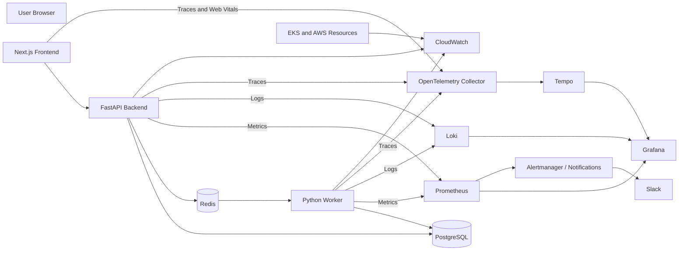

# Platform Launchpad — Observability Design

## 1. Purpose

This document defines the observability architecture for Platform Launchpad.

The platform must provide enough telemetry to understand:

- Whether the application is available
- Whether users can complete critical workflows
- Whether environment provisioning is progressing
- Whether workers are healthy
- Whether PostgreSQL and Redis are reachable
- Whether deployments are healthy
- Whether security-sensitive activity is occurring
- Whether platform resources are approaching capacity
- Whether failures can be correlated across services

The observability design covers:

- Metrics
- Logs
- Traces
- Health checks
- Dashboards
- Alerts
- Service-level indicators
- Operational runbooks
- CI/CD telemetry
- AWS and Kubernetes telemetry

---

## 2. Observability Objectives

Platform Launchpad observability must:

- Provide clear service health signals.
- Detect user-impacting failures quickly.
- Correlate requests across frontend, backend, worker, and infrastructure.
- Expose environment-lifecycle progress and failure.
- Support troubleshooting without exposing secrets.
- Provide metrics suitable for dashboards and alerts.
- Support Kubernetes and AWS infrastructure monitoring.
- Track CI/CD and GitOps deployment health.
- Control telemetry retention and cost.
- Produce useful interview-ready dashboards and demonstrations.
- Support future service-level objectives.

---

## 3. Observability Principles

### 3.1 Observe User Outcomes

The platform should monitor whether users can:

- Register
- Log in
- View environments
- Create environment requests
- Track provisioning
- Request destruction

Infrastructure health alone does not prove that user workflows are functioning.

### 3.2 Use the Four Golden Signals

For application services, monitor:

- Latency
- Traffic
- Errors
- Saturation

### 3.3 Correlate Telemetry

Metrics, logs, traces, audit events, and deployment metadata should share identifiers where possible.

Important identifiers include:

- Request ID
- Trace ID
- User ID
- Environment ID
- Deployment request ID
- Jenkins build number
- Git commit
- Image digest
- GitOps commit

### 3.4 Avoid Sensitive Telemetry

Telemetry must not contain:

- Passwords
- Password hashes
- JWTs
- Authorization headers
- AWS credentials
- Database credentials
- Secret values
- Private keys
- Full sensitive request bodies

### 3.5 Alerts Must Be Actionable

An alert should identify:

- What failed
- Where it failed
- Potential user impact
- Relevant identifiers
- Suggested investigation path
- Associated runbook

### 3.6 Instrumentation Is Part of the Application

Metrics, logs, health endpoints, and tracing are implementation requirements rather than post-release additions.

### 3.7 Cost Is a Constraint

Telemetry retention, cardinality, storage, and query patterns must be controlled.

---

## 4. Observability Architecture



---

## 5. Observability Components

### Prometheus

Prometheus collects application and platform metrics.

Primary sources:

- FastAPI
- Python worker
- Kubernetes
- Node metrics
- Kube-state metrics
- Optional Redis exporter
- Optional PostgreSQL exporter

### Grafana

Grafana provides:

- Application dashboards
- Worker dashboards
- Environment lifecycle dashboards
- Kubernetes dashboards
- Database dashboards
- CI/CD dashboards
- Alert visualization

### Loki

Loki stores and queries structured application and worker logs.

### Tempo

Tempo stores distributed traces.

### OpenTelemetry

OpenTelemetry provides vendor-neutral instrumentation and trace propagation.

### CloudWatch

CloudWatch provides AWS-native visibility for:

- EKS control plane
- RDS
- ALB
- CloudWatch Logs
- AWS service metrics
- Budget notifications

### Alertmanager

Alertmanager routes actionable Prometheus alerts.

Initial notification channel:

- Slack

---

## 6. Service Inventory

Services requiring observability:

| Service | Metrics | Logs | Traces | Health Checks |
|---|---:|---:|---:|---:|
| Next.js frontend | Yes | Yes | Yes | Yes |
| FastAPI backend | Yes | Yes | Yes | Yes |
| Python worker | Yes | Yes | Yes | Yes |
| PostgreSQL | Yes | Yes | Limited | Yes |
| Redis | Yes | Yes | Limited | Yes |
| Jenkins | Yes | Yes | Optional | Yes |
| Argo CD | Yes | Yes | Optional | Yes |
| EKS | Yes | Yes | Optional | Yes |
| ALB | Yes | Access logs | No | Yes |
| RDS | Yes | Yes | No | Yes |

---

## 7. Health Endpoints

### Backend Liveness

```http
GET /health/live
```

Purpose:

Confirm that the FastAPI process is running.

Expected response:

```json
{
  "status": "ok",
  "service": "platform-launchpad-api"
}
```

The liveness endpoint must not perform expensive dependency checks.

### Backend Readiness

```http
GET /health/ready
```

Purpose:

Confirm that the backend can serve traffic.

Checks may include:

- PostgreSQL
- Redis when introduced

Expected response:

```json
{
  "status": "ready",
  "checks": {
    "database": "ok",
    "redis": "ok"
  }
}
```

Readiness must return `503` when a required dependency is unavailable.

### Worker Health

The worker should expose or publish:

- Worker process alive
- Queue connection status
- Last successful heartbeat
- Current task count
- Failed task count

### Frontend Health

The frontend should expose a lightweight health route suitable for load-balancer and Kubernetes probes.

---

## 8. Application Metrics

### HTTP Metrics

The FastAPI backend should expose:

- Request count
- Error count
- Request duration
- In-progress requests
- Response status count
- Route-level latency

Example metric names:

```text
platform_launchpad_http_requests_total
platform_launchpad_http_request_duration_seconds
platform_launchpad_http_requests_in_progress
platform_launchpad_http_responses_total
```

Labels should include:

- Service
- Method
- Normalized route
- Status class

Avoid labels containing:

- Email addresses
- User names
- Raw URLs
- UUIDs
- Environment names

These values create excessive cardinality.

---

## 9. Authentication Metrics

Recommended metrics:

```text
platform_launchpad_auth_registration_total
platform_launchpad_auth_login_attempts_total
platform_launchpad_auth_login_failures_total
platform_launchpad_auth_disabled_account_denials_total
platform_launchpad_auth_token_validation_failures_total
```

Recommended labels:

- Result
- Failure reason category
- Service

Metrics must not include:

- Email address
- Password
- JWT
- Source credentials

Security investigations may use audit logs rather than high-cardinality metric labels.

---

## 10. Environment Lifecycle Metrics

Recommended metrics:

```text
platform_launchpad_environments_total
platform_launchpad_environment_requests_total
platform_launchpad_environment_state_transitions_total
platform_launchpad_environment_provision_duration_seconds
platform_launchpad_environment_destroy_duration_seconds
platform_launchpad_environment_failures_total
```

Environment-count gauges should expose counts by status:

- Pending
- Provisioning
- Active
- Failed
- Destroying
- Destroyed

Example:

```text
platform_launchpad_environments{status="active"} 12
```

Do not use environment ID or name as a Prometheus label.

---

## 11. Deployment Request Metrics

Recommended metrics:

```text
platform_launchpad_deployment_requests_total
platform_launchpad_deployment_request_duration_seconds
platform_launchpad_deployment_request_attempts_total
platform_launchpad_deployment_request_failures_total
platform_launchpad_deployment_requests_in_progress
```

Useful labels:

- Operation
- Status
- Environment type
- Service

Avoid labels containing deployment request UUIDs.

Individual request identifiers belong in logs and traces.

---

## 12. Worker Metrics

Recommended worker metrics:

```text
platform_launchpad_worker_heartbeat_timestamp_seconds
platform_launchpad_worker_tasks_total
platform_launchpad_worker_task_duration_seconds
platform_launchpad_worker_task_failures_total
platform_launchpad_worker_tasks_in_progress
platform_launchpad_worker_retries_total
platform_launchpad_worker_queue_depth
```

Worker metrics should identify:

- Worker service
- Task operation
- Result
- Retry category

---

## 13. Database Metrics

PostgreSQL monitoring should include:

- Connection count
- Maximum connection utilization
- Query duration
- Transaction rate
- Transaction failures
- Deadlocks
- Disk storage
- CPU utilization
- Memory utilization
- Read and write latency
- Backup health
- Replication health if used

Application-specific database metrics may include:

```text
platform_launchpad_database_operation_duration_seconds
platform_launchpad_database_errors_total
platform_launchpad_database_pool_connections
platform_launchpad_database_pool_wait_seconds
```

SQL statements containing sensitive values must not be logged.

---

## 14. Redis Metrics

Redis monitoring should include:

- Queue depth
- Connection health
- Memory usage
- Evictions
- Command latency
- Failed commands
- Key expiration
- Worker consumption rate

Application queue metrics must distinguish between:

- Queued
- Processing
- Failed
- Retried
- Completed

---

## 15. Frontend Metrics

Frontend telemetry may include:

- Page-load duration
- Core Web Vitals
- API request failures
- JavaScript exceptions
- Route-transition latency
- Authentication redirect failures
- Environment-form submission success rate

User privacy must be preserved.

Frontend telemetry must not include:

- Passwords
- JWTs
- Full sensitive form contents
- Secret values
- Unredacted email addresses

---

## 16. Structured Logging

Application logs should use structured JSON.

Example:

```json
{
  "timestamp": "2026-07-12T18:30:00Z",
  "level": "INFO",
  "service": "platform-launchpad-api",
  "environment": "development",
  "message": "Environment request accepted",
  "request_id": "req_8c071f3102a24fbb",
  "trace_id": "9ab7f51c8f394d3a",
  "user_id": "7ce8938a-4055-439b-b941-794682a72463",
  "environment_id": "397f1cc1-2750-4182-94a8-c7c53de71df4",
  "deployment_request_id": "4df37e1a-e920-41ca-9548-b170d0043dcf",
  "operation": "provision"
}
```

Logs should be machine-readable and human-understandable.

---

## 17. Log Levels

### DEBUG

Used for local development and controlled troubleshooting.

Must not expose sensitive values.

### INFO

Used for normal lifecycle events.

Examples:

- Service started
- Request completed
- Environment created
- Worker task started
- Worker task completed
- GitOps update observed

### WARNING

Used for recoverable or suspicious conditions.

Examples:

- Retry scheduled
- Slow query
- Queue depth elevated
- Repeated login failure
- Temporary dependency failure

### ERROR

Used for failed operations.

Examples:

- Provisioning failed
- Database connection failed
- Redis unavailable
- Deployment request failed
- Unhandled application exception

### CRITICAL

Used for severe platform-wide conditions.

Examples:

- Database unavailable for sustained period
- Corrupted state
- Widespread authentication failure
- Multiple critical dependencies unavailable

---

## 18. Log Redaction

Logs must redact or exclude:

- `password`
- `password_hash`
- `access_token`
- `refresh_token`
- `authorization`
- `cookie`
- `secret`
- `api_key`
- AWS credentials
- Database connection passwords
- Private keys

A centralized logging filter should prevent accidental exposure where practical.

---

## 19. Request Correlation

Every API request should have an `X-Request-ID`.

Behavior:

1. Accept a valid client-provided request ID where permitted.
2. Generate one when absent.
3. Return it in the response.
4. Include it in logs.
5. Include it in error responses.
6. Propagate it into worker tasks.
7. Include it in downstream HTTP calls where applicable.

Example:

```http
X-Request-ID: req_8c071f3102a24fbb
```

---

## 20. Distributed Tracing

OpenTelemetry tracing should cover:

- Frontend API call
- FastAPI request handling
- Authentication validation
- Database operation
- Redis queue publication
- Worker task consumption
- Worker database update
- External integration calls

A typical trace may show:

```text
Browser request
  └── FastAPI endpoint
      ├── JWT validation
      ├── PostgreSQL insert
      ├── Audit event insert
      └── Redis task publish
          └── Worker task
              ├── State transition
              ├── Simulated provisioning
              └── PostgreSQL update
```

Trace context should propagate through the queue where supported.

---

## 21. Trace Sampling

Local development may use:

```text
100 percent sampling
```

Hosted environments should use configurable sampling.

Potential policy:

- Sample a small percentage of successful requests.
- Sample all failed requests where practical.
- Sample all slow requests.
- Sample environment lifecycle operations at a higher rate.

Sampling must account for telemetry cost.

---

## 22. Audit Logs versus Application Logs

Audit logs and application logs serve different purposes.

### Audit Logs

Record:

- Who performed an action
- What resource was affected
- What action occurred
- Whether it succeeded
- When it occurred

Audit logs are stored in PostgreSQL and exposed only to administrators.

### Application Logs

Record:

- Runtime behavior
- Diagnostic events
- Exceptions
- Dependency failures
- Performance information

Application logs are stored in Loki or CloudWatch.

Audit logs must not be replaced by transient application logs.

---

## 23. Dashboard Strategy

Initial Grafana dashboards:

1. Platform Overview
2. Backend API
3. Worker and Queue
4. Environment Lifecycle
5. PostgreSQL
6. Redis
7. Kubernetes Workloads
8. CI/CD and GitOps
9. Security Activity
10. AWS Cost and Capacity Overview

---

## 24. Platform Overview Dashboard

Primary panels:

- API availability
- Frontend availability
- Active users
- Request rate
- Error rate
- P95 latency
- Active environments
- Failed environments
- Provisioning requests
- Worker queue depth
- Worker failures
- Database health
- Argo CD application health
- Current deployed version

This should be the primary demonstration dashboard.

---

## 25. Backend API Dashboard

Panels:

- Requests per second
- Responses by status
- Error rate
- P50 latency
- P95 latency
- P99 latency
- Requests in progress
- Authentication failures
- Slowest routes
- Database-operation duration
- Dependency errors
- Pod CPU and memory

---

## 26. Worker and Queue Dashboard

Panels:

- Queue depth
- Active workers
- Worker heartbeat
- Tasks started
- Tasks completed
- Tasks failed
- Retry count
- Average task duration
- P95 task duration
- Tasks by operation
- Oldest queued task age
- Worker CPU and memory

---

## 27. Environment Lifecycle Dashboard

Panels:

- Environments by status
- Environment requests by type
- Provisioning success rate
- Provisioning failure rate
- Average provisioning duration
- Destruction duration
- Failed state transitions
- Requests currently processing
- Retry frequency
- Historical lifecycle trend

---

## 28. PostgreSQL Dashboard

Panels:

- Database availability
- CPU
- Memory
- Connections
- Connection utilization
- Storage
- Read latency
- Write latency
- Transaction rate
- Transaction failures
- Deadlocks
- Slow queries
- Backup status

---

## 29. Kubernetes Dashboard

Panels:

- Pod health
- Pod restarts
- Deployment replicas
- CPU requests and usage
- Memory requests and usage
- HPA status
- Node capacity
- Pending Pods
- Failed Pods
- Container OOM events
- Ingress request rate
- Namespace resource consumption

---

## 30. CI/CD and GitOps Dashboard

Panels:

- Jenkins pipeline success rate
- Pipeline duration
- Pipeline failures by stage
- Test failures
- Security gate failures
- Container-build duration
- Deployment frequency
- GitOps update frequency
- Argo CD sync status
- Argo CD application health
- Rollback count
- Mean time to recovery
- Current image digest

---

## 31. Security Activity Dashboard

Panels:

- Login attempts
- Login failures
- Disabled-account denials
- Permission denials
- Administrative actions
- User disable events
- Status override events
- Repeated failures by source category
- Secret-scan pipeline failures
- Dependency vulnerabilities
- Container scan failures

Sensitive identities should be handled carefully.

---

## 32. Service-Level Indicators

Initial service-level indicators include:

### Availability

Percentage of successful valid requests served by the API.

### Latency

Percentage of requests completed within the target latency threshold.

### Error Rate

Percentage of requests returning unexpected server errors.

### Provisioning Success

Percentage of environment-provision requests that complete successfully.

### Provisioning Duration

Time from request acceptance to active environment state.

### Worker Health

Percentage of time at least one worker is healthy and processing tasks.

### Deployment Health

Percentage of GitOps deployments reaching a healthy state.

---

## 33. Initial Service-Level Objectives

These are portfolio targets rather than formal production commitments.

### API Availability

```text
99.0 percent over a rolling 30-day period
```

### API Latency

```text
95 percent of standard API requests complete within 500 ms
```

Long-running environment provisioning is excluded because it is asynchronous.

### Provisioning Success

```text
95 percent of valid simulated provisioning requests succeed without manual intervention
```

### Worker Processing

```text
95 percent of queued tasks begin processing within 60 seconds
```

### Deployment Health

```text
95 percent of approved GitOps changes become healthy within 10 minutes
```

These targets will be reviewed after real telemetry is available.

---

## 34. Alert Severity

### Informational

No immediate action required.

Examples:

- Deployment completed
- Environment created
- Budget threshold approaching

### Warning

Investigation required during normal operational response.

Examples:

- Elevated API latency
- Queue depth increasing
- Worker retries increasing
- Disk capacity approaching threshold

### Critical

Immediate action required.

Examples:

- API unavailable
- Database unavailable
- No healthy workers
- Sustained high error rate
- Argo CD application degraded
- RDS storage critically low

---

## 35. Initial Alert Rules

### API Availability Alert

Trigger when:

```text
API success rate drops below the defined threshold for five minutes.
```

### Elevated Error Rate

Trigger when:

```text
5xx responses exceed 5 percent for five minutes.
```

### High Latency

Trigger when:

```text
P95 API latency exceeds 1 second for ten minutes.
```

### Database Unavailable

Trigger when:

```text
Readiness checks report PostgreSQL unavailable for more than two minutes.
```

### Redis Unavailable

Trigger when:

```text
Queue publication or worker consumption cannot reach Redis.
```

### Worker Missing

Trigger when:

```text
No worker heartbeat is observed for more than two minutes.
```

### Queue Backlog

Trigger when:

```text
Queue depth or oldest task age exceeds the defined threshold.
```

### Provisioning Failure Rate

Trigger when:

```text
Provisioning failures exceed the accepted percentage in a rolling window.
```

### Pod Restart Alert

Trigger when:

```text
A workload repeatedly restarts within a short time window.
```

### Argo CD Degraded

Trigger when:

```text
An application remains degraded or out of sync beyond the accepted window.
```

### RDS Storage Alert

Trigger when:

```text
Free storage falls below the configured threshold.
```

---

## 36. Alert Routing

Initial routing:

| Severity | Destination |
|---|---|
| Informational | Dashboard or optional Slack |
| Warning | Slack platform channel |
| Critical | Slack platform channel with explicit priority |

Future routing may include:

- Email
- PagerDuty
- Opsgenie
- Incident-management platform

---

## 37. Alert Message Requirements

Alert notifications should include:

- Alert name
- Severity
- Environment
- Service
- Time
- Summary
- Current value
- Threshold
- Dashboard link
- Log query link
- Trace link where available
- Runbook link

Avoid alert messages that contain only a metric name without operational context.

---

## 38. Runbooks

Required initial runbooks:

- API unavailable
- High API error rate
- PostgreSQL unavailable
- Redis unavailable
- Worker not processing
- Queue backlog
- Environment provisioning failed
- Argo CD application degraded
- Deployment rollback
- RDS storage pressure
- Exposed credential
- Jenkins pipeline failure
- Terraform apply failure

Each runbook should include:

1. Symptoms
2. Impact
3. Validation steps
4. Investigation commands
5. Immediate mitigation
6. Recovery
7. Escalation
8. Follow-up actions

---

## 39. Kubernetes Observability

Kubernetes monitoring should include:

- Kube-state metrics
- Node metrics
- Pod metrics
- Container restarts
- Deployment health
- Stateful workload health
- HPA status
- Resource requests and limits
- Pending Pods
- Failed scheduling
- OOM kills
- Ingress metrics

Observability components should use resource limits to avoid destabilizing the cluster.

---

## 40. AWS Observability

AWS telemetry may include:

### ALB

- Request count
- Target response time
- HTTP response codes
- Unhealthy host count
- Rejected connections

### RDS

- CPU utilization
- Free storage
- Connections
- Read latency
- Write latency
- Deadlocks
- Backup health

### EKS

- Control-plane logs
- Node health
- Cluster events
- Workload logs

### ECR

- Image scan findings
- Repository activity

### Budgets

- Cost thresholds
- Forecasted spend

---

## 41. Log Retention

Retention must be configurable.

Example starting values:

| Telemetry | Development | Production-Style |
|---|---:|---:|
| Application logs | 7 days | 14–30 days |
| Worker logs | 7 days | 14–30 days |
| Audit logs | Indefinite for MVP | Policy-driven |
| Metrics | 7–15 days | 15–30 days |
| Traces | 3–7 days | 7–14 days |
| Jenkins logs | Limited build history | Defined retention |
| ALB logs | Optional | Defined lifecycle |

Long retention must be justified against cost.

---

## 42. Cardinality Controls

Prometheus labels must not include unbounded identifiers such as:

- User ID
- Email
- Environment ID
- Deployment request ID
- Request ID
- Trace ID
- Raw error message
- Raw URL

These identifiers belong in logs and traces.

Metric labels should use bounded categories such as:

- Status
- Operation
- Role
- Environment type
- HTTP method
- Normalized route
- Result

---

## 43. Telemetry Environment Labels

Every telemetry signal should identify:

- Service
- Deployment environment
- Application version
- Git commit where practical
- Image digest where practical
- Cluster
- Namespace

This supports release comparison and troubleshooting.

---

## 44. Deployment Annotations

Grafana dashboards should display deployment annotations.

Annotations may be generated from:

- Jenkins release
- GitOps commit
- Argo CD sync
- Terraform apply
- Rollback event

This helps correlate incidents with recent changes.

---

## 45. CI/CD Metrics

Jenkins telemetry should include:

- Build count
- Success rate
- Failure rate
- Build duration
- Stage duration
- Queue time
- Test failures
- Security scan failures
- Image-publish failures
- GitOps update failures
- Deployment verification failures

DORA-style metrics include:

- Deployment frequency
- Lead time for change
- Change failure rate
- Mean time to recovery

---

## 46. Synthetic Monitoring

A lightweight synthetic check may validate:

1. Frontend is reachable.
2. API liveness succeeds.
3. API readiness succeeds.
4. Login page renders.
5. Public documentation is reachable.

A future authenticated synthetic flow may:

1. Authenticate a test user.
2. Retrieve the environment list.
3. Validate a test environment.
4. Log out.

Synthetic users and credentials must be managed securely.

---

## 47. Observability in Local Development

Local development should support:

- Console JSON logs
- FastAPI metrics endpoint
- Local Prometheus
- Local Grafana where practical
- Optional Loki and Tempo
- Docker Compose health checks

The complete observability stack does not need to run continuously on the developer workstation.

A lightweight profile may run:

- PostgreSQL
- Redis
- Backend
- Worker

A full profile may additionally run:

- Prometheus
- Grafana
- Loki
- Tempo
- OpenTelemetry Collector

---

## 48. Observability Deployment Strategy

Observability resources may be deployed through:

- Helm
- Kubernetes manifests
- Terraform-managed Helm releases
- GitOps-managed applications

The preferred runtime direction is GitOps-managed deployment.

Secrets and credentials must not be embedded in Helm values committed to Git.

---

## 49. Grafana Access

Grafana access must be controlled.

Requirements:

- HTTPS
- Strong authentication
- Restricted administrative access
- No default credentials
- Secret-managed credentials
- Read-only viewer access where appropriate

The public portfolio should not expose unrestricted administrative dashboards.

---

## 50. Failure Investigation Workflow

A standard investigation flow:

1. Confirm user impact.
2. Check platform overview dashboard.
3. Identify affected service.
4. Review recent deployments.
5. Review relevant metrics.
6. Search logs using request, environment, or deployment request ID.
7. Open related trace.
8. Check dependency health.
9. Apply mitigation.
10. Confirm recovery.
11. Document findings.

---

## 51. Example Troubleshooting Correlation

A user reports that an environment is stuck in `provisioning`.

Investigation:

1. Obtain environment ID from the UI.
2. Retrieve the latest deployment request.
3. Search logs using deployment request ID.
4. Review worker task trace.
5. Check worker heartbeat.
6. Check Redis queue depth.
7. Check database update failures.
8. Review environment state-transition metrics.
9. Retry only after confirming no active worker task remains.

This correlation pattern is a primary reason identifiers must propagate through telemetry.

---

## 52. Privacy and Data Handling

Telemetry should minimize personal information.

User email addresses should not become Prometheus labels.

Where user identity is required for audit:

- Store the user ID.
- Restrict audit-log access.
- Avoid unnecessary duplication.
- Apply retention rules.

Hosted telemetry services must be reviewed before sending application data externally.

---

## 53. Testing Observability

Required test categories:

### Metrics Tests

- Metrics endpoint responds.
- Required metrics exist.
- Labels remain bounded.
- Sensitive values are absent.

### Logging Tests

- Logs are structured.
- Request ID is present.
- Sensitive fields are redacted.
- Exceptions are correlated.

### Trace Tests

- Trace IDs propagate.
- Database spans appear.
- Worker spans correlate with API requests.

### Alert Tests

- Alert rules parse.
- Test conditions trigger expected alerts.
- Alert messages include runbook references.

### Dashboard Tests

- Dashboards provision successfully.
- Queries return expected data.
- Variables work.
- Panels do not depend on unavailable labels.

---

## 54. Known MVP Limitations

The first release may not include:

- Full frontend tracing
- Complete browser session replay
- Advanced anomaly detection
- Formal SLO tooling
- Automatic remediation
- Long-term metrics storage
- Multi-region telemetry
- Enterprise SIEM integration
- PagerDuty routing
- Complete synthetic transactions
- Production-scale log retention

These limitations must not prevent basic operational visibility.

---

## 55. Observability Acceptance Criteria

The observability design is complete when:

- Observability objectives are documented.
- Metrics, logs, and traces are defined.
- Health and readiness behavior is defined.
- Application metrics are defined.
- Worker and queue metrics are defined.
- Database and Redis monitoring are defined.
- Structured logging requirements are defined.
- Sensitive telemetry restrictions are defined.
- Request and trace correlation are defined.
- Dashboards are identified.
- Service-level indicators are defined.
- Initial service-level objectives are defined.
- Alert severity and routing are defined.
- Initial alert rules are defined.
- Runbook requirements are defined.
- Kubernetes and AWS observability are defined.
- Retention and cardinality controls are defined.
- Local development observability is defined.
- Known MVP limitations are documented.