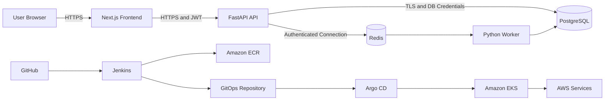

# Platform Launchpad — Security Model

## 1. Purpose

This document defines the security architecture, trust boundaries, threats, controls, and responsibilities for Platform Launchpad.

Platform Launchpad is a production-style Internal Developer Platform demonstration that includes:

- A Next.js frontend
- A FastAPI backend
- PostgreSQL
- Redis
- A Python worker
- Jenkins
- Amazon ECR
- Amazon EKS
- Argo CD
- Terraform-managed AWS infrastructure
- Prometheus, Grafana, logs, and traces

The security model applies to local development, the low-cost portfolio deployment, and the production-style AWS deployment.

---

## 2. Security Objectives

Platform Launchpad must:

- Authenticate users securely.
- Enforce authorization in the backend.
- Prevent users from accessing environments they do not own.
- Restrict administrative operations to administrators.
- Protect passwords, tokens, credentials, and secrets.
- Minimize privileges assigned to applications and automation.
- Preserve audit history for security-sensitive actions.
- Prevent CI systems from becoming unrestricted deployment administrators.
- Protect PostgreSQL and Redis from public access.
- Use encrypted communication in hosted environments.
- Prevent sensitive information from entering logs or Git.
- Detect and expose meaningful failures without disclosing internal details.
- Support secure teardown and rebuild through infrastructure as code.

---

## 3. Security Principles

### 3.1 Least Privilege

Every user, workload, pipeline, and cloud identity receives only the permissions required for its responsibilities.

### 3.2 Defense in Depth

Security does not depend on one control.

Controls exist across:

- Browser and frontend
- Backend API
- Database
- Worker
- CI/CD
- GitOps
- Kubernetes
- AWS networking and IAM
- Monitoring and audit logging

### 3.3 Backend Authorization Is Authoritative

Frontend role checks improve the user experience but do not provide security.

FastAPI must independently validate:

- Authentication
- User status
- User role
- Environment ownership
- Valid state transitions

### 3.4 Secrets Never Enter Source Control

The repository must not contain:

- Passwords
- JWT signing secrets
- AWS access keys
- Database credentials
- Redis credentials
- Private keys
- GitHub tokens
- Jenkins credentials
- Kubernetes credentials
- TLS private keys

### 3.5 Git Is the Runtime Source of Truth

Kubernetes deployment state is managed through Git and Argo CD.

Jenkins must not require unrestricted `kubectl` access to application clusters.

### 3.6 Security Events Must Be Auditable

Authentication activity, administrative changes, access denials, and environment lifecycle operations must produce safe, structured records.

### 3.7 Fail Securely

When identity, ownership, role, dependency, or lifecycle state cannot be verified, the operation must be denied.

---

## 4. Assets

The primary assets requiring protection are:

### Application Data

- User identities
- Email addresses
- Password hashes
- Environment records
- Deployment requests
- Audit records
- Platform metadata

### Credentials and Secrets

- JWT signing secret
- PostgreSQL credentials
- Redis credentials
- AWS credentials
- IAM role trust relationships
- GitHub credentials
- Jenkins credentials
- Argo CD credentials
- TLS private keys

### Platform Resources

- AWS account
- VPC
- EKS cluster
- RDS database
- ECR repositories
- Route 53 records
- ACM certificates
- Terraform state
- Kubernetes namespaces and workloads

### Software Supply Chain

- Application source code
- Dependency manifests
- Dockerfiles
- Container images
- Jenkins pipelines
- Terraform code
- Kubernetes manifests
- GitOps overlays

---

## 5. Trust Boundaries



Primary trust boundaries:

1. Public browser to frontend
2. Frontend to backend API
3. Backend to PostgreSQL
4. Backend and worker to Redis
5. Jenkins to GitHub and AWS
6. Argo CD to the Kubernetes API
7. Kubernetes workloads to AWS services
8. Terraform runner to AWS
9. Operators to administrative interfaces

---

## 6. Authentication Model

### 6.1 MVP Authentication

The MVP uses application-managed authentication with:

- Email
- Password
- JWT access token

Registration always creates the `user` role.

Clients cannot assign themselves administrative privileges.

### 6.2 Password Storage

Passwords must:

- Never be stored in plaintext
- Never be logged
- Never be returned by the API
- Never be included in audit records
- Be hashed using a password-specific hashing algorithm
- Use a unique salt managed by the hashing implementation

The initial implementation will use a maintained password-hashing library.

### 6.3 Password Policy

Passwords require:

- Minimum 12 characters
- Maximum 128 characters
- At least one uppercase letter
- At least one lowercase letter
- At least one number
- At least one special character

Password policy validation does not replace secure hashing.

### 6.4 Login Behavior

Login failures return a generic response.

The API must not reveal whether:

- The email exists
- The password was incorrect
- The account exists but has never logged in

Disabled accounts receive an access-denied response after credentials are validated.

### 6.5 Future Identity Improvements

Future releases may introduce:

- Refresh tokens
- Token revocation
- Password reset
- Email verification
- Multifactor authentication
- Enterprise SSO
- OIDC
- Short-lived federated sessions

---

## 7. JWT Security

JWT access tokens must include:

- Subject user ID
- Role
- Token type
- Issued-at time
- Expiration time

Example:

```json
{
  "sub": "7ce8938a-4055-439b-b941-794682a72463",
  "role": "user",
  "type": "access",
  "iat": 1783700000,
  "exp": 1783703600
}
```

Requirements:

- Tokens must have a short expiration period.
- The signing secret must not be committed to Git.
- The backend must explicitly validate the expected algorithm.
- The backend must validate expiration.
- The backend must validate token type.
- The backend must load the current user from PostgreSQL.
- Disabled users must be denied even if their token has not expired.
- Sensitive data must not be stored in token claims.
- Tokens must never be written to application logs.

The token role claim may improve request processing, but current authorization should be based on trusted application data where practical.

---

## 8. Token Storage

The frontend must avoid exposing tokens unnecessarily.

The initial implementation must document its chosen storage mechanism and its risks.

Preferred production direction:

- Secure
- HTTP-only
- SameSite-protected cookies
- HTTPS-only transmission

A browser-readable token may be used temporarily during early development, but this must be treated as a known risk and reviewed before public deployment.

The application must not store access tokens in:

- Source code
- Build-time public environment variables
- Logs
- Analytics events
- URLs
- Audit records

---

## 9. Authorization Model

Platform Launchpad supports:

- `user`
- `admin`

### Regular User

A regular user may:

- Read their own profile
- Create environments
- List their own environments
- Read their own environments
- View related deployment requests
- Request destruction of their own environments

### Administrator

An administrator may:

- View all users
- Enable or disable users
- View all environments
- Review failed deployment requests
- Retry supported requests
- Review audit logs
- Perform controlled status overrides

### Ownership Enforcement

For environment-scoped operations, the backend must verify:

```text
environment.owner_id == current_user.id
```

or:

```text
current_user.role == admin
```

The frontend must never provide `owner_id` as an authoritative creation field.

Ownership is derived from the authenticated user.

### Resource Concealment

For protected resources, the API may return `404 Not Found` instead of `403 Forbidden` to reduce resource enumeration.

---

## 10. Account Security

Users have an `is_active` state.

Disabled users must be prevented from:

- Logging in
- Using previously issued access tokens
- Creating environments
- Destroying environments
- Accessing authenticated routes

User records with operational history are deactivated rather than physically deleted in the MVP.

Administrative enable and disable actions must create audit records.

---

## 11. Input Validation

The backend validates all external input.

Validation includes:

- Email format
- String length
- UUID format
- Enum values
- Environment name pattern
- Pagination limits
- Supported status transitions
- Supported environment types
- Supported deployment operations

The backend must not trust:

- Frontend validation
- Hidden fields
- Browser role state
- User-provided owner IDs
- User-provided administrative flags
- User-provided lifecycle status

Unknown fields should be rejected where practical.

---

## 12. Environment Name Security

Environment names may eventually influence:

- Kubernetes namespaces
- DNS names
- GitOps paths
- Resource labels
- Cloud tags

Names must be constrained to a safe pattern.

Initial rule:

```text
^[a-z0-9][a-z0-9-]*[a-z0-9]$
```

Names must not be passed directly into shell commands.

Infrastructure integrations must use structured SDKs, templates, or safely parameterized execution.

---

## 13. API Security Controls

The FastAPI backend must provide:

- Authentication dependencies
- Role-checking dependencies
- Ownership checks
- Request validation
- Safe error envelopes
- Correlation IDs
- Controlled CORS configuration
- Security headers
- Request-size limits
- Rate limiting before public release
- Structured logging
- Dependency health checks

The API must not expose:

- Stack traces
- Raw database errors
- Internal paths
- Credential values
- Signing secrets
- SQL statements containing sensitive values

---

## 14. Cross-Origin Resource Sharing

CORS must use an explicit allowlist.

Development may permit:

```text
http://localhost:3000
```

Hosted environments must list only approved frontend origins.

The API must not use unrestricted origins with credentialed browser requests.

Allowed methods and headers should be limited to what the frontend requires.

---

## 15. CSRF Considerations

JWT bearer tokens sent through the `Authorization` header are less directly exposed to traditional cookie-based CSRF attacks but introduce browser-storage risk.

If authentication moves to cookies, the platform must add:

- SameSite cookie controls
- Secure cookies
- CSRF token validation where required
- Origin or referer validation for state-changing requests

The final browser authentication design must be reviewed before public deployment.

---

## 16. Rate Limiting

Rate limiting is required before public release.

Priority endpoints:

- Registration
- Login
- Environment creation
- Environment destruction
- Administrative retry
- Administrative status override

Rate limiting should consider:

- Source IP
- User identity
- Endpoint sensitivity
- Burst limits
- Sustained limits

Authentication failures should not allow unlimited password guessing.

---

## 17. Database Security

### Local Development

PostgreSQL runs through Docker Compose.

Requirements:

- Development credentials remain in an ignored `.env` file.
- The database port is used only for local development.
- Default credentials must not be reused in hosted environments.
- PostgreSQL data volumes must not be committed.

### AWS Deployment

Amazon RDS must:

- Run in private subnets
- Not be publicly accessible
- Accept traffic only from authorized application security groups
- Encrypt storage
- Use encrypted connections
- Enable automated backups
- Use strong credentials
- Store credentials in AWS Secrets Manager
- Restrict administrative access

### Application Database Identity

The application database user must not be a PostgreSQL superuser.

Separate roles may eventually be used for:

- Schema migrations
- Runtime application access
- Read-only reporting

---

## 18. Redis Security

Redis must not be publicly accessible.

Requirements:

- Run on an internal Docker network locally
- Run in private networking in hosted environments
- Require authentication where supported
- Use encryption in transit for production deployments
- Avoid placing secrets in task payloads
- Restrict task payloads to required operation data
- Apply expiration to temporary values

Redis must not become the permanent source of truth.

---

## 19. Worker Security

The worker processes long-running lifecycle operations.

Requirements:

- Consume only trusted queue messages
- Validate the referenced user, environment, and request
- Verify that the deployment request is still eligible for processing
- Avoid arbitrary shell execution
- Use idempotent operations
- Sanitize failure messages
- Avoid storing credentials in task payloads
- Use least-privilege platform identities
- Record lifecycle events

The worker must not accept unrestricted Terraform code or shell commands submitted by application users.

---

## 20. Audit Logging

Audit events include:

- User registration
- Successful login
- Failed login
- Account disabled or enabled
- Environment creation
- Provisioning started
- Provisioning succeeded
- Provisioning failed
- Destruction requested
- Destruction completed
- Administrative retry
- Administrative status override
- Permission denial where useful

Audit records must not contain:

- Passwords
- Password hashes
- JWTs
- AWS access keys
- Database passwords
- Private keys
- Complete connection strings
- Secret values

Audit logs are append-oriented and read-only through the application API.

---

## 21. Application Logging

Application logs should be structured.

Recommended fields:

- Timestamp
- Log level
- Service name
- Environment
- Request ID
- Trace ID
- User ID where appropriate
- Route
- HTTP method
- Status code
- Duration
- Deployment request ID
- Environment ID

Logs must not contain:

- Authorization headers
- Cookies containing credentials
- Password fields
- JWT contents
- Secret values
- Raw sensitive request bodies

---

## 22. Error Handling

Client-facing errors must be safe and consistent.

Example:

```json
{
  "error": {
    "code": "permission_denied",
    "message": "You do not have permission to perform this operation.",
    "details": {},
    "request_id": "req_8c071f3102a24fbb"
  }
}
```

Internal errors should be logged with a correlation identifier.

Production responses must not expose:

- Python tracebacks
- SQLAlchemy exceptions
- SQL queries
- Filesystem paths
- Infrastructure credentials
- Internal hostnames unless intentionally public

---

## 23. Frontend Security

The Next.js frontend must:

- Avoid embedding secrets in client bundles
- Treat all browser input as untrusted
- Escape rendered content
- Use framework-safe rendering defaults
- Protect authenticated routes
- Hide role-inappropriate navigation
- Handle expired sessions
- Avoid placing tokens in URLs
- Use HTTPS in hosted environments
- Use secure headers
- Avoid unsafe HTML rendering

Frontend access checks do not replace backend authorization.

---

## 24. Security Headers

Hosted frontend and API responses should provide appropriate headers, including:

- Content Security Policy
- Strict Transport Security
- X-Content-Type-Options
- Referrer-Policy
- Permissions-Policy
- Frame restrictions

The exact Content Security Policy will be refined after frontend dependencies and external domains are known.

---

## 25. Dependency Security

Python and Node.js dependencies must be:

- Pinned or locked
- Reviewed through pull requests
- Scanned in CI
- Updated deliberately
- Removed when unused

The project should use:

- Python dependency scanning
- Node dependency scanning
- Container image scanning
- Static analysis
- Secret scanning

Critical findings should block release unless a documented exception is approved.

---

## 26. Container Security

Application container images must:

- Use trusted base images
- Use explicit version tags
- Run as a non-root user where practical
- Exclude development tools from runtime images
- Exclude `.env` files
- Exclude Git history
- Use multi-stage builds where useful
- Minimize installed packages
- Include health checks where appropriate
- Be scanned before publication
- Be immutable after publication

Images must not contain:

- AWS credentials
- Database credentials
- Jenkins credentials
- GitHub tokens
- Kubernetes configuration files
- Private keys

---

## 27. Jenkins Security

Jenkins responsibilities include:

- Checkout
- Tests
- Linting
- Static analysis
- Dependency scanning
- Container build
- Container scanning
- ECR publishing
- GitOps repository updates

Jenkins must not:

- Hold cluster-admin Kubernetes credentials
- Deploy application workloads directly with unrestricted `kubectl`
- Print secrets in logs
- Store credentials in Jenkinsfiles
- Use long-lived AWS user access keys when role-based access is available

Credentials must be stored through Jenkins credential management and injected only into the required stages.

AWS access should use a least-privilege role.

---

## 28. Software Supply-Chain Security

The delivery pipeline should verify:

- Source repository identity
- Approved branches
- Pull-request review
- Dependency manifests
- Test results
- Static analysis
- Container scan results
- Image digest
- GitOps change

Future improvements may include:

- Image signing
- Provenance attestations
- SBOM generation
- Policy verification
- Admission controls
- Protected build environments

---

## 29. GitHub Security

Repositories should use:

- Protected `main`
- Pull requests
- Required reviews
- Required CI checks
- Restricted force pushes
- Secret scanning
- Dependency alerts
- Least-privilege tokens
- Branch deletion after merge

Sensitive changes such as IAM, CI/CD, authentication, and security policy updates should receive explicit review.

---

## 30. Terraform Security

Terraform must:

- Use remote state
- Encrypt state at rest
- Protect the state bucket
- Use DynamoDB locking where applicable
- Restrict state access
- Avoid outputting secrets
- Avoid committing `.tfstate`
- Avoid committing `.terraform`
- Use least-privilege execution roles
- Require review before applying production changes

Terraform state may contain sensitive values and must be treated as confidential.

---

## 31. AWS IAM

AWS access should use roles rather than long-lived IAM user keys.

Planned identities include:

- Terraform provisioning role
- Jenkins build and ECR publishing role
- EKS control-plane roles
- Node roles
- AWS Load Balancer Controller IRSA role
- External Secrets or secret-access IRSA role
- Application workload roles where required

IAM policies must avoid broad permissions such as:

```text
Action: "*"
Resource: "*"
```

unless a narrowly justified bootstrap condition exists.

---

## 32. AWS Network Security

The AWS architecture must use:

- Public subnets only for public load-balancing resources where required
- Private subnets for EKS worker nodes
- Private subnets for RDS
- Restricted security groups
- No public RDS endpoint
- Controlled outbound access
- TLS termination
- Route 53 and ACM for trusted application endpoints

Security groups should reference other security groups where practical rather than broad CIDR ranges.

---

## 33. Kubernetes Security

Kubernetes workloads should use:

- Dedicated namespaces
- Service accounts
- Least-privilege RBAC
- Resource requests and limits
- Liveness and readiness probes
- Non-root execution where practical
- Read-only filesystems where practical
- Dropped Linux capabilities
- Restricted privilege escalation
- Network policies where supported
- External secret retrieval
- Pod security controls
- Immutable image references or controlled version tags

Application workloads must not use the default service account unnecessarily.

---

## 34. Argo CD Security

Argo CD must:

- Read approved GitOps repositories
- Reconcile only authorized namespaces and resources
- Use scoped projects
- Restrict administrative access
- Avoid exposing credentials in manifests
- Use SSO or stronger authentication in later environments
- Preserve an auditable Git deployment history

Argo CD credentials must not be committed to Git.

---

## 35. Secrets Management

### Local Development

Use:

```text
.env
```

Requirements:

- `.env` is ignored by Git.
- `.env.example` contains only safe placeholders.
- Local credentials are development-only.
- Secret rotation is not assumed for public deployment.

### Hosted Portfolio Environment

Use the hosting platform's secret management.

### AWS Environment

Use AWS Secrets Manager or another approved AWS-native mechanism.

Kubernetes manifests should reference secrets without embedding their plaintext values.

---

## 36. TLS and Transport Security

Hosted environments require HTTPS.

Requirements:

- Browser-to-frontend traffic uses HTTPS.
- Frontend-to-API traffic uses HTTPS.
- Public endpoints redirect HTTP to HTTPS.
- TLS certificates use ACM or platform-managed certificates.
- Database traffic uses encryption in production.
- Redis traffic uses encryption in production where supported.

Sensitive credentials must never be transmitted over plaintext network connections.

---

## 37. Threat Scenarios

### Threat: Credential Stuffing or Password Guessing

Controls:

- Strong password policy
- Generic login errors
- Rate limiting
- Audit logging
- Future MFA support

### Threat: Horizontal Privilege Escalation

A user attempts to access another user's environment.

Controls:

- Backend ownership checks
- UUID identifiers
- Resource concealment
- Authorization tests

UUIDs do not replace authorization.

### Threat: Vertical Privilege Escalation

A regular user attempts to call an administrative endpoint.

Controls:

- Backend role enforcement
- Admin route dependencies
- Audit logging
- Negative authorization tests

### Threat: Client Assigns Itself as Admin

Controls:

- Registration schema excludes role
- Backend assigns `user`
- Role changes are not exposed in the MVP

### Threat: Environment Name Injection

Controls:

- Strict naming pattern
- No direct shell interpolation
- Structured infrastructure tooling
- Input validation

### Threat: JWT Theft

Controls:

- HTTPS
- Short token lifetime
- Secure storage strategy
- Security headers
- No token logging
- Future refresh-token and revocation design

### Threat: Database Exposure

Controls:

- Private RDS subnets
- Restricted security groups
- Strong credentials
- TLS
- No public endpoint
- Encrypted backups

### Threat: Secret Committed to Git

Controls:

- `.gitignore`
- Secret scanning
- Pull-request review
- Placeholder examples
- Credential rotation procedure

### Threat: Compromised Jenkins Pipeline

Controls:

- Least-privilege AWS role
- Scoped GitHub access
- No cluster-admin credentials
- Protected pipeline changes
- Credential masking
- Image scanning

### Threat: Malicious Container Image

Controls:

- Trusted base images
- CI scanning
- Controlled ECR repositories
- Immutable identifiers
- Future image signing and admission policy

### Threat: Unauthorized Terraform Apply

Controls:

- Protected branches
- Jenkins approval gates
- Restricted IAM role
- Remote-state protection
- Plan review
- Audit trail

### Threat: Audit Log Data Leakage

Controls:

- Sanitized details
- No secrets
- Admin-only access
- Retention controls
- Structured schema

---

## 38. Security Testing

Required test categories:

### Authentication Tests

- Successful registration
- Duplicate email registration
- Weak password rejection
- Successful login
- Invalid login
- Disabled-user login
- Expired token
- Invalid token

### Authorization Tests

- User accesses own environment
- User cannot access another user's environment
- User cannot use admin endpoints
- Admin can access system-wide resources
- Disabled user cannot use existing token

### Input Tests

- Invalid UUID
- Invalid environment name
- Unsupported environment type
- Oversized fields
- Unknown fields
- Invalid pagination

### Lifecycle Tests

- Duplicate environment conflict
- Invalid state transition
- Concurrent operation conflict
- Destroyed environment behavior

### Security Pipeline Tests

- Dependency scan
- Secret scan
- Static analysis
- Container scan
- Infrastructure validation

---

## 39. Incident Response Expectations

A future production version should define:

1. Detection
2. Triage
3. Containment
4. Credential rotation
5. Recovery
6. Root-cause analysis
7. Corrective actions
8. Documentation

For the portfolio release, minimum runbooks should cover:

- Exposed credential
- Compromised user account
- Unauthorized administrative action
- Vulnerable container image
- Database connectivity failure
- Failed or suspicious deployment

---

## 40. Security Responsibilities

| Component | Primary Security Responsibility |
|---|---|
| Next.js | Safe rendering, session handling, route UX |
| FastAPI | Authentication, authorization, validation |
| PostgreSQL | Durable application records |
| Redis | Temporary queue data |
| Worker | Safe and idempotent lifecycle processing |
| Jenkins | Secure build and publication |
| GitHub | Source governance and review |
| Terraform | Reproducible and controlled infrastructure |
| Argo CD | Controlled runtime reconciliation |
| EKS | Workload isolation and runtime controls |
| AWS IAM | Cloud access control |
| Secrets Manager | Production secret storage |
| Observability stack | Detection and investigation |

---

## 41. Known MVP Limitations

The MVP initially lacks:

- Multifactor authentication
- Password reset
- Email verification
- Refresh tokens
- Token revocation list
- Enterprise SSO
- Full rate limiting
- Web Application Firewall
- Image signing
- Admission control
- Complete network policies
- Automated security incident response

These limitations must be documented and addressed before claiming production readiness.

---

## 42. Security Acceptance Criteria

The Sprint 0 security design is complete when:

- Trust boundaries are documented.
- Protected assets are identified.
- Authentication behavior is defined.
- Password requirements are defined.
- JWT requirements are defined.
- RBAC and ownership rules are defined.
- Database and Redis controls are defined.
- Worker security expectations are defined.
- Secret-management requirements are defined.
- Jenkins and GitOps permissions are defined.
- AWS IAM and network controls are defined.
- Kubernetes security requirements are defined.
- Audit and logging restrictions are defined.
- Threat scenarios and mitigations are documented.
- Required security tests are identified.
- Known MVP limitations are documented.