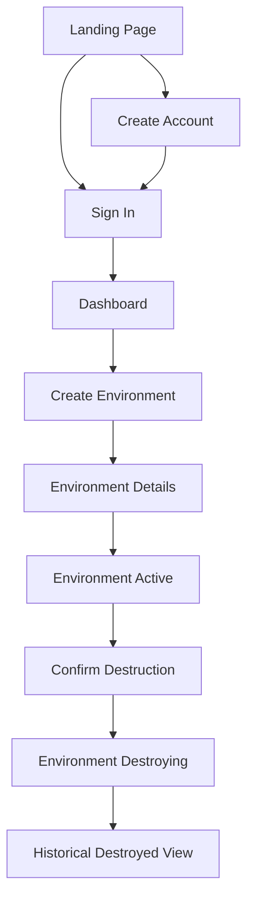
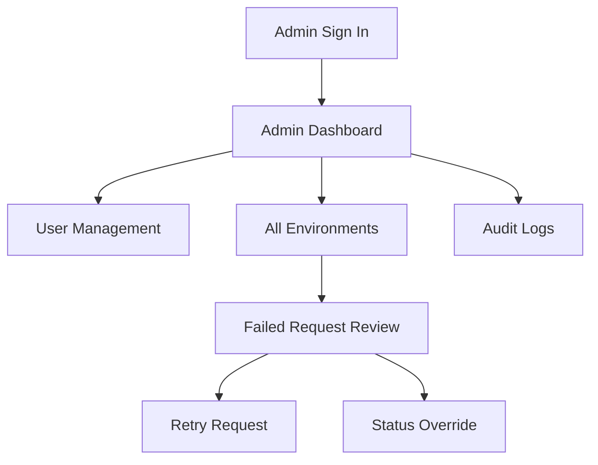

# Platform Launchpad — UI Wireframes

## 1. Purpose

This document defines the initial user-interface structure and interaction flows for Platform Launchpad.

The wireframes are intentionally low fidelity. Their purpose is to define:

- Page hierarchy
- Navigation
- Core user workflows
- Information architecture
- Role-based experiences
- Loading, empty, success, and error states
- Responsive behavior
- Accessibility expectations

The implemented frontend will use:

- Next.js
- React
- TypeScript
- Tailwind CSS

The wireframes define behavior and layout without locking the project into a final visual design.

---

## 2. Design Principles

The Platform Launchpad interface follows these principles:

- Keep developer workflows simple.
- Make environment status immediately visible.
- Separate regular-user and administrator capabilities.
- Avoid exposing unnecessary infrastructure complexity.
- Require confirmation for destructive actions.
- Make failures visible and actionable.
- Preserve historical information after destruction.
- Use consistent navigation and terminology.
- Support keyboard navigation.
- Support responsive layouts.
- Never rely on color alone to communicate status.
- Keep platform terminology understandable to non-platform users.

---

## 3. Primary User Roles

### Regular User

A regular user can:

- Register
- Log in
- View their dashboard
- Create environments
- View owned environments
- Review deployment history
- Request environment destruction
- View their profile

### Administrator

An administrator can:

- Perform all regular-user actions
- View all environments
- View all users
- Enable or disable users
- Review failed operations
- Review audit logs
- Perform controlled status overrides
- Retry supported failed requests

---

## 4. Application Navigation

### Public Navigation

Unauthenticated users see:

- Platform Launchpad logo
- Sign In
- Create Account

### Authenticated User Navigation

Regular users see:

- Dashboard
- Environments
- Create Environment
- Profile
- Sign Out

### Administrator Navigation

Administrators see:

- Dashboard
- Environments
- Create Environment
- Admin Overview
- Users
- Audit Logs
- Profile
- Sign Out

---

## 5. Route Map

| Route | Page | Access |
|---|---|---|
| `/` | Landing page | Public |
| `/login` | Login | Public |
| `/register` | Registration | Public |
| `/dashboard` | User dashboard | Authenticated |
| `/environments` | Environment list | Authenticated |
| `/environments/new` | Create environment | Authenticated |
| `/environments/[id]` | Environment details | Owner or admin |
| `/profile` | Current-user profile | Authenticated |
| `/admin` | Administrator dashboard | Admin |
| `/admin/users` | User management | Admin |
| `/admin/environments` | All environments | Admin |
| `/admin/audit-logs` | Audit logs | Admin |
| `/403` | Permission denied | Any |
| `/404` | Not found | Any |

---

# 6. Global Application Shell

Authenticated pages use a shared application shell.

```text
+--------------------------------------------------------------------------------+
| Platform Launchpad                                      Search   Alerts   User |
+----------------------+---------------------------------------------------------+
|                      |                                                         |
| Dashboard            |                    Page Header                          |
| Environments         |                                                         |
| Create Environment   |                    Page Content                         |
|                      |                                                         |
| Admin Overview       |                                                         |
| Users                |                                                         |
| Audit Logs           |                                                         |
|                      |                                                         |
| Profile              |                                                         |
| Sign Out             |                                                         |
|                      |                                                         |
+----------------------+---------------------------------------------------------+
```

## Desktop Layout

- Persistent left navigation
- Top application bar
- Main content area
- Maximum readable content width where appropriate

## Mobile Layout

- Collapsible navigation drawer
- Compact top bar
- Full-width content
- Tables may become stacked cards
- Primary actions remain visible

---

# 7. Landing Page

## Route

```text
/
```

## Purpose

Introduce Platform Launchpad and direct users to authentication.

## Wireframe

```text
+--------------------------------------------------------------------------------+
| Platform Launchpad                                      Sign In  Create Account |
+--------------------------------------------------------------------------------+
|                                                                                |
|            Self-Service Environments with Platform Guardrails                  |
|                                                                                |
|  Request, track, and manage application environments without direct access     |
|  to cloud consoles, Terraform state, or Kubernetes credentials.                |
|                                                                                |
|        [ Create Account ]             [ Sign In ]                              |
|                                                                                |
+--------------------------------------------------------------------------------+
|                                                                                |
|  Self-Service            Governed Delivery          Observable Operations       |
|                                                                                |
|  Request environments    GitOps deployment          Metrics, logs, traces       |
|  through a simple UI.    and audited workflows.     and lifecycle status.       |
|                                                                                |
+--------------------------------------------------------------------------------+
| Architecture Overview | Documentation | GitHub Repository                      |
+--------------------------------------------------------------------------------+
```

## Required Content

- Product name
- Clear one-sentence value proposition
- Primary registration action
- Secondary login action
- Three capability summaries
- Links to architecture documentation and source repository

## States

### Normal

Landing content loads successfully.

### API Unavailable

The public landing page should still render because it is statically deliverable.

---

# 8. Registration Page

## Route

```text
/register
```

## Wireframe

```text
+--------------------------------------------------------------+
|                    Create Your Account                       |
|                                                              |
| Full Name                                                    |
| [__________________________________________________________] |
|                                                              |
| Email                                                        |
| [__________________________________________________________] |
|                                                              |
| Password                                                     |
| [__________________________________________________________] |
|                                                              |
| Password requirements:                                       |
| - At least 12 characters                                     |
| - Uppercase, lowercase, number, and special character        |
|                                                              |
| [ Create Account ]                                           |
|                                                              |
| Already have an account? Sign in                             |
+--------------------------------------------------------------+
```

## Fields

- Full name
- Email
- Password
- Optional password visibility toggle

## Validation

- Validate required fields client-side.
- Display backend validation messages safely.
- Do not reveal internal validation implementation.
- Prevent duplicate form submission while processing.
- Never log password values.

## Success Flow

1. User submits valid registration data.
2. Account is created.
3. User is redirected to the login page.
4. A success message confirms account creation.

## Error States

- Invalid email
- Weak password
- Email already registered
- Service unavailable
- Unknown server error

---

# 9. Login Page

## Route

```text
/login
```

## Wireframe

```text
+--------------------------------------------------------------+
|                         Sign In                              |
|                                                              |
| Email                                                        |
| [__________________________________________________________] |
|                                                              |
| Password                                                     |
| [__________________________________________________________] |
|                                                              |
| [ ] Remember email                                           |
|                                                              |
| [ Sign In ]                                                  |
|                                                              |
| Need an account? Create one                                  |
+--------------------------------------------------------------+
```

## Fields

- Email
- Password
- Optional remember-email preference

## Security Behavior

- Use a generic authentication error.
- Do not reveal whether an email exists.
- Disable repeated submission while authenticating.
- Clear password value after failed authentication where appropriate.
- Redirect disabled users to an explanatory access-denied state.

## Success Flow

1. User submits credentials.
2. API returns a JWT access token and user summary.
3. Frontend stores authentication state securely.
4. User is redirected to `/dashboard`.

## Error States

- Invalid credentials
- Disabled account
- Expired session
- Rate limit exceeded
- API unavailable

---

# 10. User Dashboard

## Route

```text
/dashboard
```

## Purpose

Provide an immediate summary of the user's environments and recent activity.

## Wireframe

```text
+--------------------------------------------------------------------------------+
| Dashboard                                                [ Create Environment ] |
+--------------------------------------------------------------------------------+
|                                                                                |
| Welcome back, Christine                                                         |
|                                                                                |
| +----------------+ +----------------+ +----------------+ +--------------------+ |
| | Total          | | Active         | | Provisioning   | | Failed             | |
| | Environments 4 | | 2              | | 1              | | 1                  | |
| +----------------+ +----------------+ +----------------+ +--------------------+ |
|                                                                                |
| Recent Environments                                                            |
| +----------------------------------------------------------------------------+ |
| | Name            Type         Version       Status          Updated          | |
| | payments-demo   Demo         1.4.2         Active          5 min ago        | |
| | catalog-stage   Staging      2.0.0         Provisioning    12 min ago       | |
| | checkout-dev    Development  3.1.1         Failed          1 hr ago         | |
| +----------------------------------------------------------------------------+ |
|                                                                                |
| Recent Activity                                                               |
| +----------------------------------------------------------------------------+ |
| | Environment created                         payments-demo     5 min ago     | |
| | Provisioning started                        catalog-stage     12 min ago    | |
| | Provisioning failed                         checkout-dev      1 hr ago      | |
| +----------------------------------------------------------------------------+ |
+--------------------------------------------------------------------------------+
```

## Summary Cards

- Total environments
- Active environments
- Provisioning environments
- Failed environments

Optional later cards:

- Destroying
- Destroyed
- Monthly estimated cost
- Average provisioning duration

## Recent Environments

Show up to five recently updated environments.

Each row includes:

- Name
- Environment type
- Application version
- Status
- Last updated time
- Link to details

## Recent Activity

Display the user's recent environment-related actions.

The MVP may derive this from deployment requests rather than exposing user-level audit logs.

## Empty State

```text
You do not have any environments yet.

Create your first development, staging, or demo environment.

[ Create Environment ]
```

## Loading State

- Show skeleton cards.
- Show placeholder table rows.
- Preserve page layout while loading.

## Error State

```text
We could not load your dashboard.

[ Try Again ]
```

---

# 11. Environment List

## Route

```text
/environments
```

## Wireframe

```text
+--------------------------------------------------------------------------------+
| Environments                                             [ Create Environment ] |
+--------------------------------------------------------------------------------+
|                                                                                |
| Search [____________________]                                                   |
|                                                                                |
| Status [ All v ]   Type [ All v ]   Sort [ Recently Updated v ]                |
|                                                                                |
| +----------------------------------------------------------------------------+ |
| | Name            Type         Version      Status        Created      Action | |
| | payments-demo   Demo         1.4.2        Active        Jul 10       View   | |
| | catalog-stage   Staging      2.0.0        Provisioning  Jul 10       View   | |
| | checkout-dev    Development  3.1.1        Failed        Jul 09       View   | |
| +----------------------------------------------------------------------------+ |
|                                                                                |
|                   Previous    Page 1 of 3    Next                               |
+--------------------------------------------------------------------------------+
```

## Filters

- Search by environment name
- Status
- Environment type
- Sort order

## Row Content

- Name
- Environment type
- Application version
- Status badge
- Creation date
- View action

## Status Presentation

Each status uses:

- Text label
- Icon
- Distinct badge treatment

Statuses:

- Pending
- Provisioning
- Active
- Failed
- Destroying
- Destroyed

Color must not be the only indicator.

## Empty State

```text
No environments match the selected filters.

[ Clear Filters ]
```

## Mobile Layout

Each environment becomes a stacked card:

```text
payments-demo
Demo
Version 1.4.2
Status: Active
Updated 5 minutes ago

[ View Details ]
```

---

# 12. Create Environment Page

## Route

```text
/environments/new
```

## Wireframe

```text
+--------------------------------------------------------------------------------+
| Create Environment                                                             |
+--------------------------------------------------------------------------------+
|                                                                                |
| Environment Name                                                               |
| [____________________________________________________________________________] |
| Use lowercase letters, numbers, and hyphens.                                   |
|                                                                                |
| Environment Type                                                               |
| ( ) Development                                                                |
| ( ) Staging                                                                    |
| ( ) Demo                                                                       |
|                                                                                |
| Application Version                                                            |
| [____________________________________________________________________________] |
|                                                                                |
| Description                                                                    |
| [____________________________________________________________________________] |
| [____________________________________________________________________________] |
| [____________________________________________________________________________] |
|                                                                                |
| Estimated workflow                                                             |
| 1. Request validated                                                           |
| 2. Provisioning queued                                                         |
| 3. Environment created                                                         |
| 4. Application URL assigned                                                    |
|                                                                                |
| [ Cancel ]                                           [ Create Environment ]     |
+--------------------------------------------------------------------------------+
```

## Fields

- Environment name
- Environment type
- Application version
- Description

## Client-Side Validation

Environment name:

- Minimum 3 characters
- Maximum 100 characters
- Lowercase letters
- Numbers
- Hyphens
- Must begin and end with a letter or number

Application version:

- Required
- Maximum 100 characters

Description:

- Optional
- Maximum 1,000 characters

## Submission Behavior

1. Disable submit button.
2. Show processing state.
3. Submit request to API.
4. On success, redirect to environment details.
5. Display lifecycle status as `pending`.
6. Show associated deployment request.

## Error States

- Validation error
- Duplicate active environment name
- Authentication expired
- Service unavailable
- Unexpected failure

---

# 13. Environment Details Page

## Route

```text
/environments/[id]
```

## Wireframe

```text
+--------------------------------------------------------------------------------+
| payments-demo                  Active                        [ Destroy ]          |
| Demo environment | Version 1.4.2 | Created Jul 10                               |
+--------------------------------------------------------------------------------+
|                                                                                |
| Overview                                                                       |
| +----------------------------+ +---------------------------------------------+ |
| | Status                     | | Application URL                             | |
| | Active                     | | https://payments-demo.example.com           | |
| +----------------------------+ +---------------------------------------------+ |
|                                                                                |
| Environment Information                                                       |
| Owner: Christine Adelusi                                                       |
| Type: Demo                                                                     |
| Version: 1.4.2                                                                 |
| Description: Demo environment for the payments application                     |
|                                                                                |
| Lifecycle                                                                      |
| Pending → Provisioning → Active                                                |
|                                                                                |
| Deployment Requests                                                            |
| +----------------------------------------------------------------------------+ |
| | Operation   Status      Attempts      Requested            Completed        | |
| | Provision   Succeeded   1             Jul 10 3:15 PM       Jul 10 3:20 PM   | |
| +----------------------------------------------------------------------------+ |
|                                                                                |
| Platform Metadata                                                              |
| Namespace: launchpad-payments-demo                                             |
| Region: us-east-1                                                              |
| Cluster: platform-launchpad-eks                                                |
+--------------------------------------------------------------------------------+
```

## Header Actions

Available actions depend on status.

| Status | Available Actions |
|---|---|
| `pending` | None |
| `provisioning` | None |
| `active` | Open Application, Destroy |
| `failed` | Destroy; admin may retry |
| `destroying` | None |
| `destroyed` | None |

## Lifecycle Timeline

Display lifecycle events chronologically.

Each timeline entry may include:

- Status
- Timestamp
- Operation
- Result
- Sanitized message

## Deployment Request Details

Users may expand a deployment request to view:

- Request identifier
- Operation
- Status
- Attempt count
- Start time
- Completion time
- Sanitized error message

## Failed State

```text
Provisioning Failed

The platform could not complete this environment request.

Error:
The provisioning worker timed out.

Request ID:
4df37e1a-e920-41ca-9548-b170d0043dcf

Contact a platform administrator or retry through an authorized workflow.
```

## Destroyed State

The page remains accessible but clearly indicates:

```text
This environment was destroyed on July 11, 2026.

Historical lifecycle and deployment information remains available.
```

---

# 14. Destroy Environment Confirmation

## Trigger

User selects **Destroy** from the environment details page.

## Modal Wireframe

```text
+--------------------------------------------------------------+
| Destroy Environment                                          |
|                                                              |
| You are about to destroy:                                    |
|                                                              |
| payments-demo                                                |
|                                                              |
| The application will become unavailable.                     |
| Historical records will remain visible.                      |
|                                                              |
| Type the environment name to confirm:                         |
| [__________________________________________________________] |
|                                                              |
| [ Cancel ]                        [ Destroy Environment ]      |
+--------------------------------------------------------------+
```

## Requirements

- Require explicit confirmation.
- Require the user to type the environment name.
- Disable confirmation until the value matches.
- Show loading state after submission.
- Prevent duplicate destroy requests.
- Return the user to the details page with status `destroying`.

---

# 15. User Profile Page

## Route

```text
/profile
```

## Wireframe

```text
+--------------------------------------------------------------------------------+
| Profile                                                                        |
+--------------------------------------------------------------------------------+
|                                                                                |
| Full Name                                                                      |
| Christine Adelusi                                                              |
|                                                                                |
| Email                                                                          |
| christine@example.com                                                          |
|                                                                                |
| Role                                                                           |
| User                                                                           |
|                                                                                |
| Account Status                                                                 |
| Active                                                                         |
|                                                                                |
| Created                                                                        |
| July 10, 2026                                                                  |
|                                                                                |
| Last Login                                                                     |
| July 11, 2026 at 9:30 PM                                                       |
+--------------------------------------------------------------------------------+
```

## MVP Scope

The profile page is read-only.

Future capabilities may include:

- Change display name
- Change password
- Configure notifications
- View API tokens
- View active sessions

---

# 16. Administrator Dashboard

## Route

```text
/admin
```

## Wireframe

```text
+--------------------------------------------------------------------------------+
| Admin Overview                                                                 |
+--------------------------------------------------------------------------------+
|                                                                                |
| +----------------+ +----------------+ +----------------+ +--------------------+ |
| | Users          | | Environments   | | Failed Jobs    | | Active Jobs        | |
| | 28             | | 42             | | 3              | | 5                  | |
| +----------------+ +----------------+ +----------------+ +--------------------+ |
|                                                                                |
| Environment Status                                                             |
| Active: 25 | Provisioning: 5 | Failed: 3 | Destroying: 2 | Destroyed: 7        |
|                                                                                |
| Failed Deployment Requests                                                     |
| +----------------------------------------------------------------------------+ |
| | Environment    Operation     User              Failed At       Action       | |
| | checkout-dev   Provision     dev@example.com   1 hr ago        Review       | |
| +----------------------------------------------------------------------------+ |
|                                                                                |
| Recent Administrative Activity                                                 |
| +----------------------------------------------------------------------------+ |
| | User disabled                 admin@example.com            20 min ago       | |
| | Request retried               checkout-dev                 35 min ago       | |
| +----------------------------------------------------------------------------+ |
+--------------------------------------------------------------------------------+
```

## Dashboard Cards

- Total users
- Total environments
- Failed deployment requests
- Active deployment requests

## Administrator Actions

- Review failed requests
- Navigate to user management
- Navigate to audit logs
- Navigate to all-environment view

---

# 17. Administrator User Management

## Route

```text
/admin/users
```

## Wireframe

```text
+--------------------------------------------------------------------------------+
| Users                                                                          |
+--------------------------------------------------------------------------------+
|                                                                                |
| Search [____________________]   Role [ All v ]   Status [ All v ]               |
|                                                                                |
| +----------------------------------------------------------------------------+ |
| | Name              Email                  Role     Status      Action         | |
| | Christine         user@example.com       User     Active      View           | |
| | Platform Admin    admin@example.com      Admin    Active      View           | |
| | Disabled User     old@example.com        User     Disabled    View           | |
| +----------------------------------------------------------------------------+ |
|                                                                                |
|                   Previous    Page 1 of 2    Next                               |
+--------------------------------------------------------------------------------+
```

## User Detail Drawer or Page

```text
Name: Christine Adelusi
Email: user@example.com
Role: User
Status: Active
Created: July 10, 2026
Last Login: July 11, 2026

Owned Environments: 3

[ Disable User ]
```

## Disable Confirmation

```text
Disable this user?

The user will no longer be able to authenticate.
Existing environment history will remain available.

[ Cancel ] [ Disable User ]
```

## Restrictions

- The MVP does not support changing user roles.
- Administrators should not be able to accidentally disable themselves without additional confirmation.
- Every enable or disable action creates an audit event.

---

# 18. Administrator Environment List

## Route

```text
/admin/environments
```

## Wireframe

```text
+--------------------------------------------------------------------------------+
| All Environments                                                               |
+--------------------------------------------------------------------------------+
|                                                                                |
| Search [____________] Owner [____________] Status [ All v ] Type [ All v ]      |
|                                                                                |
| +----------------------------------------------------------------------------+ |
| | Name          Owner             Type      Version    Status      Action     | |
| | payments-demo dev@example.com   Demo      1.4.2      Active      Review     | |
| | catalog-stage qa@example.com    Staging   2.0.0      Failed      Review     | |
| +----------------------------------------------------------------------------+ |
|                                                                                |
|                   Previous    Page 1 of 5    Next                               |
+--------------------------------------------------------------------------------+
```

## Additional Administrator Data

- Owner
- Latest deployment request
- Attempt count
- Last error
- Last updated
- Administrative actions

---

# 19. Administrative Environment Review

## Route

The administrator may use the same environment details route with additional controls or a dedicated administrative view.

## Wireframe

```text
+--------------------------------------------------------------------------------+
| catalog-stage                  Failed                                           |
| Owner: qa@example.com                           [ Retry ] [ Override Status ]     |
+--------------------------------------------------------------------------------+
|                                                                                |
| Failure Summary                                                                |
| Worker timed out while provisioning the namespace.                             |
|                                                                                |
| Deployment Request                                                             |
| ID: 4df37e1a-e920-41ca-9548-b170d0043dcf                                      |
| Attempts: 2                                                                    |
| Started: July 10, 2026 3:15 PM                                                 |
| Failed: July 10, 2026 3:20 PM                                                  |
|                                                                                |
| Related Audit Events                                                           |
| - Provisioning started                                                         |
| - Worker retry attempted                                                       |
| - Provisioning failed                                                          |
+--------------------------------------------------------------------------------+
```

## Retry Confirmation

```text
Retry failed deployment request?

A new deployment request will be created.

[ Cancel ] [ Retry Request ]
```

## Status Override

```text
Override Environment Status

New Status
[ Failed v ]

Reason
[____________________________________________________________]
[____________________________________________________________]

[ Cancel ] [ Apply Override ]
```

A reason is required.

---

# 20. Audit Log Page

## Route

```text
/admin/audit-logs
```

## Wireframe

```text
+--------------------------------------------------------------------------------+
| Audit Logs                                                                     |
+--------------------------------------------------------------------------------+
|                                                                                |
| Action [ All v ] Result [ All v ] Resource [ All v ]                           |
| User [________________] Date From [________] Date To [________]                  |
|                                                                                |
| +----------------------------------------------------------------------------+ |
| | Time          Action                    User            Result     Resource | |
| | 3:15 PM       environment.created       dev@example     Success    Env      | |
| | 3:10 PM       user.login_failed         unknown         Failure    User     | |
| | 2:45 PM       admin.user_disabled       admin@example   Success    User     | |
| +----------------------------------------------------------------------------+ |
|                                                                                |
|                   Previous    Page 1 of 8    Next                               |
+--------------------------------------------------------------------------------+
```

## Audit Detail Drawer

```text
Action:
environment.created

Result:
success

Actor:
dev@example.com

Resource:
Environment payments-demo

Request ID:
req_8c071f3102a24fbb

Source IP:
192.0.2.10

Timestamp:
July 10, 2026 3:15 PM UTC

Details:
{
  "environment_type": "demo",
  "application_version": "1.4.2"
}
```

## Security Requirements

Audit detail must never display:

- Passwords
- Password hashes
- JWTs
- AWS credentials
- Database credentials
- Private keys
- Secret values

---

# 21. Permission Denied Page

## Route

```text
/403
```

## Wireframe

```text
+--------------------------------------------------------------+
|                      Access Denied                           |
|                                                              |
| You do not have permission to access this page.              |
|                                                              |
| [ Return to Dashboard ]                                      |
+--------------------------------------------------------------+
```

The frontend should normally hide inaccessible navigation items, but backend authorization remains authoritative.

---

# 22. Not Found Page

## Route

```text
/404
```

## Wireframe

```text
+--------------------------------------------------------------+
|                     Page Not Found                           |
|                                                              |
| The page or resource you requested could not be found.       |
|                                                              |
| [ Return to Dashboard ]                                      |
+--------------------------------------------------------------+
```

For protected resources, the API may intentionally return `404` rather than reveal unauthorized resource existence.

---

# 23. Session Expiration

When an API request returns an expired-token response:

```text
Your session has expired.

Please sign in again to continue.

[ Sign In ]
```

Behavior:

1. Clear invalid authentication state.
2. Preserve the intended route where appropriate.
3. Redirect to login.
4. Return the user to the original page after successful authentication where safe.

---

# 24. Global Loading States

The application should use:

- Skeleton cards
- Skeleton table rows
- Button spinners
- Disabled duplicate actions
- Inline loading indicators

Avoid:

- Blank pages
- Unexplained long waits
- Full-screen blocking indicators for small operations

---

# 25. Global Empty States

Every data collection requires a purposeful empty state.

Examples:

### No Environments

```text
You have not created any environments.

[ Create Environment ]
```

### No Deployment Requests

```text
No deployment requests have been recorded for this environment.
```

### No Audit Results

```text
No audit events match the selected filters.

[ Clear Filters ]
```

### No Failed Jobs

```text
There are no failed deployment requests.
```

---

# 26. Global Error States

Errors should include:

- Clear message
- Safe explanation
- Retry action where appropriate
- Correlation request identifier where useful

Example:

```text
We could not load this environment.

Request ID: req_8c071f3102a24fbb

[ Try Again ] [ Return to Environments ]
```

Internal stack traces must never be displayed.

---

# 27. Notifications

The frontend may use temporary toast notifications for:

- Registration success
- Login success
- Environment request accepted
- Destruction request accepted
- Retry request accepted
- User status changed
- Non-blocking failures

Critical failures should also remain visible within the relevant page.

A toast alone is insufficient for lifecycle failure state.

---

# 28. Accessibility Requirements

The frontend must:

- Support keyboard-only navigation.
- Use semantic HTML.
- Associate labels with fields.
- Use visible focus states.
- Provide meaningful button labels.
- Provide accessible validation messages.
- Use sufficient contrast.
- Avoid communicating status through color alone.
- Support screen-reader-friendly status text.
- Use `aria-live` for important asynchronous updates where appropriate.
- Respect reduced-motion preferences.

---

# 29. Responsive Requirements

## Desktop

- Persistent navigation sidebar
- Data tables
- Multi-column summary cards
- Wide environment detail layout

## Tablet

- Collapsible sidebar
- Reduced table columns
- Two-column summary cards

## Mobile

- Navigation drawer
- Single-column layouts
- Environment cards instead of wide tables
- Sticky primary action where useful
- Confirmation dialogs sized for small screens

---

# 30. Frontend State Model

The frontend will manage:

- Authentication state
- Current-user state
- Environment collections
- Environment details
- Deployment requests
- Administrator data
- Pagination
- Filters
- Loading states
- Error states

Server data should be treated as remote state and refreshed through API requests.

The frontend must not invent authoritative environment status.

---

# 31. Page-to-API Mapping

| Page | API Endpoint |
|---|---|
| Registration | `POST /api/v1/auth/register` |
| Login | `POST /api/v1/auth/login` |
| Profile | `GET /api/v1/users/me` |
| User dashboard | `GET /api/v1/environments` |
| Environment list | `GET /api/v1/environments` |
| Create environment | `POST /api/v1/environments` |
| Environment details | `GET /api/v1/environments/{environment_id}` |
| Deployment history | `GET /api/v1/environments/{environment_id}/deployment-requests` |
| Destroy environment | `POST /api/v1/environments/{environment_id}/destroy` |
| Admin users | `GET /api/v1/admin/users` |
| Admin user update | `PATCH /api/v1/admin/users/{user_id}` |
| Admin environments | `GET /api/v1/admin/environments` |
| Admin audit logs | `GET /api/v1/admin/audit-logs` |
| Retry request | `POST /api/v1/admin/deployment-requests/{request_id}/retry` |
| Status override | `PATCH /api/v1/admin/environments/{environment_id}/status` |

---

# 32. Primary User Flow



---

# 33. Administrator Flow



---

# 34. Visual Design Direction

The eventual visual design should feel:

- Professional
- Technical
- Modern
- Calm
- Operational
- Trustworthy

The interface should avoid looking like:

- A consumer social application
- A gaming dashboard
- An overly decorative marketing site
- A raw infrastructure console

Recommended visual characteristics:

- Clear typography
- Generous spacing
- Neutral surfaces
- Strong information hierarchy
- Compact but readable tables
- Consistent status badges
- Simple technical illustrations
- Minimal animation

---

# 35. MVP Wireframe Acceptance Criteria

The wireframe design is complete when:

- All public pages are defined.
- All authenticated user pages are defined.
- All administrator pages are defined.
- Core navigation is documented.
- Environment creation is documented.
- Environment destruction confirmation is documented.
- Lifecycle status display is documented.
- Deployment history is documented.
- User management is documented.
- Audit-log review is documented.
- Empty states are documented.
- Loading states are documented.
- Error states are documented.
- Responsive behavior is documented.
- Accessibility expectations are documented.
- Pages map directly to the approved API contract.